# 23.k8s核心实战-deployment多副本的能力

​	使用deployment部署的应用是拥有自愈能力的，如果deployment发现pod宕机或者是被删除就会重新启动一个pod。

​	如果我们真的想删除掉这个pod怎么办？因为我们是使用deploy部署的，所以还是需要使用deploy来删除的，`kubectl get deploy`查看deploy，然后使用kubectl delete deploye mytomcat 就删除掉了，我们把这个deploye删除这个pod才会真正的删除

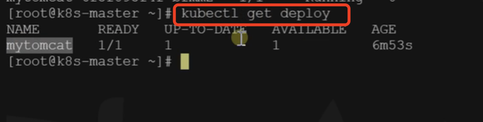

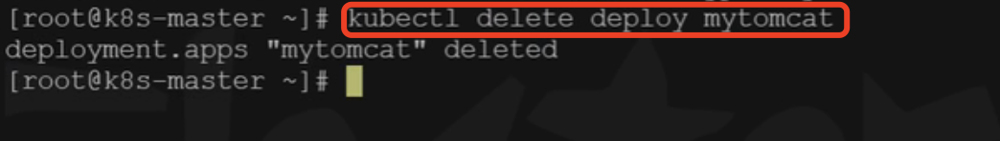


#### 多副本

​	我们现在看一下deployment的另外一个能力，比如订单服务，在一台机器上肯定不行，我们需要多台机器同时部署，多个副本的进行

​	我们使用以下命令进行多副本的部署 my-dev是部署的名称，image是指定的镜像，replicas是副本数量

```bash
kubectl create deployment my-dep --image=nginx --replicas=3
```

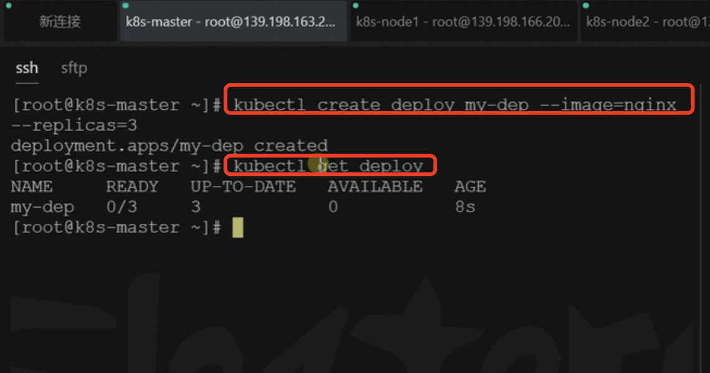

​	0/3代表我这个deploy有3个pod，但是有0个启动成功


我们在可视化界面也是可以看到我们的deploy部署的内容

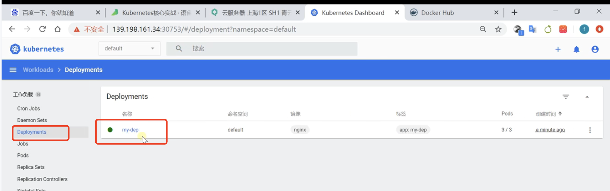


​	如果我们想在可视化界面删除掉这个deploy，点击删除按钮就OK了

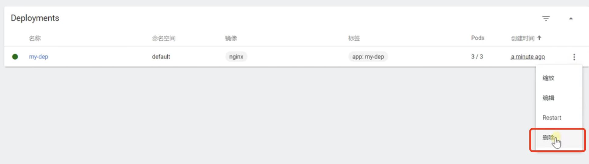


如果在我们可视化界面如何创建一个多副本的应用，我们点击+号创建

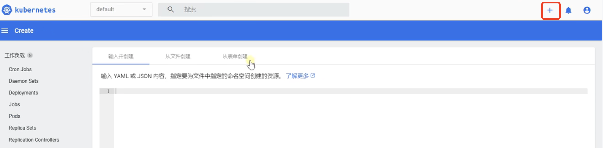


然后我们使用表单创建--然后填写应用名称-容器镜像，pod数量

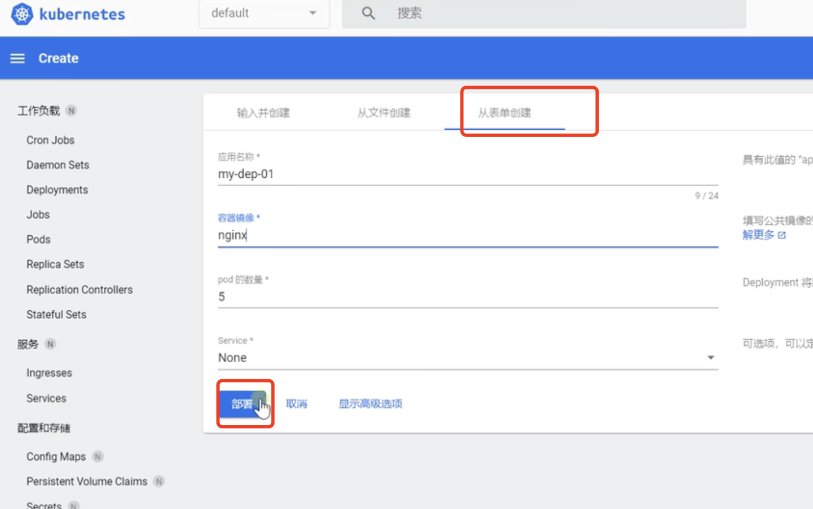


还没有完全启动起来

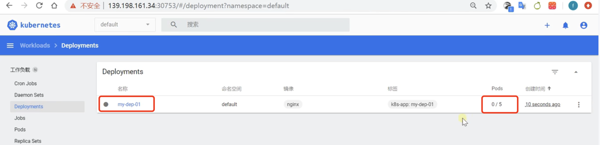


我们使用命令查看一下：可以看到启动了5个pod，分别分配了5个IP地址，部署的节点由k8s进行的分配

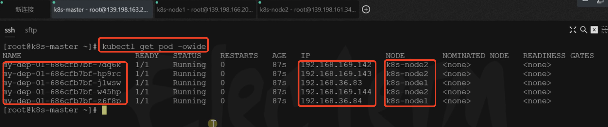


#### 使用配置文件进行多副本操作

​	我们使用命令的方式，还可以使用可视化的表单方式，还可以使用配置文件的方式

​	配置文件的核心就是 replicas参数，还有就是image参数

```
apiVersion: apps/v1
kind: Deployment
metadata:
  labels:
    app: my-dep
  name: my-dep
spec:
  replicas: 3
  selector:
    matchLabels:
      app: my-dep
  template:
    metadata:
      labels:
        app: my-dep
    spec:
      containers:
      - image: nginx
        name: nginx
        
```


点击上传

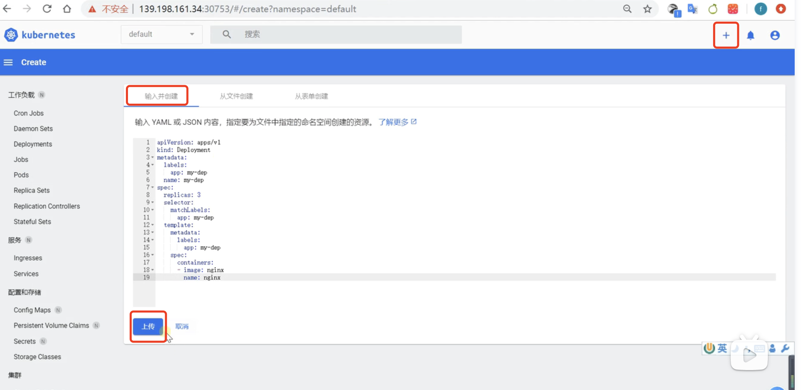


我们看到这个是我们使用文件部署的

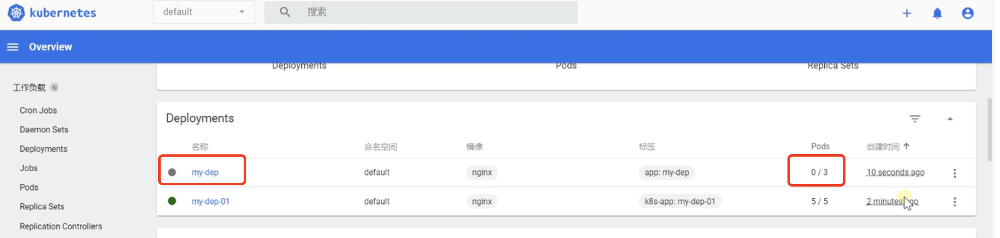


