# 24.k8s核心实战-工作负载-deployment扩缩容能力


#### 1.什么是扩缩容？

​	比如，我们现在创建一个deployment--然后有2个副本，随着用户量的变大我们发现这2个pod已经负载均衡不了或者说处理不了太多的请求任务了，我们希望再多部署几台Pod，我们把这个多部署的pod叫扩容

​	扩容在k8s中也很简单，叫kubectl scale ，

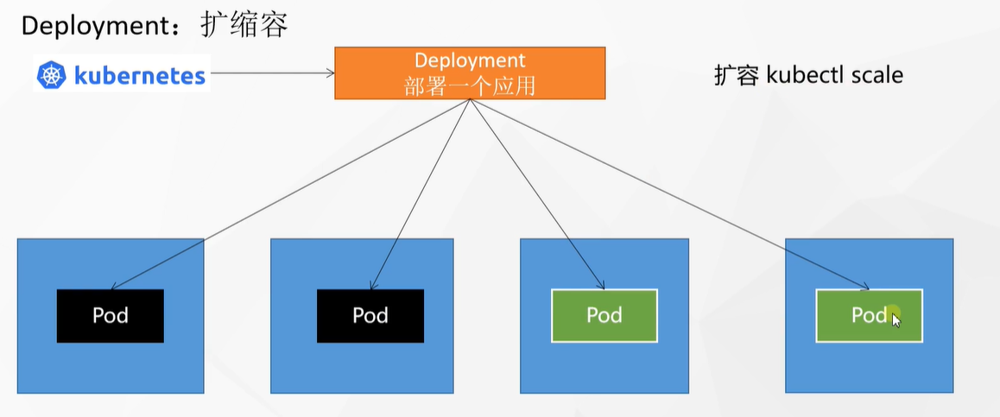


​	当我们整个流量高峰过去之后，我们也可以让这些pod下线，为我们腾出资源，我们把这个过程叫做 **缩容kubectl scale**

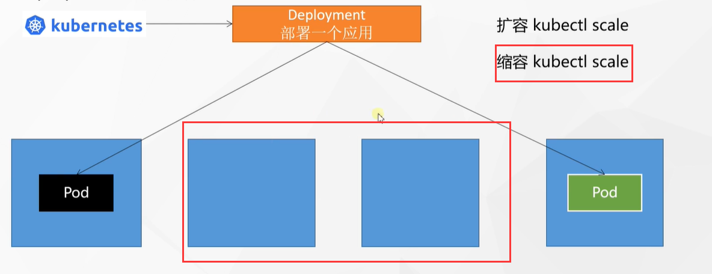


​	这个扩缩容，以后k8s也可以动态做到扩缩容，所谓的动态就是让k8s自己判断，这个应用负载如果太高了，他自己给扩到多份，负载比较低的时候又自动缩减Pod


#### 2.展示扩缩容能力

​		扩缩容能力在k8s中只有一行命令

​		scale是扩缩容参数  replacas是副本数量  deployment 是对deploy的   my-dep是部署的deployment名称

```
kubectl scale --replicas=5 deployment/my-dep
```


我们原先的deploy是部署的3个pod，现在我们执行以下扩容增加到5个副本Pod

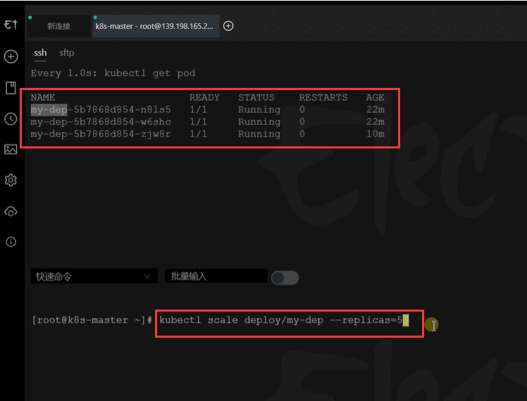


​	我们看到又增加了2个Pod正在创建中，一共是5个Pod

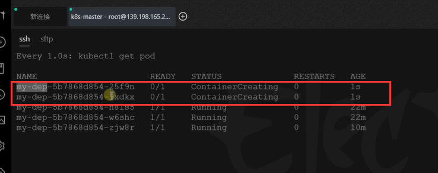


如果我们的流量高峰过去了，我们也可以进行一下缩容，我们现在将deploy缩容到2个Pod

​		现在是监视看到5个Pod

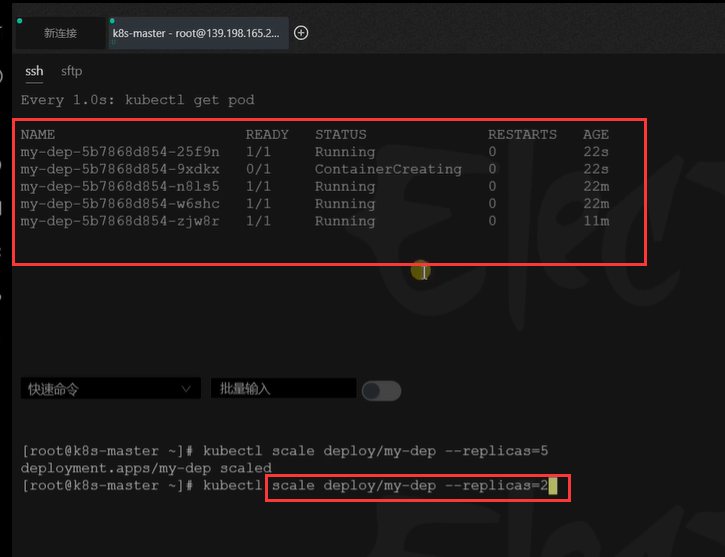


​	执行缩容命令后：我们可以看到有3个Pod进行了中断删除

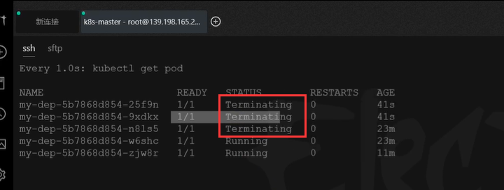


扩容容还可以使用命令kubectl edit deploy mydep名称

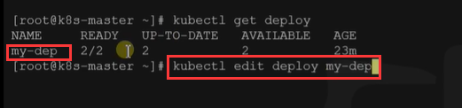


这种修改的方式呢，直接会以yaml的方式打开，我们输入i进入插入模式，可以修改replacas

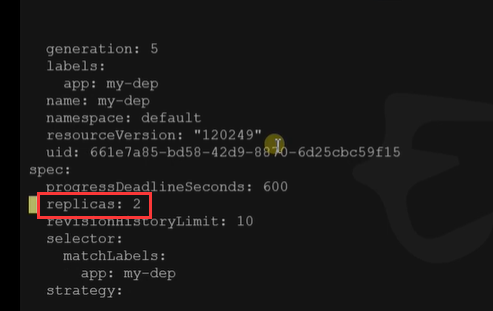

例如改为4，然后esc ，冒号 wq保存


我们发现又开始创建Pod了，总数为4个副本Pod

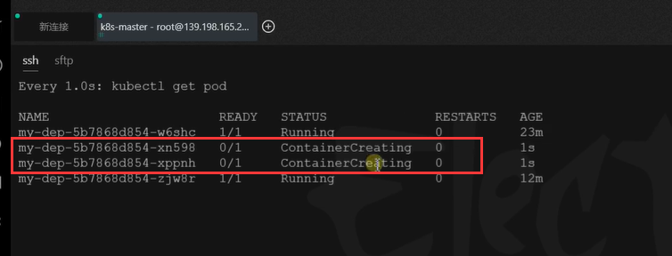


#### 3、可视化dashboard进行扩缩容处理

​	我们在可视化进行扩缩容也是很方便的


​	进入工作负载--》然后找到对应的deploy 点击操作中的缩放按钮

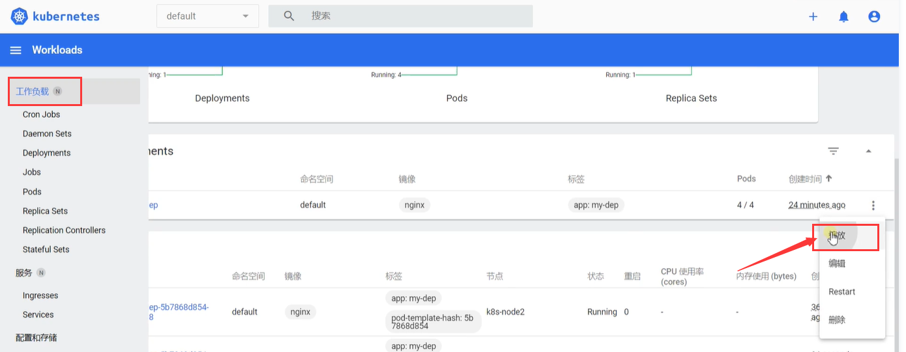


点击数量进行扩缩容--点击缩放，下面也会有提示运行了什么命令--此操作相当于

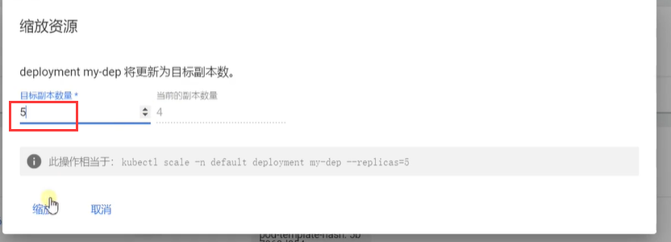


