# 25.k8s核心实战-工作负载-deployment自愈&故障转移能力

​		自愈及故障转移能力，什么是自愈及故障转移？

​		比如-我们在deployment部署一个应用，分别在4个机器部署pod，但是应用在长久的运行过程中总有些遭遇意外运行的情况，比如机器宕机了，或者说Pod中的容器内存泄漏了，容器奔溃了等等故障，我们就希望在出现这样问题的时候我们的k8s集群可以感知到那个应用出现了问题，然后能够自我修复

​	比如自愈能力，我们有一个Pod运行的过程中自我奔溃掉了，当Pod奔溃后，我们的k8s会尝试重启这个Pod，如果重启修复了，那么这种情况就称为 自愈能力

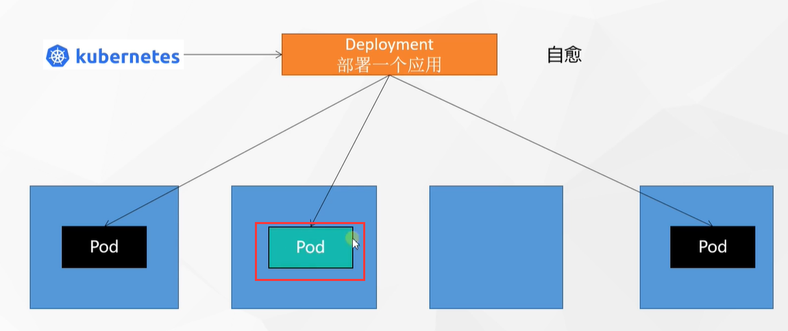

#### 故障转移

​	当然还有种情况是没办法修复的，例如我们另外一台机器突然宕机了或者说是断电了，这个Pod没办法在集群中提供服务了，所以我们k8s集群就会感知到这个机器可能下线了，这样的话我们这个机器甚至跑的所有的应用k8s会帮我们在其他机器再拉起来一份，我们把这个过程叫做故障转移

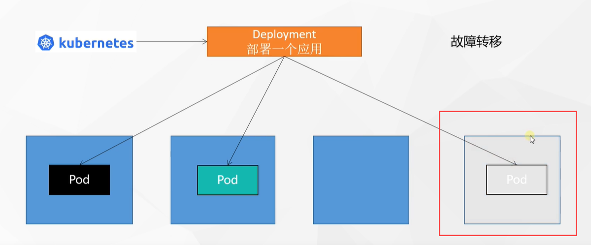

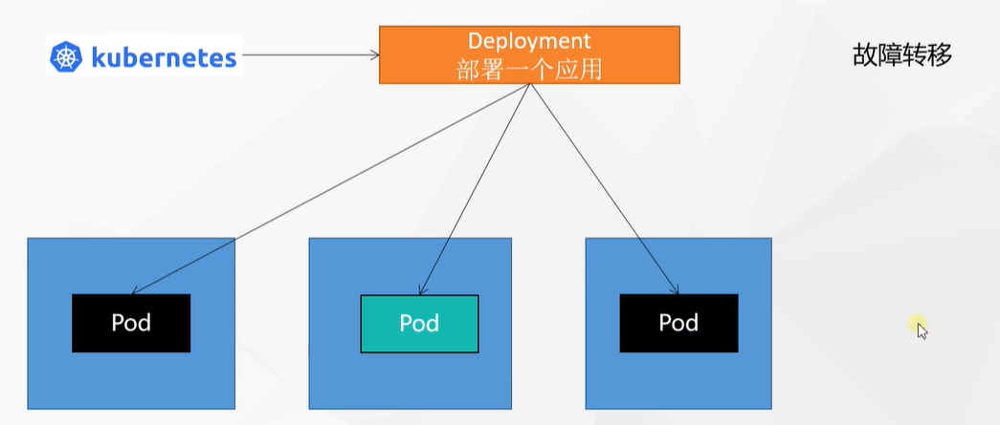

#### 演示一下这个过程

​	我们先每秒监视一下Pod，watch -n 1 kubectl get pod

​	可以看到现在有3个pod

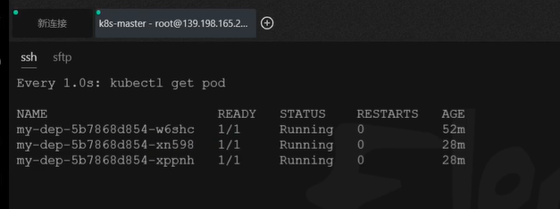

我们再看一下这些pod的详情，都部署在哪些节点上了

​	kubectl get pod -owide

​	在node1和node2节点

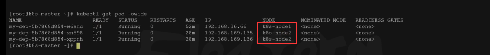

​	我们连接node1机器，先检查一下容器名称

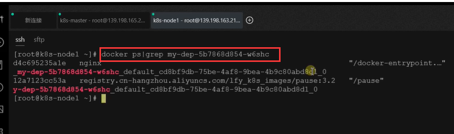

然后我们模拟一下容器奔溃，我们把容器停掉

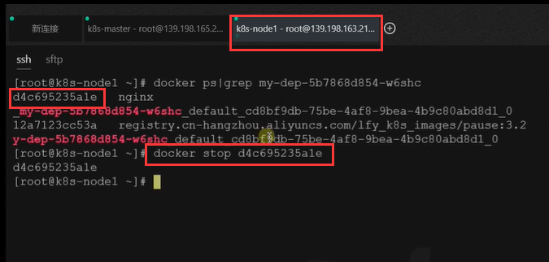

​	我们发现k8s集群查看Pod的时候是会感知到的，现在他的状态是Completed

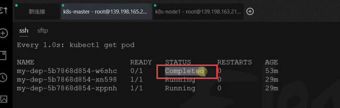

我们稍等一会，发现又重新运行起来了，状态为Running了，restarts变为1 重启了一次

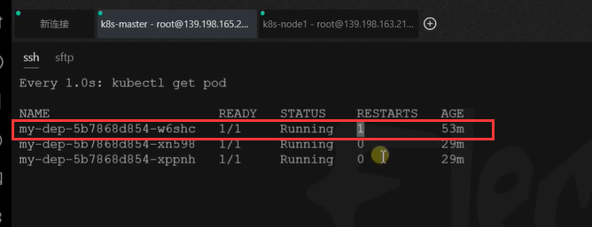

​	这就是k8s的自愈能力。这个能力非常强大，这在我们线上如果哪些应用出现故障，我们k8s就会把这个Pod的容器杀死进行重启。

​	我们模拟一下宕机，我们把node-1节点关机一下

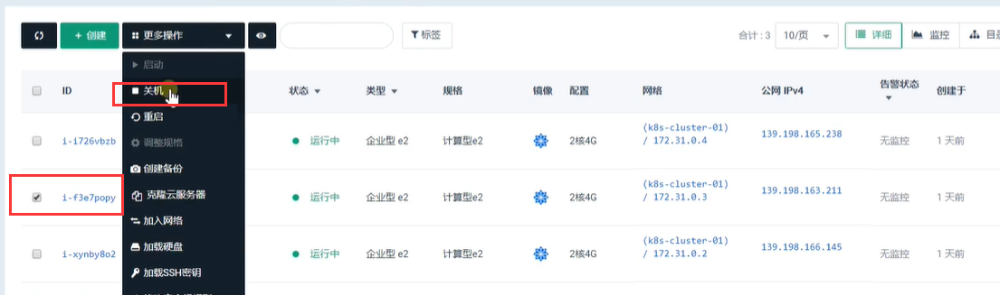

​	我们现在看一下k8s集群有什么变化，它是有一个阈值的如果5分钟都没有反应的话，才会产生变化

​	这个是关机前的Pod情况

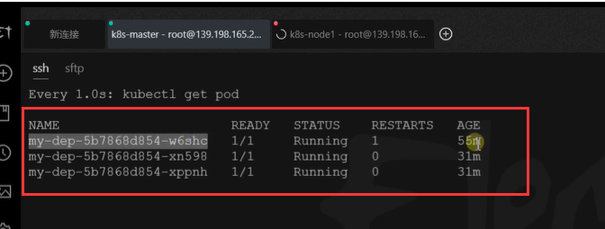

​		我们发现5分钟后k8s集群会对这个w6关机的节点Pod进行中断Terminating

​		然后又新启动一个hz2xf的Pod，进行一系列状态变化后最终running

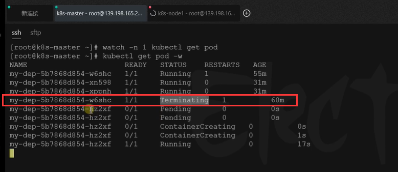

​	这就是我们所说的故障转移，这个故障转移为什么要等5分钟这么久呢？因为在我们整个集群中，我们的某个机器可能会因为网络故障导致的失联情况（30s,或1分钟都正常），如果我们把这个阈值设置的很小就会浪费集群的资源，所以我们应该配置一个比较合理的阈值

​	最终达到的效果就是只有有任何一个pod有问题，那么我们集群总会保证我们部署的Pod数量，也就是说我们deployment就是保证我们副本数量。

