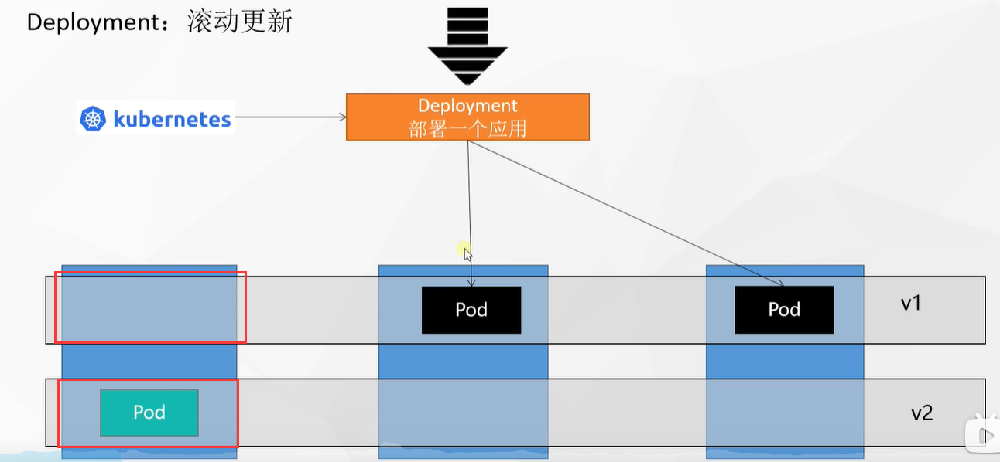
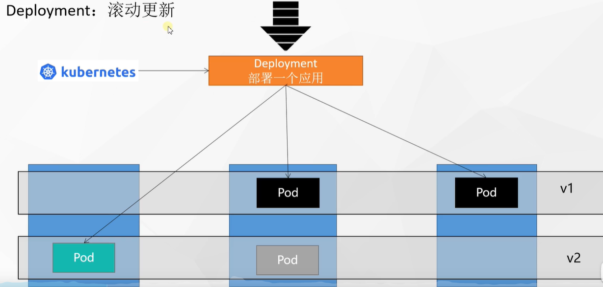
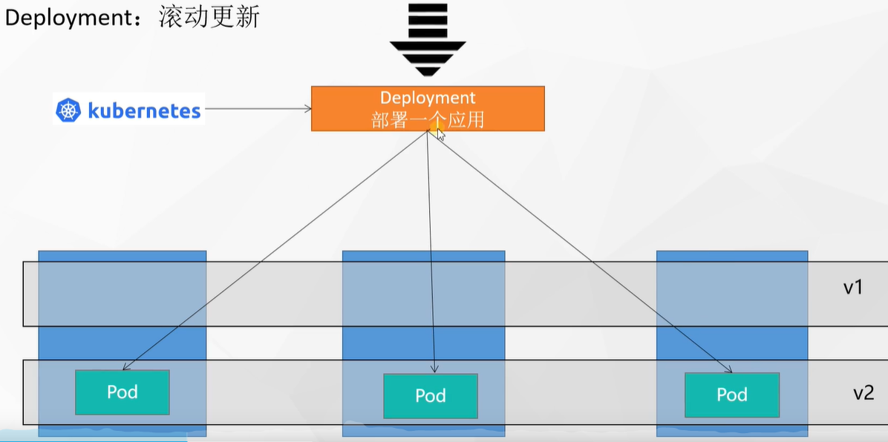
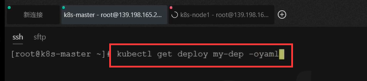
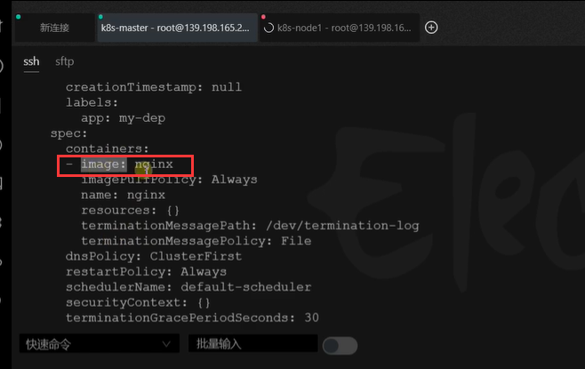
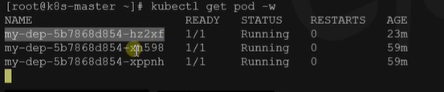
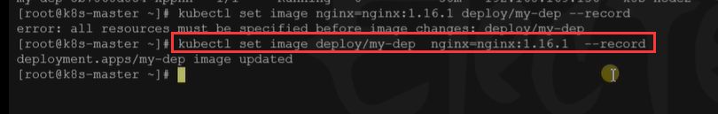
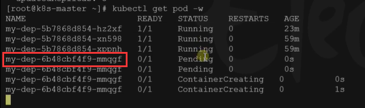
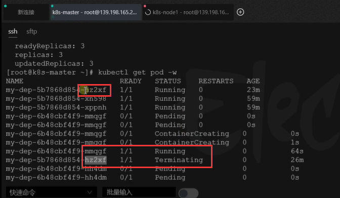
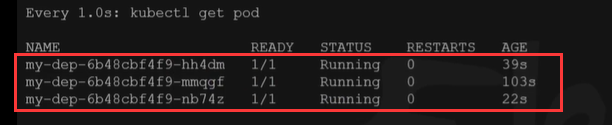

# 26.k8s核心实战-工作负载-deployment滚动更新能力


	#### 滚动更新

​	 什么是滚动更新？

​	    假设我们k8s集群 deployment部署了一个应用3个副本，这个为应用的v1版本，然后我们这个应用想升级，升级到V2版本，我们如何升级？ 而且升级的过程中不断有流量请求涌入，我们现在想要更新还需要不间断流量的处理过程，那我们需要怎么做呢？


​	我们想升级V2版本，我们可以先启动一个V2版本的Pod，等我们这个Pod一切运行成功了，我们接下来就把这台机器的v1版本的Pod进行下线




​	这个过程是先让deployment将流量转到 新升级的Pod上，再下线旧版的Pod，其实现在是我们deployment部署的应用是有2种版本并存的




​	滚动更新就是，我们下一个Pod也是一样，先启动一个新的Pod等待启动完成运行后，再把旧的版本下线，最终将最新版本完全上线



​	滚动更新：全程无需停机维护，我们把这个也称为不停机更新，而且是滚动更新一个更新完成才可以进行下一个更新。


​	如果我们像以前一样将所有的旧版全部下线，将新版全部上线，这样就会导致如果新版有问题那么整个请求过来的都会有问题，而且会发生停机，如果新版本上线有问题，那么新版本将一直尝试自愈，如果不能自愈也不会进行继续副本的创建，我们还是可以使用旧版的正常进行工作


#### 滚动更新操作

​		更新应用其实在k8s中就相当于更新镜像

​	

```
kubectl set image deployment/my-dep nginx=nginx:1.16.1 --record
kubectl rollout status deployment/my-dep

```


​		我们现在查看一下我们部署的my-dep使用的是那个镜像，我们以-oyaml 参数就是以yaml的方式输出一下







​	如果我们想要给他滚动升级

​	我们先监视一下之前的pod ，kubectl get pod -w




​	我们现在更新一下镜像，set image 设置镜像 name是容器的名称，deploye/my-dep相当于我们要修改部署的my-dep这个部署镜像，然后我们每次更新版本最好加上 --record,record会记录下这次版本的更新




​	现在我们看一下监控的pod情况

​	我们发现给我们新建了一个mmqqf的pod，我们旧的Pod还都存在




​	当这个新的Pod，running之后我们看一下变化

​	我们可以看到等我们新的Pod启动成功后，就会中断掉旧的hz2xf这个Pod，整个过程就是起一个中断下线一个，这么滚动的进行的版本更新




最后我们发现Pod最终还是3个，但是全是最新的版本Pod，名字都发生了改变，旧的全部下线了




使用它我们就可以实现不停机更新，我们以后想要升级版本，只需要一个命令就可以搞定了


```
# 修改 kubectl edit deployment/my-dep
```


https://www.bilibili.com/video/BV13Q4y1C7hS?p=51&spm_id_from=pageDriver


​		


