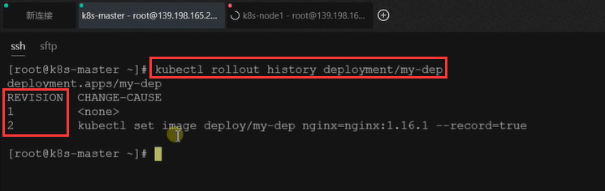
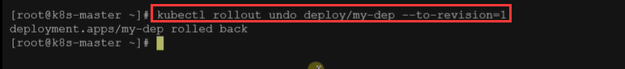
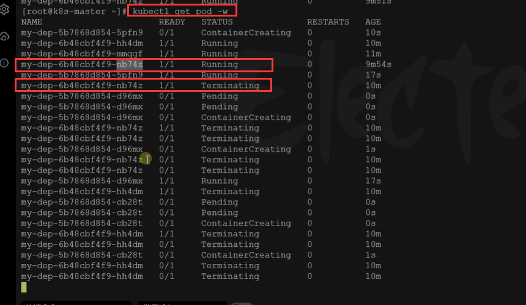
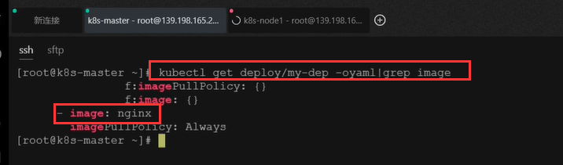

# 27.k8s核心实战-工作负载-deployment版本回退能力


​	我们了解一下k8s的版本回退能力：就拿我们之前部署的deployment，my-dep来说，我们之前进行了镜像升级，我们又产生了一个版本，未来我们的应用会经常的升级，这样我们就会有很多的以前部署记录。

​	然后突然我们发现这次部署的我们不满意，我们想回退到某个历史记录版本状态，我们把这种情况就叫做版本回退。


#### 版本回退

​	在k8s中想要实现版本回退也是一个命令就ok了

​	我们需要先查看一下部署的历史记录，使用命令kubectl rollout history deployment/my-dep

​	我们看到有打印Revision 下面有1,2就是2个版本，因为我们在升级的时候添加了--record参数，所以这里会把我们升级的命令记录显示出来




​	如果我们现在想要版本回退，使用**kubectl rollout undo deploye/my-dep --to-reversion=1**这样就可以回退到第一个版本，而且这个回退也是滚动回退的



​		我们看到rolled back 进行回滚版本回退


​	我们看一下这个Pod--也是滚动更新的




​	那么我们怎么能够确定它是否回退到之前的版本呢？我们可以使用命令将deploy以yaml输出，并且过滤image

​	`kubectl get deploy/my-dep -oyaml | grep image`


​	我们现在看到image是nginx，相当于nginx的最新版本，因为我们上个版本就是nginx最新版本，所以回退没有问题




​		版本回退需要使用到的命令

```
#历史记录
kubectl rollout history deployment/my-dep


#查看某个历史详情
kubectl rollout history deployment/my-dep --revision=2

#回滚(回到上次)
kubectl rollout undo deployment/my-dep

#回滚(回到指定版本)
kubectl rollout undo deployment/my-dep --to-revision=2

```


​	


