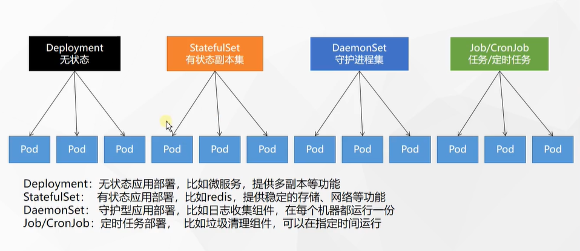
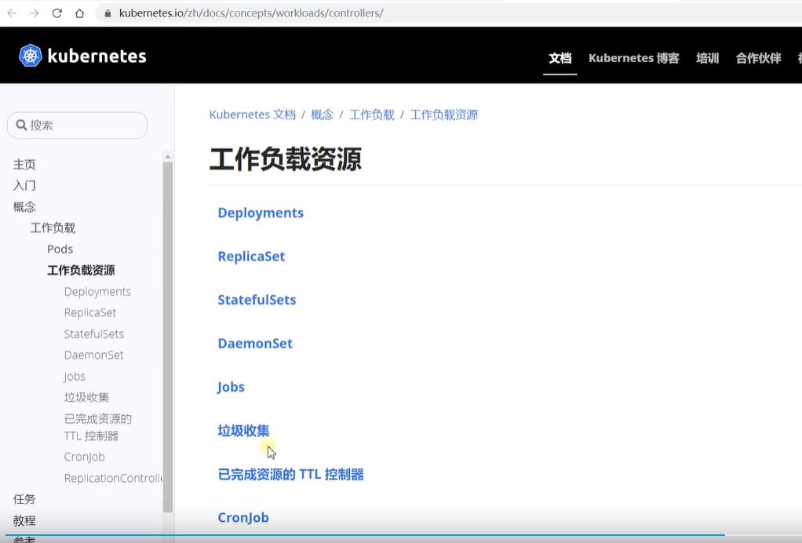
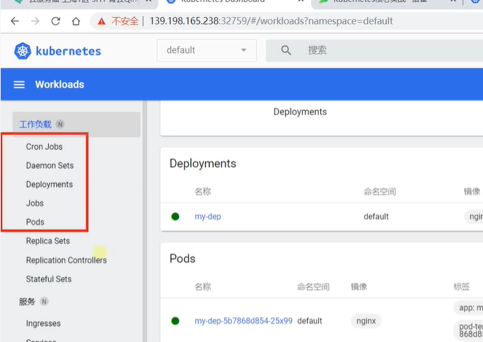

# 28.k8s核心实战-工作负载-工作负载总结

​		我们之前了解了使用Deployment部署给我们带来了诸多的优点，但未来在我们使用k8s系统过程中，我们也应该优先考虑使用Deployment部署应用，而不是直接使用kubectl run这种方式运行启动一个Pod。

​		在k8s中类似于我们Deployment的资源还有更多，如StatefulSet、DeamonSet、Job等类型资源，我们都称为工作负载。

​	我们可以参照这个图：

​	**Deployment**：我们一般使用Deployment部署的应用一般都是无状态的，比如微服务，我们只关心它有几个副本，他都所在哪些机器，用他来处理请求。

​	**StatefulSet**：而我们微服务的数据一般都是要提供数据中间件来处理的，所以未来我们k8s可能还需要部署一些有状态应用，比如redis这些数据中间件，**有状态指的就是例如一个副部Pod宕机后，重新拉起来一个新的Pod，这个新的Pod中是有之前存储的数据的或保存应用的内容的**（之前的数据会挂载到外面）。

​	有状态还有一个特点就是 可以为服务提供稳定的网络，比如我们之前使用Deployment部署的属于无状态应用，可能宕机重新拉起新的Pod后IP发生了改变，而有状态的部署就不一样了，他宕机后重新拉起来的Pod还是会使用原来的IP地址的

​	**DaemonSet**：这个是用来部署守护进程集，比如我们集群中有十几台机器，每个机器可能都产生大量的日志，所以我们未来可能给每个机器都驻留一个日志收集器，这样的话就可以把所有机器的日志全部都收集过来，发送到我们的日志中心，像这种场景 我们就可以使用DaemonSet进行部署，这样DaemonSet控制的Pod相当于在每个机器上都会有一份，想一个机器部署多份是不可以的。

​	**Job/CronJob**:他称为任务或者是定时任务，比如我们做的一些事情，像垃圾清理工作，每天晚上2点运行一次垃圾清理，像这些应用Pod，我们就可以使用Job这些工作负载来控制。

​	最终一句话：在k8s中未来我们不直接部署Pod，虽然说Pod才是应用的真正载体，但是我们是使用这些工作负载来控制Pod，这样让每一个Pod都具有比他原先更强大一些功能。

​	对于其他工作负载的使用我们也可以参考k8s的官方文档里面写的也非常的详细

https://kubernetes.io/zh/docs/concepts/workloads/controllers/

​	

​	在我们的dashboard可视化界面也可以看到我们的工作负载

​	无论我们使用的是哪种工作负载-他们都是用来控制Pod的。

​	现在有个问题就是，我们现在部署的所有的应用都是不能在外网进行访问的，我们现在部署的应用都是只能在内网机器进行访问，所以我们之后来探究一下我们这些Pod如何给他们添加网络的访问

