# 29.k8s核心实战-服务网络-Service服务发现ClusterIP方式


#### 1.k8s的Service功能及概念

​		我们现在了解一下k8s的Service，所谓的服务是k8s用来做服务发现功能的。

​		举个例子：假设我们现在使用deployment部署一个应用后台管理系统，我们采用前后端分离的方式进行开发的，假设我们前端使用的vue开发的，这就需要我们配置好后端的api地址，如果按照以前的方式我们配置一个IP地址他只访问一个Pod，但是如果这个Pod宕机了那么服务就无法提供了，所以我们希望这些Pod对外提供一个公共的地址。

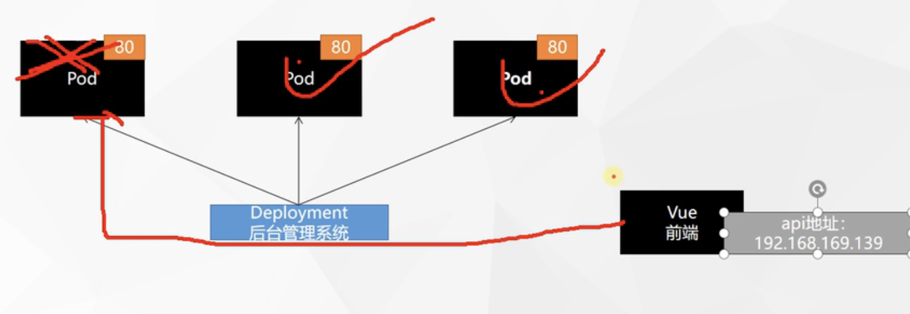


​	这三个Pod其实对外是一组服务，那么在k8s中这一组服务就叫Service，他是将一组Pods公开为网络服务的抽象方法。


​	就像我们这个例子，我们这组Pods都是后台管理系统，Service为他们统一暴露一个地址，所以我们的前端只需要配置一个Service的IP地址就可以了，这样呢我们还需要达成的效果是当我们前端来访问Service的时候可以负载均衡的进行访问

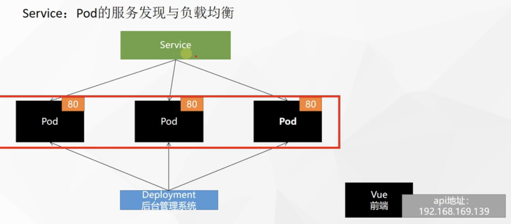

​	还需要做到的是假如有一个Pod宕机了Service还可以自动发现，之后前端发起的请求就负载均衡到其他正常运行的Pod上

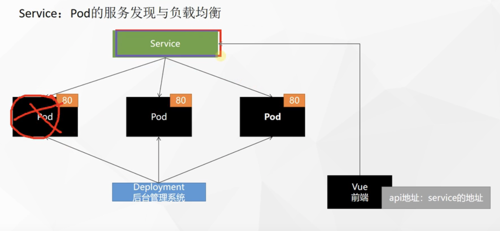


#### 2.测试演示Service功能

​	我们先来可视化界面中，这是我们之前部署的3个nginx，我们选择一个Pod进行操作一下进入容器，我们假设这就是后台管理系统，我们来到nginx的页面

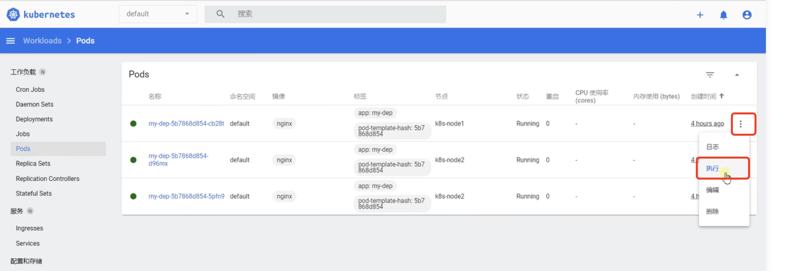


​	我们将这个页面内容改一下比如输出1111，echo 1111 > index.html

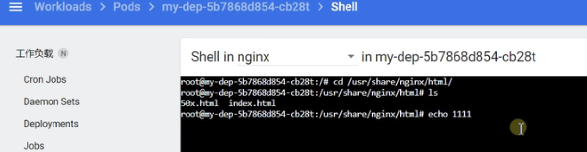


​	我们第二个Pod也这么改

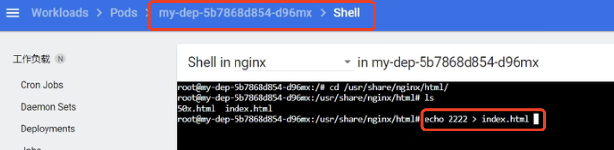


第三个也一样改为3333

​	我们使用curl访问一下，是没有问题的

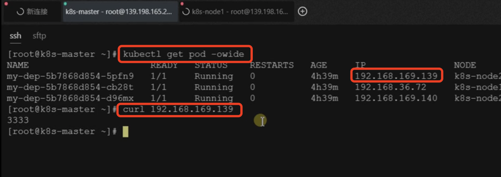


​	那么我们现在想把这三个Pod配置一个公共的IP地址，怎么配呢？使用命令

​	kubectl expose deploy my-dep --port=8000 --target-port=80

​		expose 暴露-- deploy部署的名为my-dep的全部Pod

​		重要的几个参数： --port=8000相当于这个服务将使用8000端口对外暴露

​									--target-port=80这个是目标端口，相当于访问容器内部的端口

​	运行完这个命令提示我们service/my-dep给我们创建了一个新的service资源

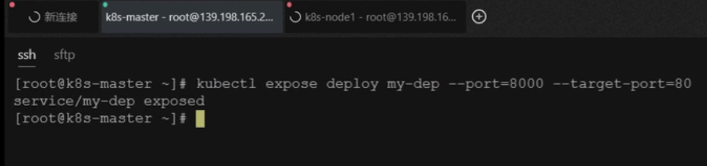


​	我们使用kubectl get service可以查看service资源

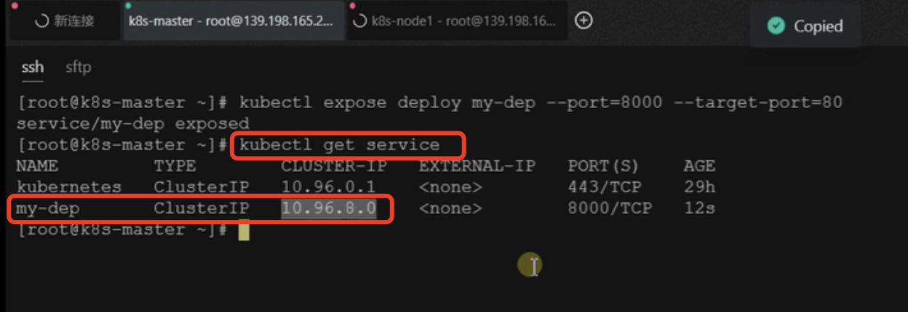


​	我们使用curl来访问这个service的IP加8000对外的端口，发现会自动为我们负载均衡的访问我们的Pod

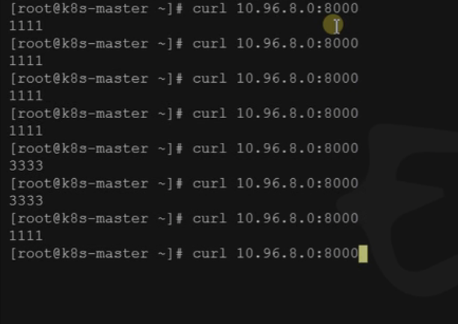

​	图解：Service

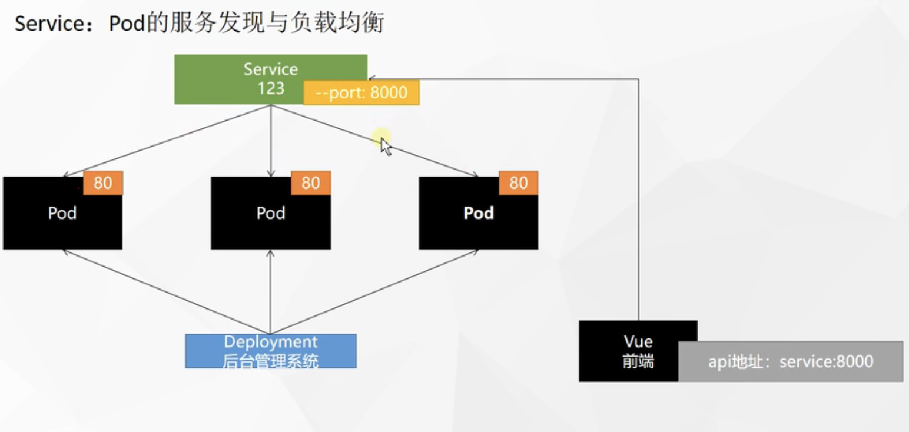


```
#暴露Deploy
kubectl expose deployment my-dep --port=8000 --target-port=80

#使用标签检索Pod
kubectl get pod -l app=my-dep
```


#### 3.配置文件的方式创建Service

​	我们也可以使用yaml配置文件的方式进行配置Service

​	在这个配置文件中重要的就是kind是Service功能，还有port和targetPort，更重要的是selector下的app：my-dep 是部署的名称，相当于我的这个Service是把那一组的Pod暴露出来的。

```yaml
apiVersion: v1
kind: Service
metadata:
  labels:
    app: my-dep
  name: my-dep
spec:
  selector:
    app: my-dep
  ports:
  - port: 8000
    protocol: TCP
    targetPort: 80
```


每一个Pod其实在部署期间会有一个这样的东西--标签

kubectl get pod --show-labels

​	每个pod都会有一个标签如app=my-dep，我们相当于按标签来选择同样一组Pod的

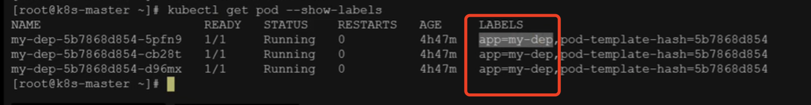

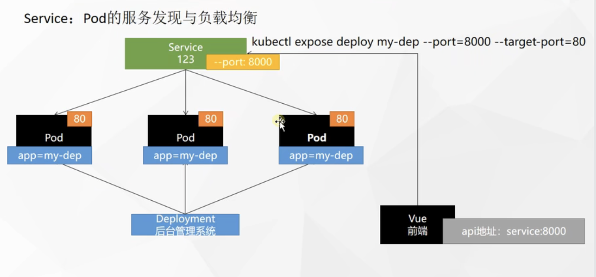

​	所以我们看到Service的优点就是可以按标签选择一组Pod，然后对外提供统一服务因为我们service会有一个固定的IP，这个IP我们注意默认也是在集群内有效--外网访问不到


​	比如我们在其他集群节点机器进行访问也是没有问题的

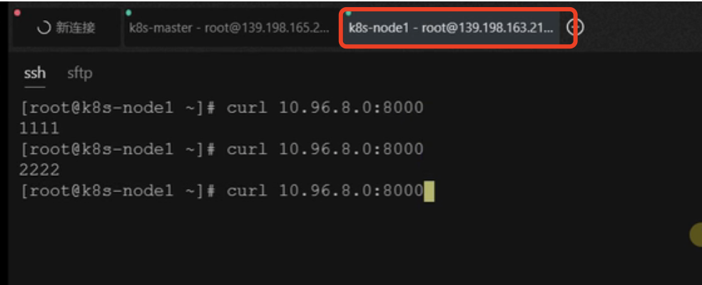


​	甚至我们可以以域名的方式访问也是可以的，默认的域名是（服务名.所在名称空间.svc）

​	注意这种域名的访问只能是在容器中进行的

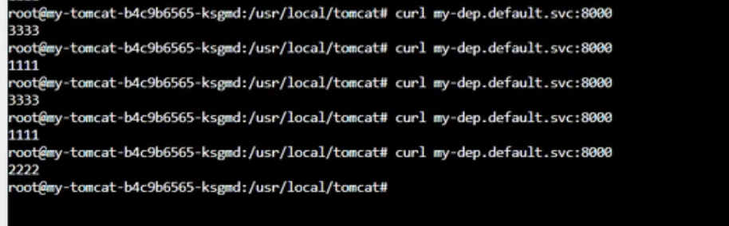


​	这种Service域名如果是在机器节点中访问是不行的

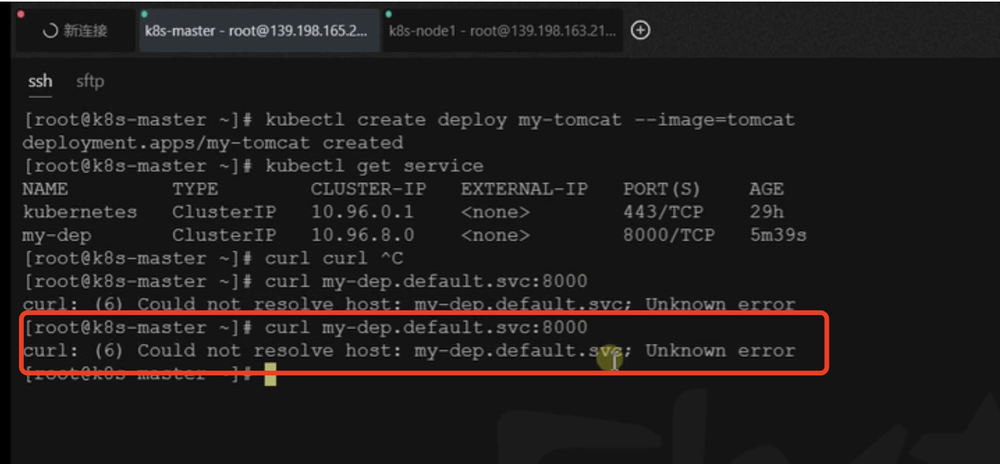


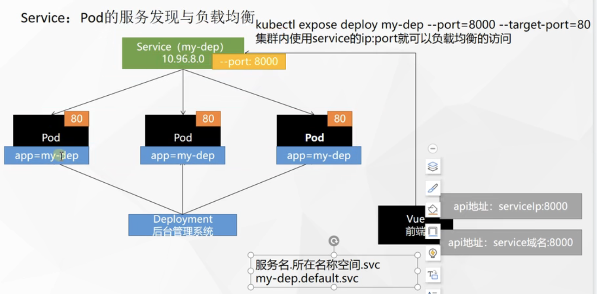

​	这种模式就是Service的默认ClusterIP的类型

​	我们看到这个Service的Type就是ClusterIP--称为集群IP类型

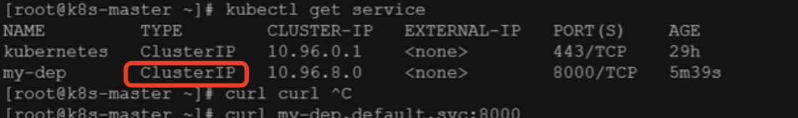

​	也就是说我们暴露的这个IP只能在集群内部访问


#### ClusterIP

```
# 等同于没有--type的
kubectl expose deployment my-dep --port=8000 --target-port=80 --type=ClusterIP
```


```yaml
apiVersion: v1
kind: Service
metadata:
  labels:
    app: my-dep
  name: my-dep
spec:
  ports:
  - port: 8000
    protocol: TCP
    targetPort: 80
  selector:
    app: my-dep
  type: ClusterIP
```


​	如果说我们想让大家都能访问，我们就需要使用另外一种类型叫NodePort


https://www.bilibili.com/video/BV13Q4y1C7hS?p=54


​	

​	


​	


​	


