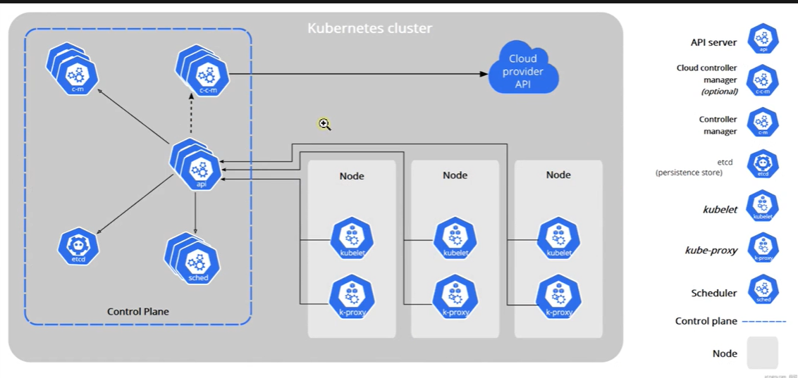
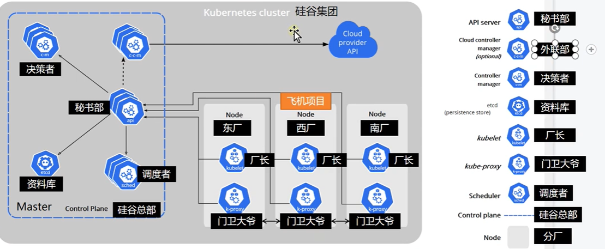

# 3.kubermetes基础-组件架构


## 组件架构

​		如下图：这块也是k8s中比较难理解的部分。


- 右侧的部分就是整个k8s要运行起来需要的核心组件，包括每个组件的名字如 API Server
- 每个组件要干什么--就是左侧的图（这个图不是太好理解）
  - 我们对下图做一个比喻的理解

```
	假设下图的k8s集群，就是一个硅谷集团，硅谷集团就代表了整个集团的产业集群，硅谷集团要开发一些项目，比如要搞飞机，火车等等。
	1、而真正研发项目的可能是硅谷集团下的一些分厂，在k8s集群中每个节点node就代表每个分厂
	2、想让整个分厂干活就需要有一个控制中心-集团总部，在k8s集群中就是Control Plane 控制中心，每个分厂要干什么需要总部发号施令，也就是k8s的master节点
	3.我们准备干活就需要有决策者由他决定干什么活，在k8s中就是c-m（controller manager），比如决策者要研究飞机，那么签署一个研究飞机的文件
	4.集团的文件就需要一个文件的资料库存放，在k8s中就是etcd，一个类似于redis的KV存储库
	5.这个决策者要把资料存放到资料库中，是经过秘书来中转的，在k8s中称为API Server
	6.那么资料文件下发后，由那个厂区开搞呢，因为每个厂区的配置都不一样，然后就需要调度者，由调度者决定是由那个厂进行生产，在k8s中调度者就是Scheduler，那么调度者决定由那个厂来搞项目也是会通知到秘书，由秘书来通知厂区和资料库进行回档保存操作
	7.秘书和厂区是如何进行联系的，是通过厂长，在k8s中 kubelet就代表厂长
	8.比如现在有个领导人来视察，想视察飞机的项目，那么怎么能知道飞机项目在哪个流水线上，就由门卫进行引导，这个门卫在k8s中就是K-proxy，各个厂的门卫也是互通的，比如领导来到东厂视察项目，而项目在西厂，门卫就会告诉领导去西厂视察吧
	9.云决策者--外联部，就是我们决策者要不要和外边的厂商进行合作，就是我们对接外部的
```





整个工作示意图




