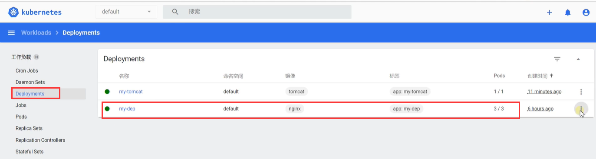
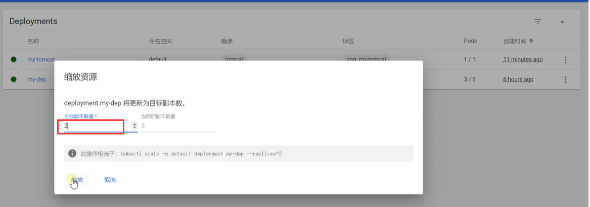
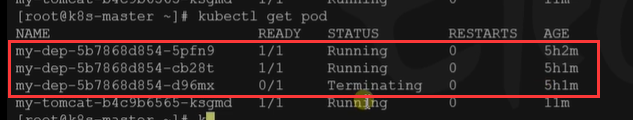
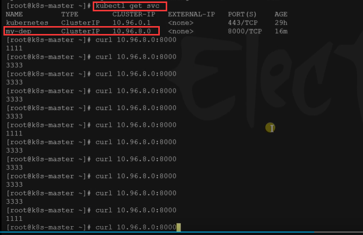
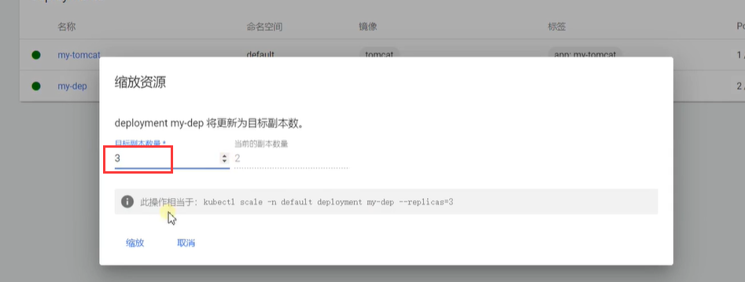
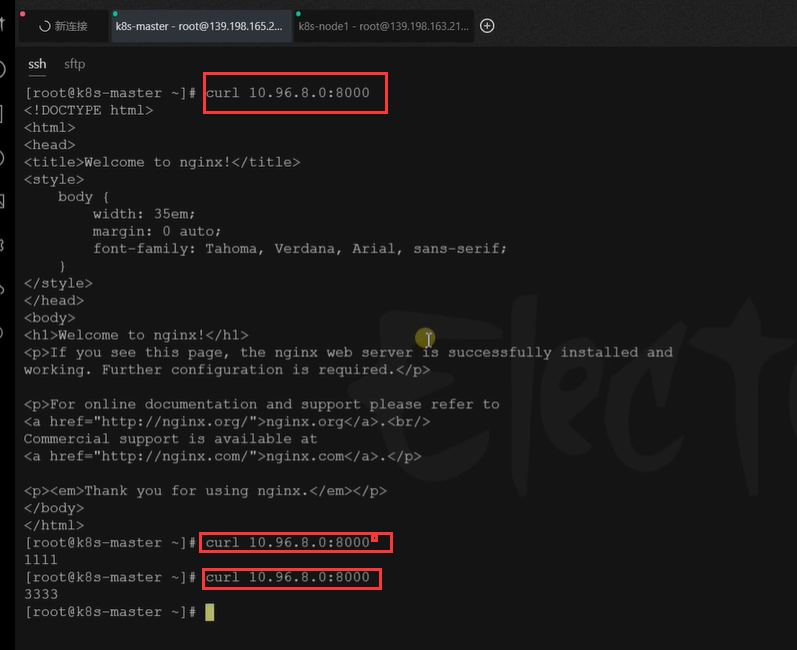

# 30.k8s核心实战-服务网络-测试Service的服务发现

​		之前我们使用Service将一组Pod统一对外暴露一个IP和端口，以后我们只需要访问Service所在的IP和端口就可以负载均衡的访问这组Pod，并且具有服务发现的能力

#### 服务发现

​		例如：我们之前部署的my-dep有3个Nginx的Pod

​	我们现在扩缩容一下，缩放到2个副本

​	我们可以看到最终会有一个Pod进行下线

​	我们现在查看一下service简称svc，然后请求一下service地址和端口，我们看一下，我们发现现在无论我们发送多少请求都不会出现2222了，因为这个Pod已经下线

如果我们再进行一个缩扩容，扩容为3个副本

我们测试请求发现会自动的发现新副本Pod

​	所以说无论这个应用是上线还是下线，他们Pod都会自动加入到Service中来，这就是我们测试的Service服务发现机制。

