# 31.k8s核心实战-服务网络-Service服务暴露NodePort方式


​		我们使用默认的暴露发布的方式其实是ClusterIP方式，也就是集群IP方式，kubectl expose deploy deployName --port=集群端口 --target-port=容器端口 --type=默认是ClusterIP，默认也可以不写type类型，这种方式我们只能在集群内部访问。


​		而我们如果真正想在公网上访问的话，我们还可以使用另外一种方式叫NodePort，这种方式是在集群外部也是可以进行访问的，翻译过来他叫节点端口，所谓的节点端口意思就是我接下来暴露的这个服务会在每个节点都开一个端口，这样的话就可以使用每个节点的公网IP加端口的方式访问了


​	我们先把之前的service删除掉，免得后续影响我们实验

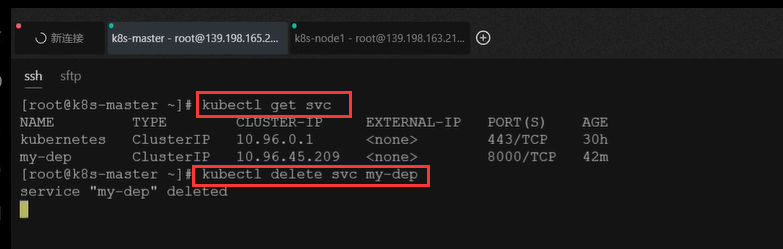


​	我们重新暴露一下以类型为 NodePort的方式

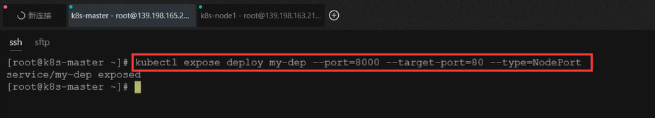


​	然后我们看一下这个Service，我们发现这个Service也会有集群IP地址，我们使用集群ip访问是没有问题的

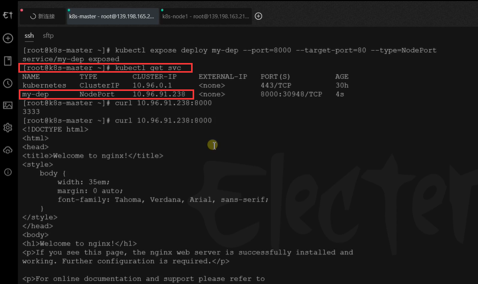

​	

​     我们发现我们的这个service多了30948的端口，这个端口是k8s随机为我们开的一个端口，而且这个端口最大的特点就是每台机器都开，所以为什么叫NodePort

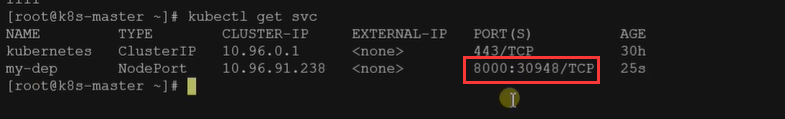


​	这样就相当于我们访问节点的IP+这个k8s给随机分配的端口我们就可以访问到我们的应用

​	我们要注意这个端口是随机的但是也是有范围的，这个范围是在30000-32767之间


​	所以为了我们访问方便，我们就在我们的服务器-安全组-添加规则

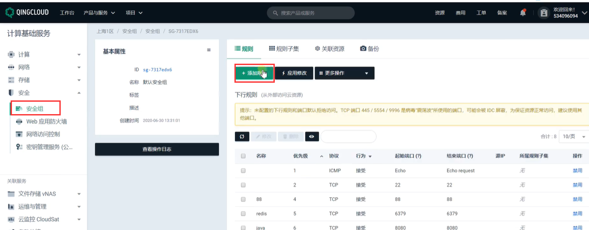


​	我们开放30000-32767的端口

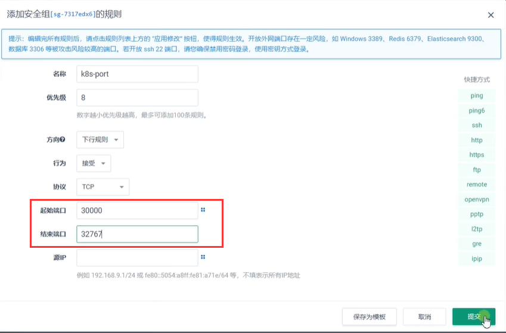


然后点击应用修改

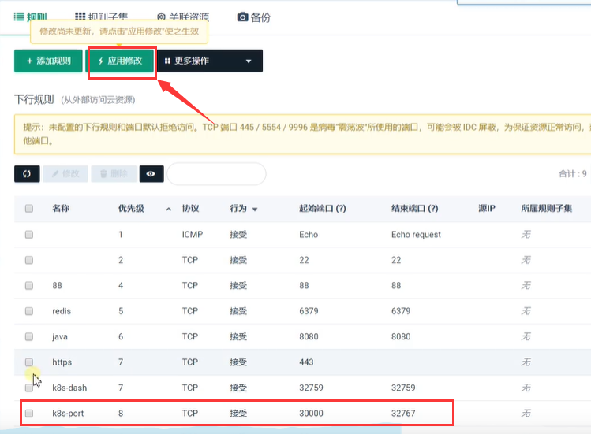


​	NodePort方式的图解：

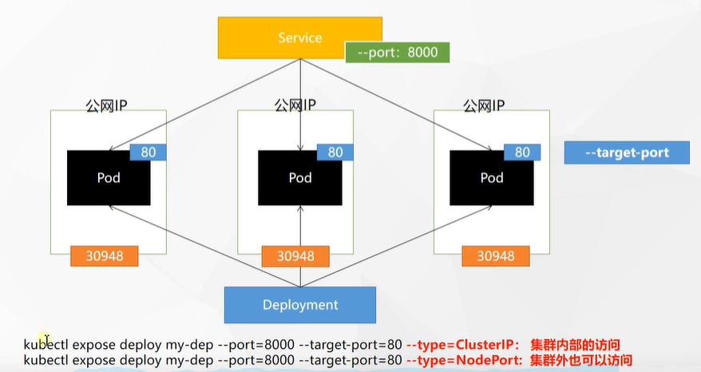


​	比如我们现在拿master节点的Ip来进行一下请求

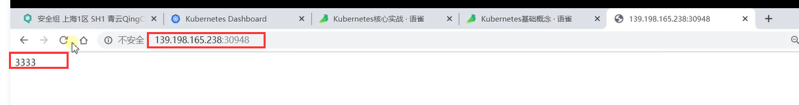

​	我们切换一个浏览器访问，发现打印的是1111

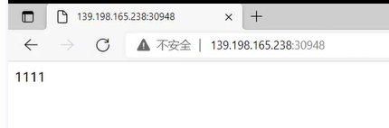

​		这就说明已经进行了负载均衡处理了


​	任何集群公网IP都是可以进行访问的，我们使用node1节点的IP测试一下

​				也是可以访问到我们的Pod的

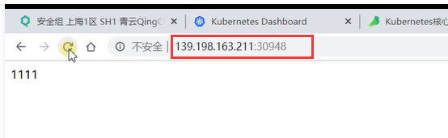


​	  我们暴露的这个Service除了我们使用机器端口能访问，剩下的特性也都还在，比如我们可以拿他的ip，也可以在Pod内使用他的域名

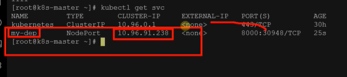


```
kubectl expose deployment my-dep --port=8000 --target-port=80 --type=NodePort
```


​	文件的配置方式

```yaml
apiVersion: v1
kind: Service
metadata:
  labels:
    app: my-dep
  name: my-dep
spec:
  ports:
  - port: 8000
    protocol: TCP
    targetPort: 80
  selector:
    app: my-dep
  type: NodePort

```

NodePort范围在 30000-32767 之间


​	


