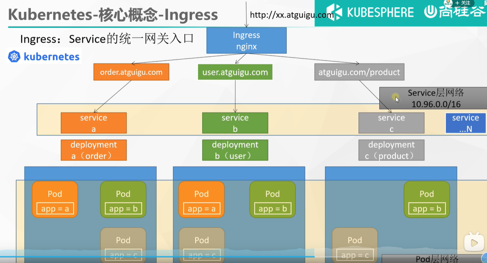
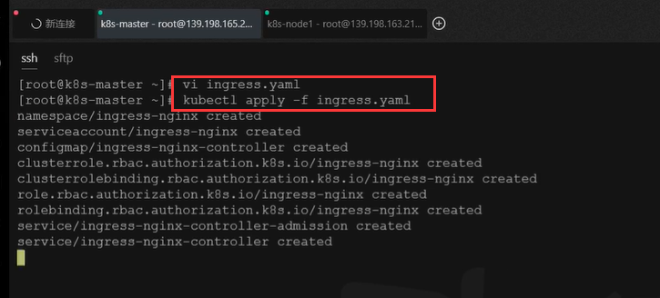
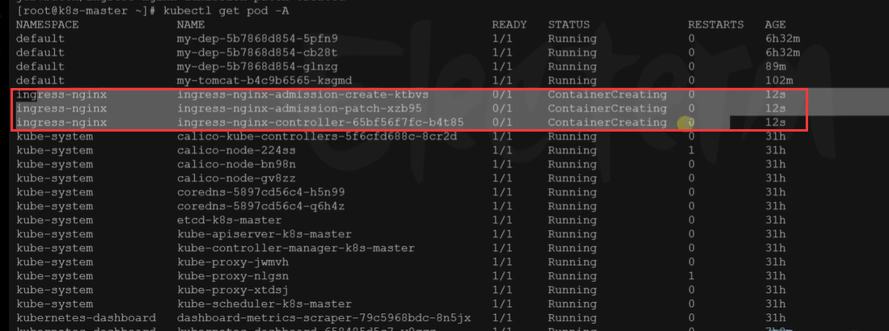
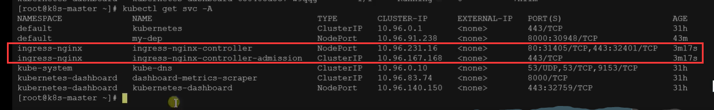
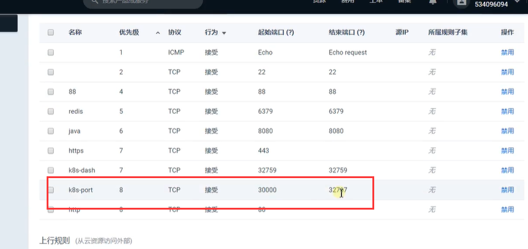
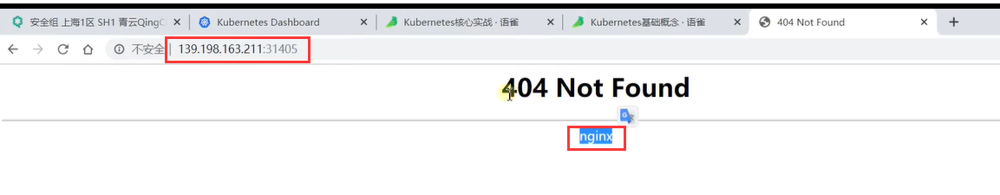
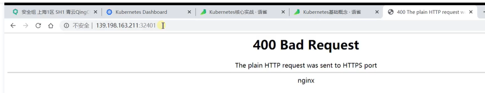
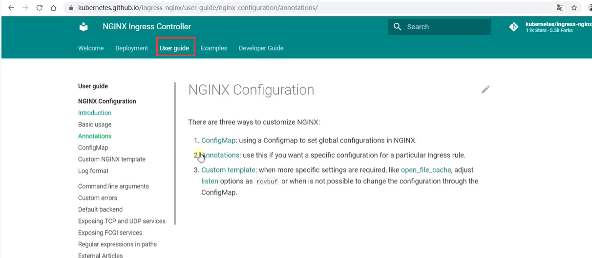

# 32.k8s核心实战-服务网络-Ingress网络模型分析及安装

​		

#### Ingress

​	Ingress也是k8s的核心概念，Ingress翻译过来就是入口的意思，k8s希望Ingress能成为我们集群流量的唯一入口。

​	举个例子：我们未来在k8s中部署我们很多的服务应用，我们这些服务要对外提供功能，所有的请求流量都应该先通过我们的Ingress这一层，由他负责把这些流量打给那些服务，相当于Ingress是我们集群统一的网关入口

​	我们的Service是所有Pod的流量入口，而我们的Ingress又是所有的Service流量入口

​	我们的请求首先进入Ingress然后由Ingress交给Service处理，Service交给Pod处理


​	我们理解一下Ingress想做什么，我们参照一下这个图




​	所有的请求进入Ingress我们判断是什么请求什么路径然后进行路由到对应的Service，然后由Service负载均衡到Pod，这个Ingress底层就是使用Nginx来做的。


​		我们想要使用这个Ingress我们就需要先安装这个Ingress，Ingress默认k8s是不带的


#### 1、安装Ingress

​		有了k8s我们安装东西都很简单，比如我们找到需要安装的yaml文件，然后我们kubectl apply 文件名称就可以了


```
wget https://raw.githubusercontent.com/kubernetes/ingress-nginx/controller-v0.47.0/deploy/static/provider/baremetal/deploy.yaml

#修改镜像
vi deploy.yaml
#将image的值改为如下值：
registry.cn-hangzhou.aliyuncs.com/lfy_k8s_images/ingress-nginx-controller:v0.46.0

# 检查安装的结果
kubectl get pod,svc -n ingress-nginx

# 最后别忘记把svc暴露的端口要放行
```


​	我们要注意--可能我们下载比较慢或者说下载不下来原因是外网导致的，可以使用修改镜像地址的方式处理

如果下载不到，用以下文件

```yaml
apiVersion: v1
kind: Namespace
metadata:
  name: ingress-nginx
  labels:
    app.kubernetes.io/name: ingress-nginx
    app.kubernetes.io/instance: ingress-nginx

---
# Source: ingress-nginx/templates/controller-serviceaccount.yaml
apiVersion: v1
kind: ServiceAccount
metadata:
  labels:
    helm.sh/chart: ingress-nginx-3.33.0
    app.kubernetes.io/name: ingress-nginx
    app.kubernetes.io/instance: ingress-nginx
    app.kubernetes.io/version: 0.47.0
    app.kubernetes.io/managed-by: Helm
    app.kubernetes.io/component: controller
  name: ingress-nginx
  namespace: ingress-nginx
automountServiceAccountToken: true
---
# Source: ingress-nginx/templates/controller-configmap.yaml
apiVersion: v1
kind: ConfigMap
metadata:
  labels:
    helm.sh/chart: ingress-nginx-3.33.0
    app.kubernetes.io/name: ingress-nginx
    app.kubernetes.io/instance: ingress-nginx
    app.kubernetes.io/version: 0.47.0
    app.kubernetes.io/managed-by: Helm
    app.kubernetes.io/component: controller
  name: ingress-nginx-controller
  namespace: ingress-nginx
data:
---
# Source: ingress-nginx/templates/clusterrole.yaml
apiVersion: rbac.authorization.k8s.io/v1
kind: ClusterRole
metadata:
  labels:
    helm.sh/chart: ingress-nginx-3.33.0
    app.kubernetes.io/name: ingress-nginx
    app.kubernetes.io/instance: ingress-nginx
    app.kubernetes.io/version: 0.47.0
    app.kubernetes.io/managed-by: Helm
  name: ingress-nginx
rules:
  - apiGroups:
      - ''
    resources:
      - configmaps
      - endpoints
      - nodes
      - pods
      - secrets
    verbs:
      - list
      - watch
  - apiGroups:
      - ''
    resources:
      - nodes
    verbs:
      - get
  - apiGroups:
      - ''
    resources:
      - services
    verbs:
      - get
      - list
      - watch
  - apiGroups:
      - extensions
      - networking.k8s.io   # k8s 1.14+
    resources:
      - ingresses
    verbs:
      - get
      - list
      - watch
  - apiGroups:
      - ''
    resources:
      - events
    verbs:
      - create
      - patch
  - apiGroups:
      - extensions
      - networking.k8s.io   # k8s 1.14+
    resources:
      - ingresses/status
    verbs:
      - update
  - apiGroups:
      - networking.k8s.io   # k8s 1.14+
    resources:
      - ingressclasses
    verbs:
      - get
      - list
      - watch
---
# Source: ingress-nginx/templates/clusterrolebinding.yaml
apiVersion: rbac.authorization.k8s.io/v1
kind: ClusterRoleBinding
metadata:
  labels:
    helm.sh/chart: ingress-nginx-3.33.0
    app.kubernetes.io/name: ingress-nginx
    app.kubernetes.io/instance: ingress-nginx
    app.kubernetes.io/version: 0.47.0
    app.kubernetes.io/managed-by: Helm
  name: ingress-nginx
roleRef:
  apiGroup: rbac.authorization.k8s.io
  kind: ClusterRole
  name: ingress-nginx
subjects:
  - kind: ServiceAccount
    name: ingress-nginx
    namespace: ingress-nginx
---
# Source: ingress-nginx/templates/controller-role.yaml
apiVersion: rbac.authorization.k8s.io/v1
kind: Role
metadata:
  labels:
    helm.sh/chart: ingress-nginx-3.33.0
    app.kubernetes.io/name: ingress-nginx
    app.kubernetes.io/instance: ingress-nginx
    app.kubernetes.io/version: 0.47.0
    app.kubernetes.io/managed-by: Helm
    app.kubernetes.io/component: controller
  name: ingress-nginx
  namespace: ingress-nginx
rules:
  - apiGroups:
      - ''
    resources:
      - namespaces
    verbs:
      - get
  - apiGroups:
      - ''
    resources:
      - configmaps
      - pods
      - secrets
      - endpoints
    verbs:
      - get
      - list
      - watch
  - apiGroups:
      - ''
    resources:
      - services
    verbs:
      - get
      - list
      - watch
  - apiGroups:
      - extensions
      - networking.k8s.io   # k8s 1.14+
    resources:
      - ingresses
    verbs:
      - get
      - list
      - watch
  - apiGroups:
      - extensions
      - networking.k8s.io   # k8s 1.14+
    resources:
      - ingresses/status
    verbs:
      - update
  - apiGroups:
      - networking.k8s.io   # k8s 1.14+
    resources:
      - ingressclasses
    verbs:
      - get
      - list
      - watch
  - apiGroups:
      - ''
    resources:
      - configmaps
    resourceNames:
      - ingress-controller-leader-nginx
    verbs:
      - get
      - update
  - apiGroups:
      - ''
    resources:
      - configmaps
    verbs:
      - create
  - apiGroups:
      - ''
    resources:
      - events
    verbs:
      - create
      - patch
---
# Source: ingress-nginx/templates/controller-rolebinding.yaml
apiVersion: rbac.authorization.k8s.io/v1
kind: RoleBinding
metadata:
  labels:
    helm.sh/chart: ingress-nginx-3.33.0
    app.kubernetes.io/name: ingress-nginx
    app.kubernetes.io/instance: ingress-nginx
    app.kubernetes.io/version: 0.47.0
    app.kubernetes.io/managed-by: Helm
    app.kubernetes.io/component: controller
  name: ingress-nginx
  namespace: ingress-nginx
roleRef:
  apiGroup: rbac.authorization.k8s.io
  kind: Role
  name: ingress-nginx
subjects:
  - kind: ServiceAccount
    name: ingress-nginx
    namespace: ingress-nginx
---
# Source: ingress-nginx/templates/controller-service-webhook.yaml
apiVersion: v1
kind: Service
metadata:
  labels:
    helm.sh/chart: ingress-nginx-3.33.0
    app.kubernetes.io/name: ingress-nginx
    app.kubernetes.io/instance: ingress-nginx
    app.kubernetes.io/version: 0.47.0
    app.kubernetes.io/managed-by: Helm
    app.kubernetes.io/component: controller
  name: ingress-nginx-controller-admission
  namespace: ingress-nginx
spec:
  type: ClusterIP
  ports:
    - name: https-webhook
      port: 443
      targetPort: webhook
  selector:
    app.kubernetes.io/name: ingress-nginx
    app.kubernetes.io/instance: ingress-nginx
    app.kubernetes.io/component: controller
---
# Source: ingress-nginx/templates/controller-service.yaml
apiVersion: v1
kind: Service
metadata:
  annotations:
  labels:
    helm.sh/chart: ingress-nginx-3.33.0
    app.kubernetes.io/name: ingress-nginx
    app.kubernetes.io/instance: ingress-nginx
    app.kubernetes.io/version: 0.47.0
    app.kubernetes.io/managed-by: Helm
    app.kubernetes.io/component: controller
  name: ingress-nginx-controller
  namespace: ingress-nginx
spec:
  type: NodePort
  ports:
    - name: http
      port: 80
      protocol: TCP
      targetPort: http
    - name: https
      port: 443
      protocol: TCP
      targetPort: https
  selector:
    app.kubernetes.io/name: ingress-nginx
    app.kubernetes.io/instance: ingress-nginx
    app.kubernetes.io/component: controller
---
# Source: ingress-nginx/templates/controller-deployment.yaml
apiVersion: apps/v1
kind: Deployment
metadata:
  labels:
    helm.sh/chart: ingress-nginx-3.33.0
    app.kubernetes.io/name: ingress-nginx
    app.kubernetes.io/instance: ingress-nginx
    app.kubernetes.io/version: 0.47.0
    app.kubernetes.io/managed-by: Helm
    app.kubernetes.io/component: controller
  name: ingress-nginx-controller
  namespace: ingress-nginx
spec:
  selector:
    matchLabels:
      app.kubernetes.io/name: ingress-nginx
      app.kubernetes.io/instance: ingress-nginx
      app.kubernetes.io/component: controller
  revisionHistoryLimit: 10
  minReadySeconds: 0
  template:
    metadata:
      labels:
        app.kubernetes.io/name: ingress-nginx
        app.kubernetes.io/instance: ingress-nginx
        app.kubernetes.io/component: controller
    spec:
      dnsPolicy: ClusterFirst
      containers:
        - name: controller
          image: registry.cn-hangzhou.aliyuncs.com/lfy_k8s_images/ingress-nginx-controller:v0.46.0
          imagePullPolicy: IfNotPresent
          lifecycle:
            preStop:
              exec:
                command:
                  - /wait-shutdown
          args:
            - /nginx-ingress-controller
            - --election-id=ingress-controller-leader
            - --ingress-class=nginx
            - --configmap=$(POD_NAMESPACE)/ingress-nginx-controller
            - --validating-webhook=:8443
            - --validating-webhook-certificate=/usr/local/certificates/cert
            - --validating-webhook-key=/usr/local/certificates/key
          securityContext:
            capabilities:
              drop:
                - ALL
              add:
                - NET_BIND_SERVICE
            runAsUser: 101
            allowPrivilegeEscalation: true
          env:
            - name: POD_NAME
              valueFrom:
                fieldRef:
                  fieldPath: metadata.name
            - name: POD_NAMESPACE
              valueFrom:
                fieldRef:
                  fieldPath: metadata.namespace
            - name: LD_PRELOAD
              value: /usr/local/lib/libmimalloc.so
          livenessProbe:
            failureThreshold: 5
            httpGet:
              path: /healthz
              port: 10254
              scheme: HTTP
            initialDelaySeconds: 10
            periodSeconds: 10
            successThreshold: 1
            timeoutSeconds: 1
          readinessProbe:
            failureThreshold: 3
            httpGet:
              path: /healthz
              port: 10254
              scheme: HTTP
            initialDelaySeconds: 10
            periodSeconds: 10
            successThreshold: 1
            timeoutSeconds: 1
          ports:
            - name: http
              containerPort: 80
              protocol: TCP
            - name: https
              containerPort: 443
              protocol: TCP
            - name: webhook
              containerPort: 8443
              protocol: TCP
          volumeMounts:
            - name: webhook-cert
              mountPath: /usr/local/certificates/
              readOnly: true
          resources:
            requests:
              cpu: 100m
              memory: 90Mi
      nodeSelector:
        kubernetes.io/os: linux
      serviceAccountName: ingress-nginx
      terminationGracePeriodSeconds: 300
      volumes:
        - name: webhook-cert
          secret:
            secretName: ingress-nginx-admission
---
# Source: ingress-nginx/templates/admission-webhooks/validating-webhook.yaml
# before changing this value, check the required kubernetes version
# https://kubernetes.io/docs/reference/access-authn-authz/extensible-admission-controllers/#prerequisites
apiVersion: admissionregistration.k8s.io/v1
kind: ValidatingWebhookConfiguration
metadata:
  labels:
    helm.sh/chart: ingress-nginx-3.33.0
    app.kubernetes.io/name: ingress-nginx
    app.kubernetes.io/instance: ingress-nginx
    app.kubernetes.io/version: 0.47.0
    app.kubernetes.io/managed-by: Helm
    app.kubernetes.io/component: admission-webhook
  name: ingress-nginx-admission
webhooks:
  - name: validate.nginx.ingress.kubernetes.io
    matchPolicy: Equivalent
    rules:
      - apiGroups:
          - networking.k8s.io
        apiVersions:
          - v1beta1
        operations:
          - CREATE
          - UPDATE
        resources:
          - ingresses
    failurePolicy: Fail
    sideEffects: None
    admissionReviewVersions:
      - v1
      - v1beta1
    clientConfig:
      service:
        namespace: ingress-nginx
        name: ingress-nginx-controller-admission
        path: /networking/v1beta1/ingresses
---
# Source: ingress-nginx/templates/admission-webhooks/job-patch/serviceaccount.yaml
apiVersion: v1
kind: ServiceAccount
metadata:
  name: ingress-nginx-admission
  annotations:
    helm.sh/hook: pre-install,pre-upgrade,post-install,post-upgrade
    helm.sh/hook-delete-policy: before-hook-creation,hook-succeeded
  labels:
    helm.sh/chart: ingress-nginx-3.33.0
    app.kubernetes.io/name: ingress-nginx
    app.kubernetes.io/instance: ingress-nginx
    app.kubernetes.io/version: 0.47.0
    app.kubernetes.io/managed-by: Helm
    app.kubernetes.io/component: admission-webhook
  namespace: ingress-nginx
---
# Source: ingress-nginx/templates/admission-webhooks/job-patch/clusterrole.yaml
apiVersion: rbac.authorization.k8s.io/v1
kind: ClusterRole
metadata:
  name: ingress-nginx-admission
  annotations:
    helm.sh/hook: pre-install,pre-upgrade,post-install,post-upgrade
    helm.sh/hook-delete-policy: before-hook-creation,hook-succeeded
  labels:
    helm.sh/chart: ingress-nginx-3.33.0
    app.kubernetes.io/name: ingress-nginx
    app.kubernetes.io/instance: ingress-nginx
    app.kubernetes.io/version: 0.47.0
    app.kubernetes.io/managed-by: Helm
    app.kubernetes.io/component: admission-webhook
rules:
  - apiGroups:
      - admissionregistration.k8s.io
    resources:
      - validatingwebhookconfigurations
    verbs:
      - get
      - update
---
# Source: ingress-nginx/templates/admission-webhooks/job-patch/clusterrolebinding.yaml
apiVersion: rbac.authorization.k8s.io/v1
kind: ClusterRoleBinding
metadata:
  name: ingress-nginx-admission
  annotations:
    helm.sh/hook: pre-install,pre-upgrade,post-install,post-upgrade
    helm.sh/hook-delete-policy: before-hook-creation,hook-succeeded
  labels:
    helm.sh/chart: ingress-nginx-3.33.0
    app.kubernetes.io/name: ingress-nginx
    app.kubernetes.io/instance: ingress-nginx
    app.kubernetes.io/version: 0.47.0
    app.kubernetes.io/managed-by: Helm
    app.kubernetes.io/component: admission-webhook
roleRef:
  apiGroup: rbac.authorization.k8s.io
  kind: ClusterRole
  name: ingress-nginx-admission
subjects:
  - kind: ServiceAccount
    name: ingress-nginx-admission
    namespace: ingress-nginx
---
# Source: ingress-nginx/templates/admission-webhooks/job-patch/role.yaml
apiVersion: rbac.authorization.k8s.io/v1
kind: Role
metadata:
  name: ingress-nginx-admission
  annotations:
    helm.sh/hook: pre-install,pre-upgrade,post-install,post-upgrade
    helm.sh/hook-delete-policy: before-hook-creation,hook-succeeded
  labels:
    helm.sh/chart: ingress-nginx-3.33.0
    app.kubernetes.io/name: ingress-nginx
    app.kubernetes.io/instance: ingress-nginx
    app.kubernetes.io/version: 0.47.0
    app.kubernetes.io/managed-by: Helm
    app.kubernetes.io/component: admission-webhook
  namespace: ingress-nginx
rules:
  - apiGroups:
      - ''
    resources:
      - secrets
    verbs:
      - get
      - create
---
# Source: ingress-nginx/templates/admission-webhooks/job-patch/rolebinding.yaml
apiVersion: rbac.authorization.k8s.io/v1
kind: RoleBinding
metadata:
  name: ingress-nginx-admission
  annotations:
    helm.sh/hook: pre-install,pre-upgrade,post-install,post-upgrade
    helm.sh/hook-delete-policy: before-hook-creation,hook-succeeded
  labels:
    helm.sh/chart: ingress-nginx-3.33.0
    app.kubernetes.io/name: ingress-nginx
    app.kubernetes.io/instance: ingress-nginx
    app.kubernetes.io/version: 0.47.0
    app.kubernetes.io/managed-by: Helm
    app.kubernetes.io/component: admission-webhook
  namespace: ingress-nginx
roleRef:
  apiGroup: rbac.authorization.k8s.io
  kind: Role
  name: ingress-nginx-admission
subjects:
  - kind: ServiceAccount
    name: ingress-nginx-admission
    namespace: ingress-nginx
---
# Source: ingress-nginx/templates/admission-webhooks/job-patch/job-createSecret.yaml
apiVersion: batch/v1
kind: Job
metadata:
  name: ingress-nginx-admission-create
  annotations:
    helm.sh/hook: pre-install,pre-upgrade
    helm.sh/hook-delete-policy: before-hook-creation,hook-succeeded
  labels:
    helm.sh/chart: ingress-nginx-3.33.0
    app.kubernetes.io/name: ingress-nginx
    app.kubernetes.io/instance: ingress-nginx
    app.kubernetes.io/version: 0.47.0
    app.kubernetes.io/managed-by: Helm
    app.kubernetes.io/component: admission-webhook
  namespace: ingress-nginx
spec:
  template:
    metadata:
      name: ingress-nginx-admission-create
      labels:
        helm.sh/chart: ingress-nginx-3.33.0
        app.kubernetes.io/name: ingress-nginx
        app.kubernetes.io/instance: ingress-nginx
        app.kubernetes.io/version: 0.47.0
        app.kubernetes.io/managed-by: Helm
        app.kubernetes.io/component: admission-webhook
    spec:
      containers:
        - name: create
          image: docker.io/jettech/kube-webhook-certgen:v1.5.1
          imagePullPolicy: IfNotPresent
          args:
            - create
            - --host=ingress-nginx-controller-admission,ingress-nginx-controller-admission.$(POD_NAMESPACE).svc
            - --namespace=$(POD_NAMESPACE)
            - --secret-name=ingress-nginx-admission
          env:
            - name: POD_NAMESPACE
              valueFrom:
                fieldRef:
                  fieldPath: metadata.namespace
      restartPolicy: OnFailure
      serviceAccountName: ingress-nginx-admission
      securityContext:
        runAsNonRoot: true
        runAsUser: 2000
---
# Source: ingress-nginx/templates/admission-webhooks/job-patch/job-patchWebhook.yaml
apiVersion: batch/v1
kind: Job
metadata:
  name: ingress-nginx-admission-patch
  annotations:
    helm.sh/hook: post-install,post-upgrade
    helm.sh/hook-delete-policy: before-hook-creation,hook-succeeded
  labels:
    helm.sh/chart: ingress-nginx-3.33.0
    app.kubernetes.io/name: ingress-nginx
    app.kubernetes.io/instance: ingress-nginx
    app.kubernetes.io/version: 0.47.0
    app.kubernetes.io/managed-by: Helm
    app.kubernetes.io/component: admission-webhook
  namespace: ingress-nginx
spec:
  template:
    metadata:
      name: ingress-nginx-admission-patch
      labels:
        helm.sh/chart: ingress-nginx-3.33.0
        app.kubernetes.io/name: ingress-nginx
        app.kubernetes.io/instance: ingress-nginx
        app.kubernetes.io/version: 0.47.0
        app.kubernetes.io/managed-by: Helm
        app.kubernetes.io/component: admission-webhook
    spec:
      containers:
        - name: patch
          image: docker.io/jettech/kube-webhook-certgen:v1.5.1
          imagePullPolicy: IfNotPresent
          args:
            - patch
            - --webhook-name=ingress-nginx-admission
            - --namespace=$(POD_NAMESPACE)
            - --patch-mutating=false
            - --secret-name=ingress-nginx-admission
            - --patch-failure-policy=Fail
          env:
            - name: POD_NAMESPACE
              valueFrom:
                fieldRef:
                  fieldPath: metadata.namespace
      restartPolicy: OnFailure
      serviceAccountName: ingress-nginx-admission
      securityContext:
        runAsNonRoot: true
        runAsUser: 2000
```


​	然后我们现在vi ingress.yaml一下将内容copy进去，然后我们应用一下安装这个Ingress




​	我们来确认一下是否安装好了   

​	kubectl get pod -A

​	我们看到这些东西正在运行创建中



​	等这个安装好后，就相当于我们这个k8s就拥有一个统一的网关入口了


​	另外我们注意我们这个Ingress安装还会产生一个Service，这个Service叫ingress-nginx

​	它是以NodePort的方式暴露，端口分别是31405和32401



​		因为Ingress需要接所有的请求流量，所以ingress就有自己的开放端口

​	一定要记得这个31405和32401这俩个端口在安全组中放行

​	我们已经整体放行了




​	如果我们访问31405我们相当于http的请求的80端口，如果访问32401这个是访问的https的443端口


​	比如我们现在访问任意一台集群机器的31405端口，我们可以看到他其实也是一个nginx



如果我们访问32401，我们发现其实是来到我们的https的443端口




​	所以我们下节就来通过对于我们整个总网关的入口配置，最终会达到什么样的效果


​	详细内容我们也可以参考官方网站：

官网地址：https://kubernetes.github.io/ingress-nginx/

就是nginx做的




俩种请求方式：

https://139.198.163.211:32401/

[http://139.198.163.211:31405/](https://139.198.163.211:32401/)


​		

​		

​		


​	

​		


​		


