# 33.k8s核心实战-服务网络-ingress实战域名访问


​		我们安装好ingress后，会为我们提供2个端口一个是32401是处理https请求的，一个是31405处理http请求的。


​		

​		

​	所以我们使用ingress的目的就是--所有流量请求都由Ingress来处理

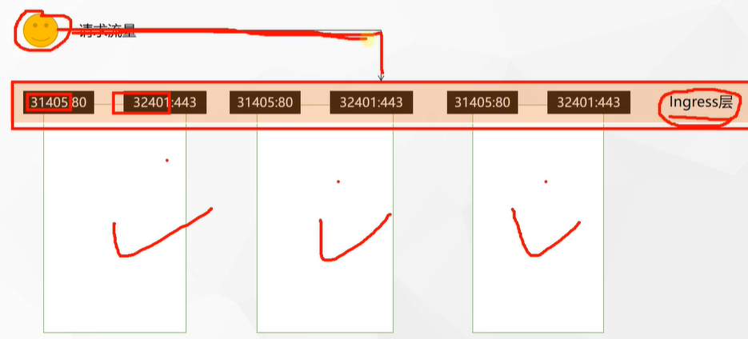


​	

​	那么由Ingress来处理后呢？交给谁来处理呢我们下面测试一下


#### 测试环境

​	应用如下yaml，准备好测试环境

```yaml
apiVersion: apps/v1
kind: Deployment
metadata:
  name: hello-server
spec:
  replicas: 2
  selector:
    matchLabels:
      app: hello-server
  template:
    metadata:
      labels:
        app: hello-server
    spec:
      containers:
      - name: hello-server
        image: registry.cn-hangzhou.aliyuncs.com/lfy_k8s_images/hello-server
        ports:
        - containerPort: 9000
---
apiVersion: apps/v1
kind: Deployment
metadata:
  labels:
    app: nginx-demo
  name: nginx-demo
spec:
  replicas: 2
  selector:
    matchLabels:
      app: nginx-demo
  template:
    metadata:
      labels:
        app: nginx-demo
    spec:
      containers:
      - image: nginx
        name: nginx
---
apiVersion: v1
kind: Service
metadata:
  labels:
    app: nginx-demo
  name: nginx-demo
spec:
  selector:
    app: nginx-demo
  ports:
  - port: 8000
    protocol: TCP
    targetPort: 80
---
apiVersion: v1
kind: Service
metadata:
  labels:
    app: hello-server
  name: hello-server
spec:
  selector:
    app: hello-server
  ports:
  - port: 8000
    protocol: TCP
    targetPort: 9000
```


​	我们先把这段yaml创建出来，并且让他生效

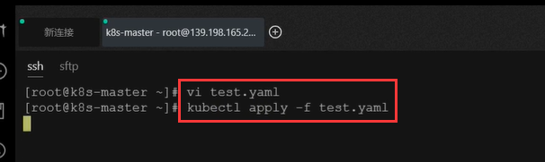


​		我们部署的有hello-server还有一个部署是nginx-demo

​		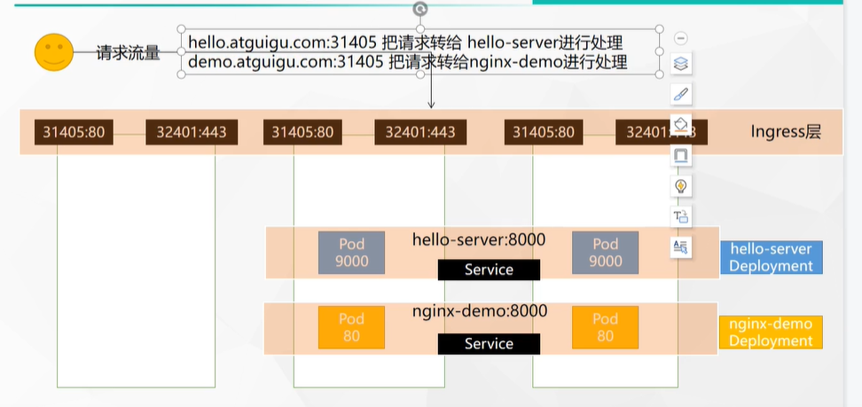


​		我们来访问一下这个service 8000端口的集群IP方式，没有问题


​	接下来我们想把不同的请求经过ingress，路由给不同的service，就需要给ingress配置域名访问了


#### 1、域名访问

​		主要配置文件中的host--就是匹配的域名，pathType：Prefix是前缀模式，path：/ --就是以host为前缀的/的所有请求，backend--意思就是后台服务

​		service.name：serviceName指定后台Service处理

​		port.number: 指定后台处理服务的端口号

```yaml
apiVersion: networking.k8s.io/v1
kind: Ingress  
metadata:
  name: ingress-host-bar
spec:
  ingressClassName: nginx
  rules:
  - host: "hello.atguigu.com"
    http:
      paths:
      - pathType: Prefix
        path: "/"
        backend:
          service:
            name: hello-server
            port:
              number: 8000
  - host: "demo.atguigu.com"
    http:
      paths:
      - pathType: Prefix
        path: "/nginx"  # 把请求会转给下面的服务，下面的服务一定要能处理这个路径，不能处理就是404
        backend:
          service:
            name: nginx-demo  ## java，比如使用路径重写，去掉前缀nginx
            port:
              number: 8000
```


​	当然如果有更多的规则就是在配置文件的rules代表一个数组，可以配置多个规则

​	我们编辑一个规则的yaml，然后应用这个yaml

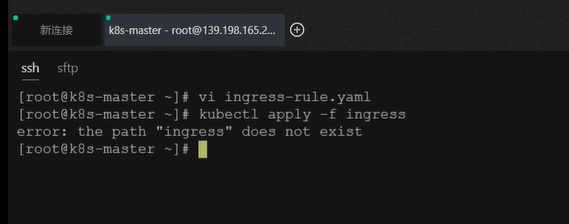


​	我们可以获取一下集群的ingress规则

​	kubectl get ingress   我们可以看到有2条规则一条是hello.atguigu.com一条是demo.atguigu.com

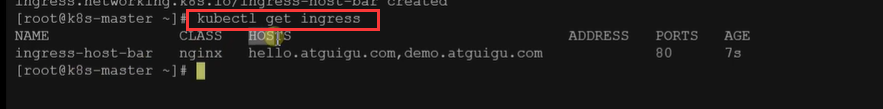


​	我们使用一下域名工具uTools


​	

​	我们使用这个域名工具配置一下


​		我们配置一个假的映射，写入hosts文件

​		hosts文件存放于C: windows--system32--drivers--etc--hosts

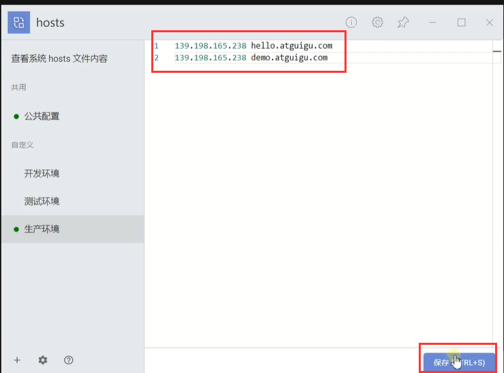


​		我们的映射配置的就是将域名映射到我们集群的机器上

​		我们访问一下域名+端口试试效果---按照我们预想的hello.atguigu.com是交给我们集群的Ingress接收后路由给hello-Service来处理这个请求

​	而我们现在是没有看到内容

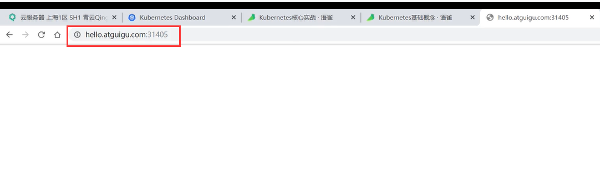

​		排查了一下原因还是因为hosts文件没有应用--现在就好了

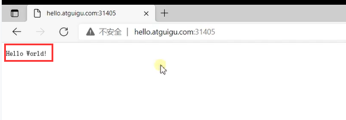


​		我们访问demo.atguigu.com：31405的时候就会给我们返回nginx页面

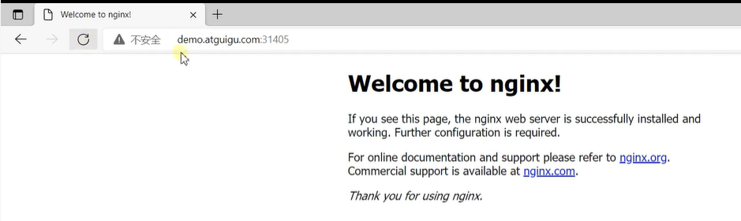


​	这就是我们Ingress层的优点，在我们的请求进来后我们Ingress层先进行一个处理，然后进行路由到Service进行对服务的处理


#### Ingress精确处理某个请求

​		以上我们使用Ingress入口统一处理和路由我们的请求，我们把path的/改为nginx

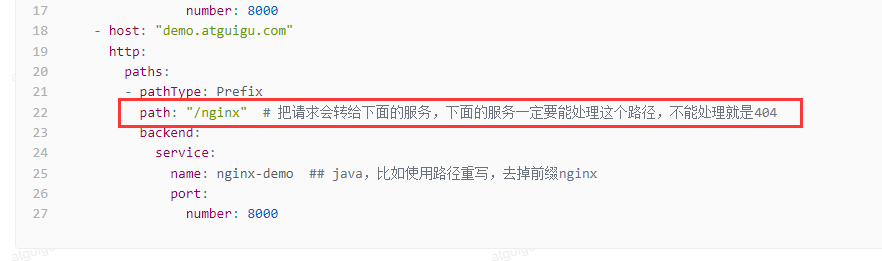


​	我们查看一下Ingress，kubectl get ing（ingress的简写）  然后修改一下kubectl edit ing ingressName

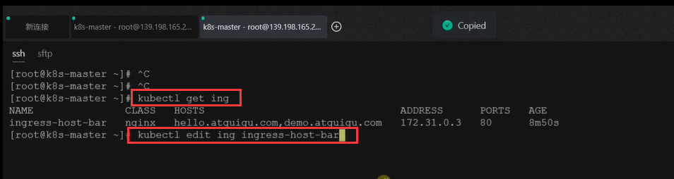


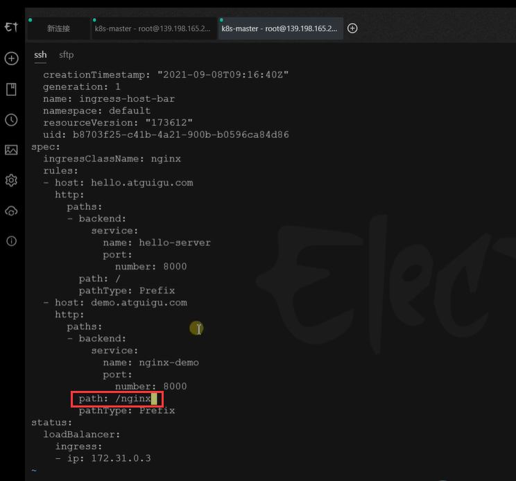


​	现在我们看一下加这个nginx和不加这个nginx有什么区别？


​	访问404


加/nginx路径访问

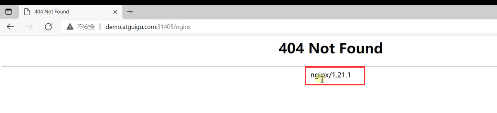

​	为什么会有这样的区别呢？？

​	因为我们直接域名+端口访问其实是由Ingress处理的--由Ingress直接返回了404并没有携带nginx版本号，因为没有路由到处理的service（因为Ingress底层也是nginx）


​	而我们加了/nginx后，由Ingress处理的时候是可以找到路由的Service的，但是为什么又出现了404嗯，因为我们的Service交给Pod去处理，而我们的Pod需要处理这个/nginx的请求，因为Pod中并没有这个/nginx资源，所以就返回404了

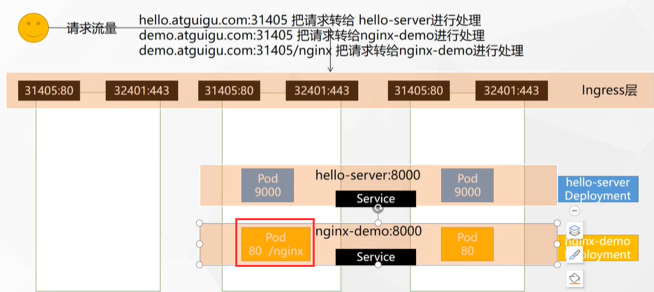


​	我们现在进入dashboard中给容器中添加一个nginx的内容

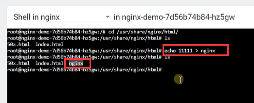


​	我们再次请求，发现我们多次请求会负载到这个修改的Pod，里面有nginx文件

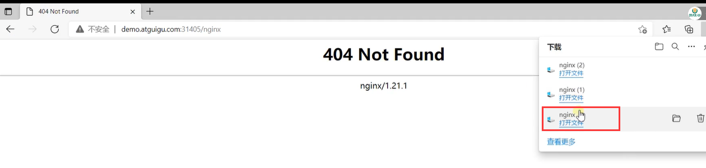

​	我们打开内容里面就是我们添加的1111内容

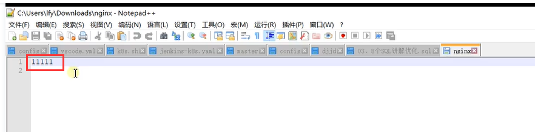

​		path：“/nginx”  这种方式会把请求转给下面的服务，下面的服务一定要能处理这个路径，如果不能处理就是404

​		后续我们的一些微服务，可能就需要下放各种路径请求，或者是重写路径，详细的配置我们参考官方文档。


​		比如这个Rewrite就是路径重写的文档

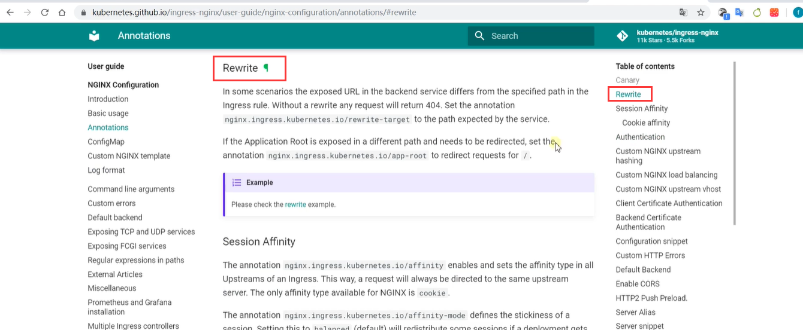


https://www.bilibili.com/video/BV13Q4y1C7hS?p=58&spm_id_from=pageDriver


​	


​	


