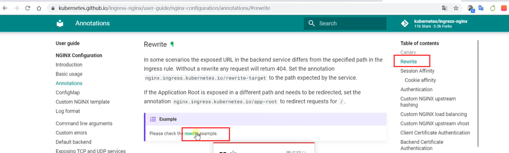
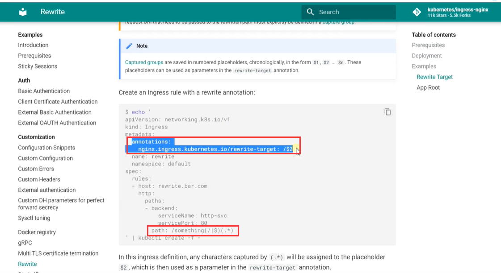
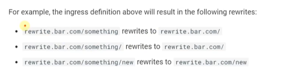
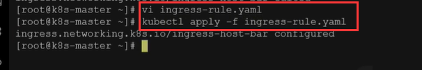
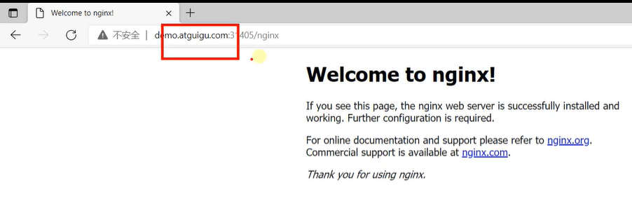

# 34.k8s核心实战-服务网络-Ingress高级用法-路径重写

​		

#### 1、使用Ingress的高级用法--路径重写

​		我们参照rewrite路径重写的文档看一下example案例




​		我们只需要加一个annotation配置 $2是代表重写的地方，path:下使用了一些通配符



​	

​		这个配置的效果-在下面的案例也写清楚了

​			就是去掉了/something



路径重写的配置文件： 所谓的$2 其实就是以$符分割的第二的东西就是我们需要的

```yaml
apiVersion: networking.k8s.io/v1
kind: Ingress  
metadata:
  annotations:
    nginx.ingress.kubernetes.io/rewrite-target: /$2
  name: ingress-host-bar
spec:
  ingressClassName: nginx
  rules:
  - host: "hello.atguigu.com"
    http:
      paths:
      - pathType: Prefix
        path: "/"
        backend:
          service:
            name: hello-server
            port:
              number: 8000
  - host: "demo.atguigu.com"
    http:
      paths:
      - pathType: Prefix
        path: "/nginx(/|$)(.*)"  # 把请求会转给下面的服务，下面的服务一定要能处理这个路径，不能处理就是404
        backend:
          service:
            name: nginx-demo  ## java，比如使用路径重写，去掉前缀nginx
            port:
              number: 8000
```


​		路径重写--需要做2件事，1.需要在metadata下配置annotation，及注解信息，2设置通配的path

​	现在我们修改一下Ingress的配置内容，然后应用一下




​			我们请求一下带/nginx，但我们重写了路径相当于把Nginx给截取去掉了，这样就是正常访问了




​	


