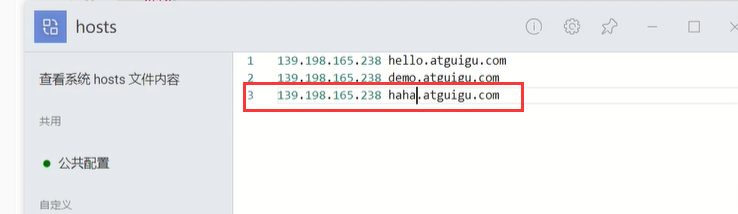
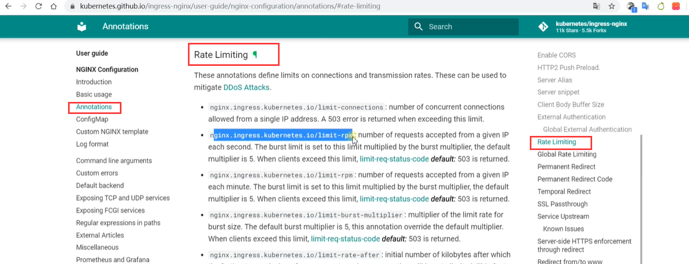
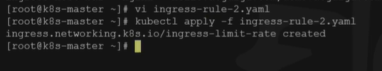
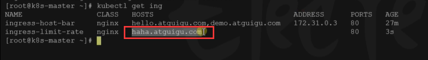
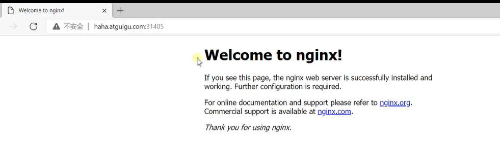
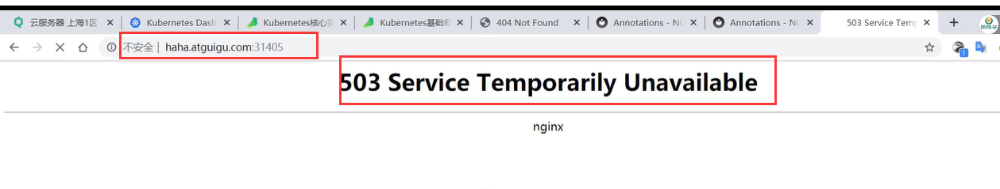
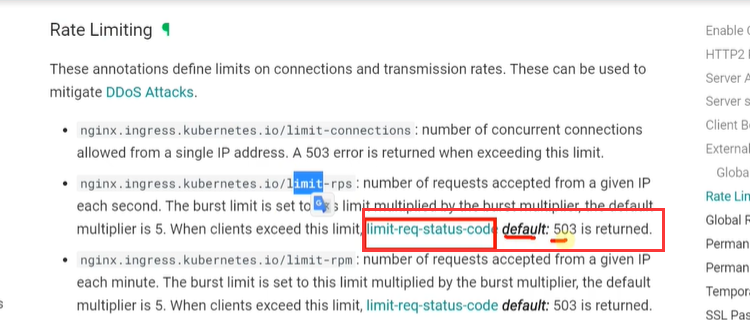
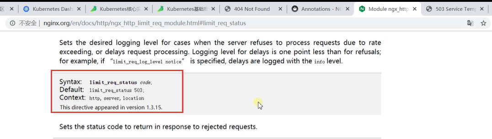

# 35.k8s核心实战-服务网络-Ingress高级-限流

​	

​		我们了解一下Ingress的流量限流


​		我们再来映射一个haha.atguigu.com




​		我们的这个请求还是映射到nginx，但是我们想让这个请求-做一个流量的流速限制，相当于每秒我们放进去一个请求进来


​	我们可以参考一下官方文档--看一下如果我们需要加入限流需要加入什么参数




​	Ingress加入限流规则的yaml

```yaml
apiVersion: networking.k8s.io/v1
kind: Ingress
metadata:
  name: ingress-limit-rate
  annotations:
    nginx.ingress.kubernetes.io/limit-rps: "1"
spec:
  ingressClassName: nginx
  rules:
  - host: "haha.atguigu.com"
    http:
      paths:
      - pathType: Exact
        path: "/"
        backend:
          service:
            name: nginx-demo
            port:
              number: 8000
```

- pathType: Exact 是精确模式

​	限流起作用的参数就是，限制每秒1个请求

	annotations:
		nginx.ingress.kubernetes.io/limit-rps: "1"
​	

我们应用一下这个配置文件




我们看一下这个Ingress规则




没有问题--可以响应




​	我们加快访问的速度-疯狂刷新一下页面--发现偶尔会报503

​	503是服务不可用



​	为什么是503呢--我们的文档提示，如果我们限流的流量太大的时候我们就给她返回503状态




​	如果想修改这个状态码--点击limit-req-status-code--会进入到nginx文档，需要配置的就是nginx的内容了




