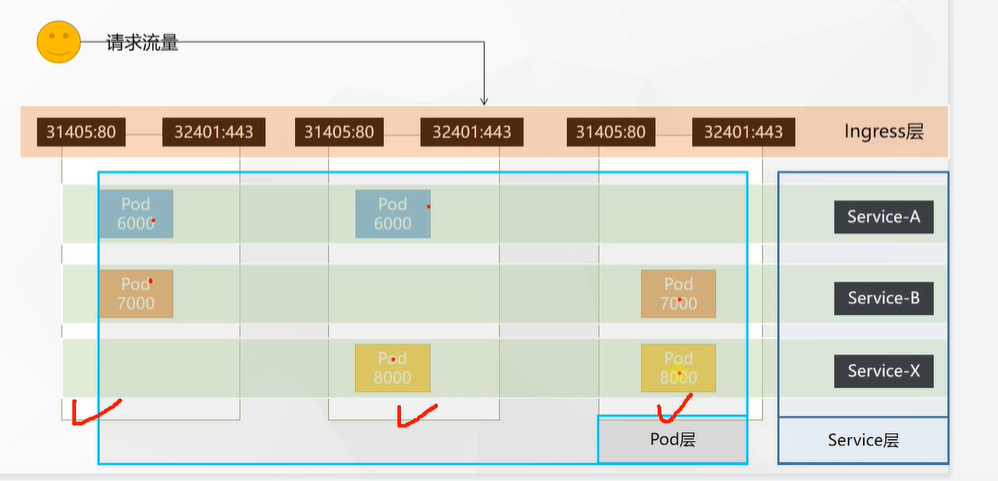
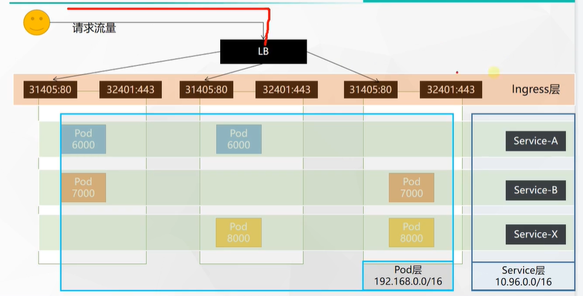

# 37.k8s核心实战-服务网络-网络模型总结

​		前面我们的Ingress的实战操作就完成了。

#### 网络模型总结

​	我们总结一下k8s的网络模型。

​			首先我们k8s当前是使用3个节点，这三个机器未来会部署很多的Pod，而相同颜色的Pod我们标记为一组Pod，这些Pod要能提供访问，我们要把他们抽象成一个Service，接下来我们的流量过来首先是来到三台机器的任何一个80/443映射出来的NodePort端口，我们把这一层称为Ingress层

​			

​	其实在Ingress层的前面我们甚至可以做一个负载均衡，我们的负责均衡叫loadbalance，简称LB，我们这个负载均衡的流量一旦进来之后，会发送请求到我们三台机器中的任意一台，Ingress收到请求后，我们会根据域名/ip等规则过滤后交给Service，然后由Service交给Pod去处理

​		所以我们的k8s中就产生了3层网络，第一层是所有的Pod都是一层网络，Service层的网络是互通的，Pod和Service层的网络也是互通的，还有一层就是Ingress层，Ingress是流量入口层，进入Ingress后在进入Service层--Pod层，只要是在集群中K8s为我们分配的IP地址无论是那层的都是可以进行访问的，k8s为我们打通了整个网络的访问过程。

