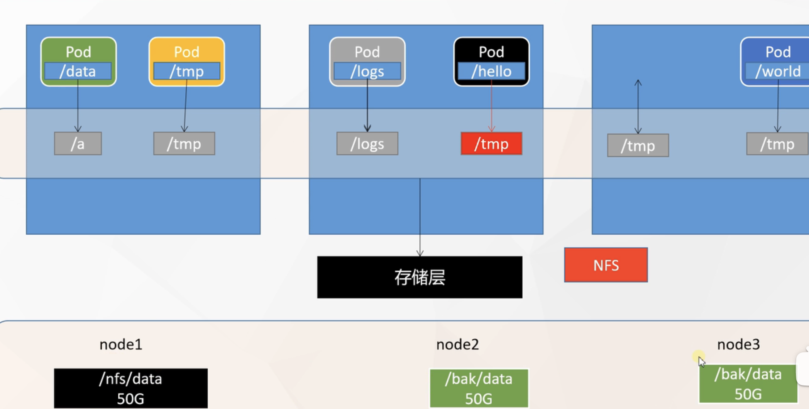

# 38.k8s核心实战-存储抽象-基本概念与NFS环境搭建

​	

## 存储抽象

​		下面我们聊一下k8s的存储抽象

​	首先我们参考一下这么个场景，还是3台机器，这些机器运行了各种各样的Pod，而Pod往往有些数据想要挂载到外面我们来方便修改，比如我们以前学docker的时候，把nginx的html 目录挂载到外面，这样我们在外面放一个nginx的页面我们的内部就相当于改变了。

​		所以呢我们未来可能每个Pod都会有这样的需求，比如我们现在的Pod想把他的容器内的/data 挂载到我们主机的/a位置，我们在/a位置修改就相当于修改/data目录的内容。


​	其他的Pod也一样，比如想把/logs挂载等等每个Pod可能都需要进行挂载，这是我们以前，先不聊k8s，如果按docker启动容器的话，我们就可以这么来做，这样我们启动的容器越多我们挂载在外边的内容也就越多。


​	但是如果使用k8s后，我们还是使用这种方式挂载的话，就会面临很严重的问题，例如，我们现在的Pod都这样来挂载，但是有一个Pod突然发生了故障宕机，宕机后k8s感知到这个Pod线下了，按照k8s故障转移他会在5分钟后在其他机器再启动一份，但是我们宕机的Pod是在3号机器的，他挂载的目录也是在3号机器的，假如k8s重新启动了一份是在2号机器那么对应的挂载就映射到了2号机器，而3号机器的内容在2号机器并没有

​	这就导致虽然这个Pod重新拉起一份，但是里面没有数据，如果这个Pod是mySql那就完蛋了


​		我们现在就希望如果Pod宕机转移到其他机器，这个挂载的数据能够还在，所以我们现在把整个数据挂载层整理一下，k8s就可以把我们这个挂载的内容统一管理起来叫存储层


​	以后我们每个Pod想挂载什么就告诉k8s就可以了，k8s会自动为我们分配空间然后挂载，包括就算这个Pod宕机，在别的机器重新拉起一份k8s还会让这个Pod去找之前挂载的那个空间，所以我们就希望有这样的一个能力，k8s就将存储层抽象出来。

​		这个存储层使用的技术可以有很多，比如Glusterfs、NFS、CephFS等等框架，但k8s又不是专业负责存储的，我们可以对这些文件存储框架可以挑选一种，也就是说k8s对于存储层是开放的，我们用什么技术都行。

​		比如我们使用的是NFS（网络文件系统）为例，解决上面的问题就需要这么来做，比如我们在1号机器我开了一个目录叫/nfs/data有50G空间，未来大家的Pod挂数据都可以往这个目录挂，NFS的效果就是我们在1号机器开一个目录，为了防止1号机器宕机，我们在其他机器也都备份一个目录/bak/data，里面内容是一样的


​		假设我们的某个Pod是将内容写在这个备份的挂载目录下的，NFS会自动进行同步将数据都发送给其他的机器，就算是宕机在其他机器拉起一份Pod，那么在其他机器上挂载的内容和之前的是同步的，数据还在这就是我们说的NFS文件系统。


​	我们使用NFS系统将来把我们的存储空间都抽象下来，我们NFS系统的这些文件夹它可能存在各个机器中比如node1，node2，node3



​	这样就算某个node2节点宕机了，我们的故障转移，node2的Pod在node3中又启动一份，而这个node3中Pod数据怎么办呢，node3中的Pod会在node3中的挂载数据中去找，因为集群中的存储层都使用NFS系统每个节点的数据都是会同步的，这就是我们所说的k8s存储抽象。


## 2、搭建NFS网络文件环境

​	接下来我们要体验k8s存储抽象的完整内容，我们先要搭建一个NFS网络文件系统，这个网络文件系统我们可以随便指定一台机器作为NFS-Server就是NFS的主节点，然后其他的机器我们可以称为NFS的客户端

​	NFS的客户端去同步NFS-Server的数据，只要Server发生变化Client客户端就会发生变化


#### 2.1安装NFS文件系统

​	所有的节点都需要安装nfs--如我们现在测试3个节点，那么3个节点都需要安装一下

```
yum install -y nfs-utils
```


#### 2.2主节点

​	我们选择一个节点作为主节点--然后执行脚本

​	这个脚本的意思是：我们在主节点，准备暴露/nfs/data/这个目录 *就是所有客户端都可以同步我的这个目录，而且以insecure非安全的方式，rw读写的方式来进行同步

```bash
#nfs主节点
echo "/nfs/data/ *(insecure,rw,sync,no_root_squash)" > /etc/exports
```


​	执行


​	然后我们必须要有这个文件夹，如果没有就创建一下mkdir -p /nfs/data/


​	接下来只需要2个命令

​	我们启动RPC远程绑定，开机就启动

​	systemctl enable rpcbind --now

​	再来启动NFS服务器，开机启动而且现在就启动

​	systemctl enable nfs-server --now


然后我们让配置生效

​	exportfs -r

​	这样我们的NFS系统就搞定了服务端了--都是在主节点执行的命令

​	我们也可以检查一下exportfs，确认NFS的目录是/nfs/data/这个目录


```
#nfs主节点
echo "/nfs/data/ *(insecure,rw,sync,no_root_squash)" > /etc/exports

mkdir -p /nfs/data
systemctl enable rpcbind --now
systemctl enable nfs-server --now
#配置生效
exportfs -r
```


#### 2.3从节点

​	接下来我们想让其他节点来同步主节点的NFS文件系统的内容，我们需要先查看一下NFS服务器有哪些内容可以让我们同步挂载

​	showmount -e 主节点的IP

​	ip a我们在主节点查看一下IP

​	


​	我们看到远程机器有nfs/data这个路径可以挂载


​	我们需要给每个客户端也就是从节点也都创建一个挂载的目录，这个从节点的目录名字与主节点不一致也是可以的


​	

​	我们创建好文件夹后就需要进行同步操作了

​	mount 挂载 使用nfs系统进行挂载，远程NFS的server地址，远程服务器暴露的文件夹，然后是将远程文件夹挂载到本地同步的文件夹

```
mount -t nfs IP 远程文件夹 本地文件夹
```


```
showmount -e 172.31.0.4

#执行以下命令挂载 nfs 服务器上的共享目录到本机路径 /root/nfsmount
mkdir -p /nfs/data

mount -t nfs 172.31.0.4:/nfs/data /nfs/data
# 写入一个测试文件
echo "hello nfs server" > /nfs/data/test.txt

```


​	我们验证一下：进入主节点，然后进入暴露的文件夹内，我们输出一个1111到a文件下，a文件是在暴露的文件夹内


​	我们现在来到客户端节点，然后看一下有没有同步到这个文件

​		我们发现是存在的，同步过来了


​	

​	我们在客户端修改一下这个a文件的内容


​	我们回到主节点看一下有没有变化--也发生改变了，从节点变化也会同步到主节点


​	这就是一个典型的网络文件系统


https://www.bilibili.com/video/BV13Q4y1C7hS?p=62


