# 39.k8s核心实战-存储抽象-Deployment使用NFS进行挂载


#### 原生方式数据挂载

​		比如我们现在这里有yaml文件，首先kind是Deployment是一次部署，这次部署一定会使用一些镜像在containers --image声明用nginx镜像，这样我们就以2个副本使用Nginx镜像部署的Pod

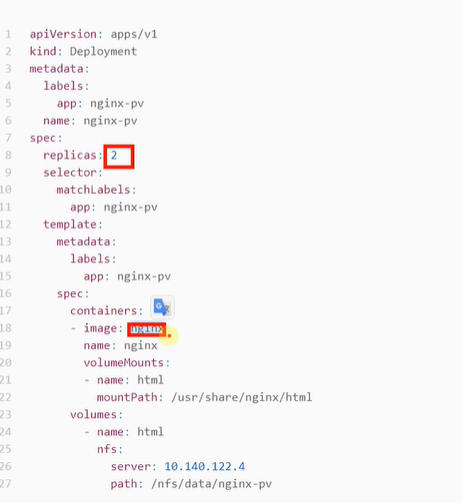


​	而每一个容器又需要挂载 volumeMounts就是我们的资源挂载，资源挂载下面有一个mountPath这个就代表我当前这个Nginx容器内部的/usr/share/nginx/html挂到外面，挂到外面叫什么名字呢叫html这个挂载的名字随便起。

​	而html是怎么的挂载方式是在下面声明的：在volumes有一个名叫html这种方式的挂载，然后下面是nfs代表使用nfs网络文件系统的，相当于是我们的容器的mountPath指定的路径 映射到 nfs的path路径，server是NFS的文件系统服务IP

```yaml
apiVersion: apps/v1
kind: Deployment
metadata:
  labels:
    app: nginx-pv-demo
  name: nginx-pv-demo
spec:
  replicas: 2
  selector:
    matchLabels:
      app: nginx-pv-demo
  template:
    metadata:
      labels:
        app: nginx-pv-demo
    spec:
      containers:
      - image: nginx
        name: nginx
        volumeMounts:
        - name: html
          mountPath: /usr/share/nginx/html
      volumes:
        - name: html
          nfs:
            server: 172.31.0.4
            path: /nfs/data/nginx-pv
            
            
```


​	我们这段yaml翻译过来就是这么个图例：

​		因为我们启动的是2个Pod，就相当于这2个Pod会共用一个路径，也就是说接下来我们在这个网络文件系统NFS上，只要我们一修改我们nginx-pv文件夹里面的内容，这俩个Pod里面的内容相当于都改了

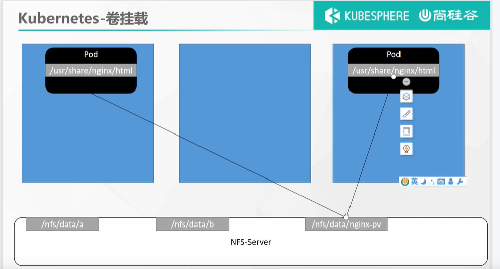


​	现在我们把这个案例yaml文件测试运行一下：

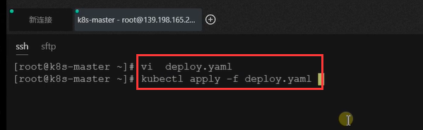

​	執行完之后我们来看一下这个Pod，有俩个nginx-pv-demo的Pod

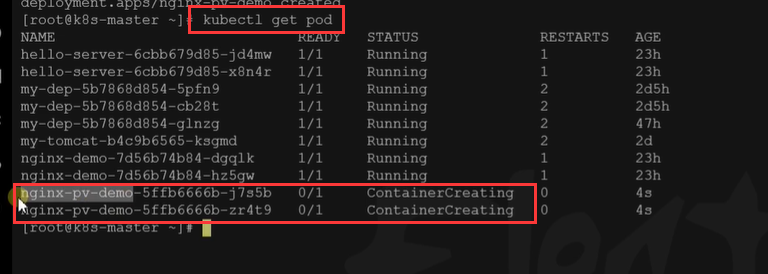

​		


​	我们来到可视化界面看一下我们的这俩个Pod一直都没有好

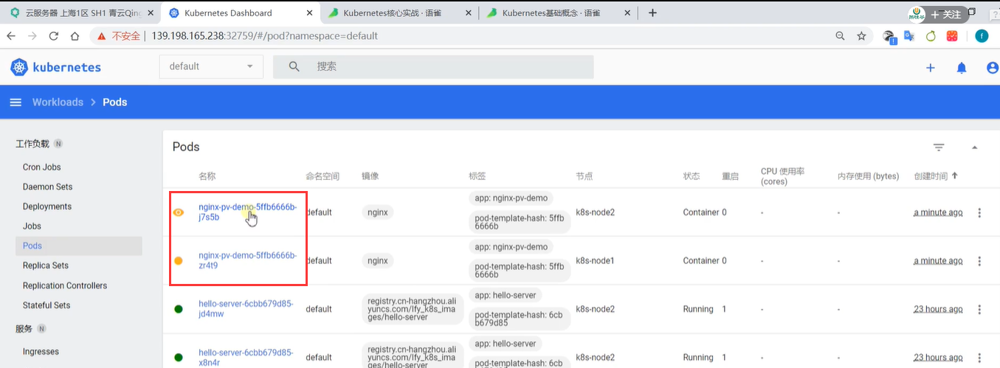


​	键入后来到事件中查看一下--发现我们挂载卷的时候有问题

​		问题的原因是mount nfs ：mounting 172.31.0.4：/nfs/data/nginx-pv 我们需要有这个目录，但是No such file or director  ,也就是说想要挂载之前，先创建这个目录

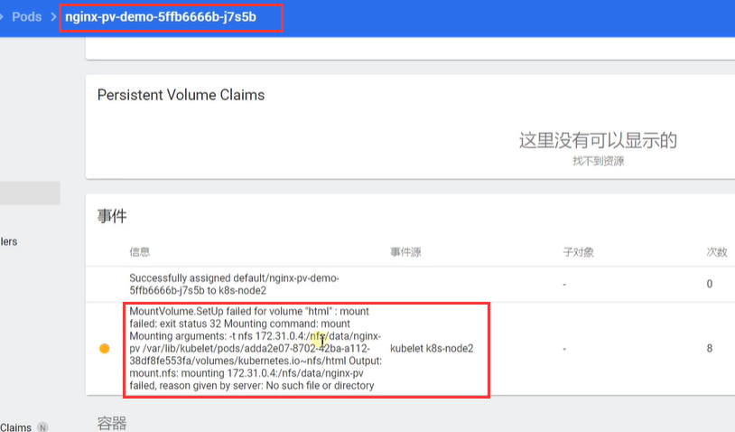


​	创建nginx-pv文件夹

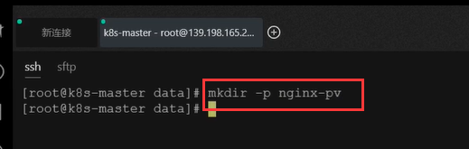


​	然后我们把这个deployment先删除一下，重新创建一下

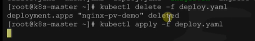


​	重新创建后我们看一下这个Pod的详情，发现是启动没有问题的

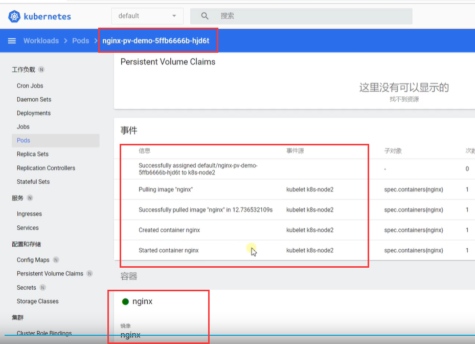


​	那么现在我们相当于在这个/nfs/data/nginx-pv下修改页面，这2个Pod也就都改了

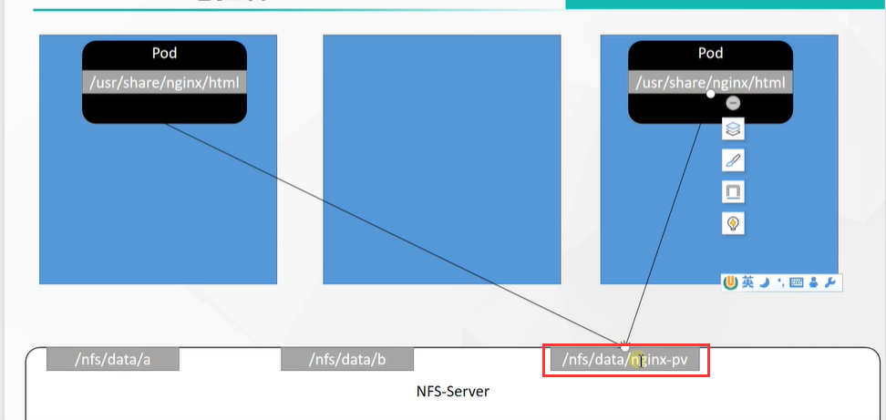


​	我们测试一下：我们在nginx-pv目录下 输出一个1111222内容到index.html

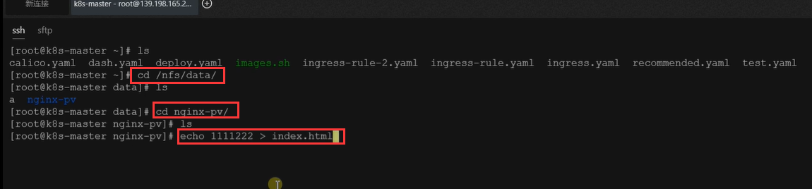


​	我们现在到这2个Pod中确定一下，我们的这个NFS文件系统有没有挂载进去到容器中内容，我们从可视化窗口执行进入：发现是挂载上的NFS系统会自动为我们同步内容

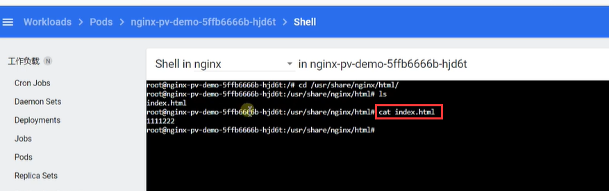


​	这就是我们使用原生的方式，只要NFS系统搭建起来我们就可以进行挂载同步了，核心就是yaml的配置文件volumeMounts，volumes这俩个参数及下面配置的内容


​	如果我们不想使用NFS想使用其他的文件系统，那么配置文件中切换一下就可以了

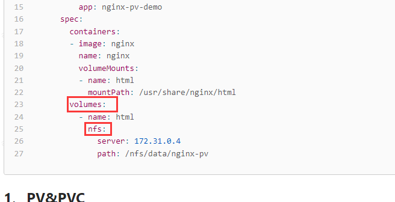


​		


​	

​	


​	