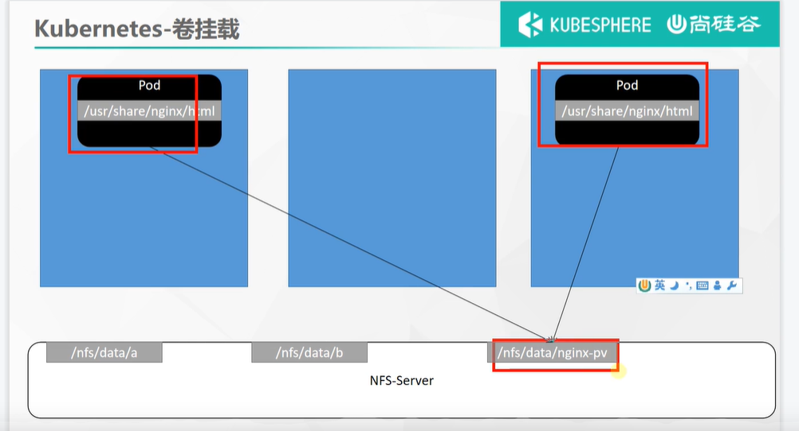
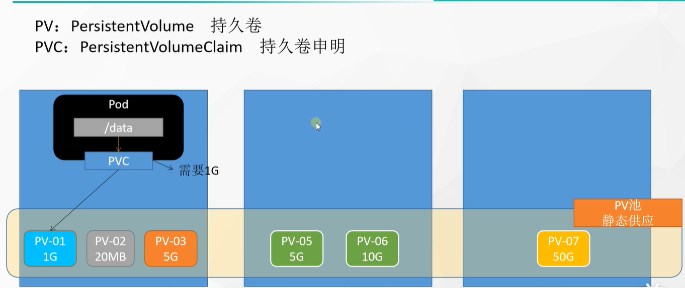

# 40.k8s核心实战-存储抽象-PV与PVC使用

​	之前我们测试了使用原生的方式进行挂载，使用原生的挂载方式会产生一些问题

​	例如：我们的Pod都挂载在/nfs/data/nginx-pv

​					1.每个节点的文件夹需要我们创建

​					2.如果我们其中一个Pod不要了把这个Pod删除了-挂载的内容不会被删除，我们可能后续是删除Pod的时候是需要删除挂载的数据的

​					3.我们这2个Pod挂载的是nginx-pv这个目录，其他的Pod可能挂载在b目录，但是默认对他们可以使用多少的空间没有限制，我们后续是需要对挂载的文件夹有一个容量的控制的。

​		我们了解一下k8s的PV和PVC模式

## 1、PV&PVC

*PV：持久卷（Persistent Volume），将应用需要持久化的数据保存到指定位置*

*PVC：持久卷申明（**Persistent Volume Claim**），申明需要使用的持久卷规格*

​	持久卷：我们可以理解为就是挂载的文件夹可以在这里保存一些东西如nginx-pv这个文件夹

​	PVC：其实就像一个申请，就是我们挂载到外面的文件夹需要写一个申请书，然后是申请多大的空间，然后就给开通一个申请大小的文件夹空间，相当于一个申请书和一个实际的空间进行一个绑定，这样的话你的哪个Pod删除了你可以带着这个申请书也删除掉，这就是我们说的pv与pvc

​		假如这个PVC需要的空间是900M那么也会智能k8s给分配空间分配到如下图 1G的空间资源

#### 2、实战测试

https://www.bilibili.com/video/BV13Q4y1C7hS?p=64&spm_id_from=pageDriver

