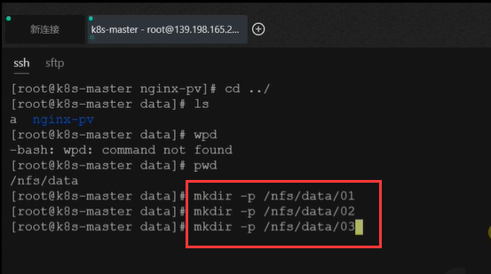
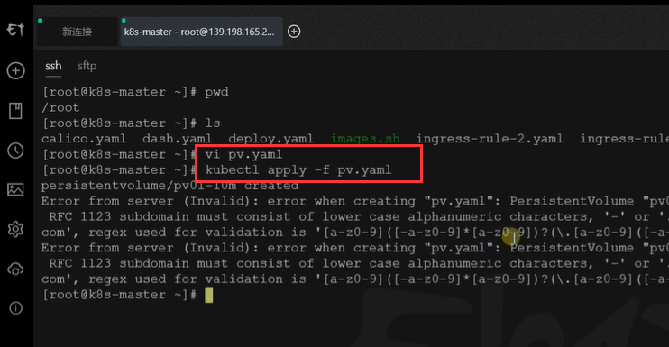
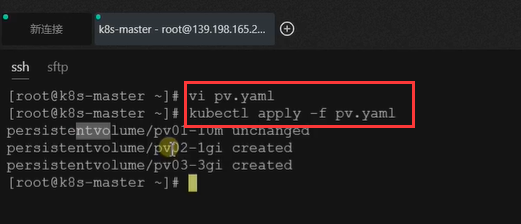
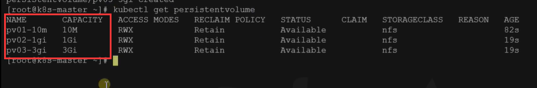
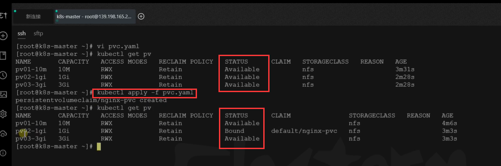
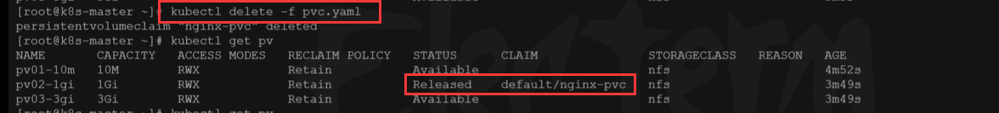
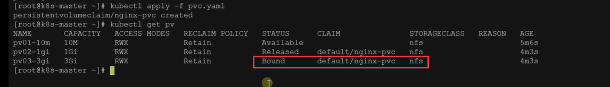
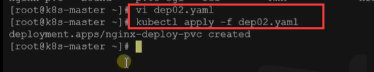
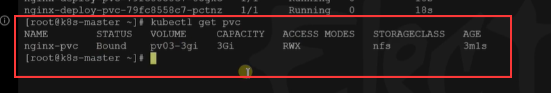
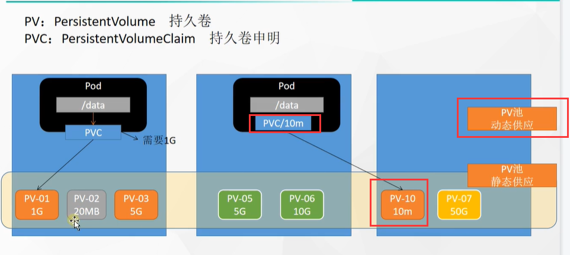

# 40.k8s核心实战-存储抽象-PV与PVC使用


​	之前我们测试了使用原生的方式进行挂载，使用原生的挂载方式会产生一些问题


​	例如：我们的Pod都挂载在/nfs/data/nginx-pv

​					1.每个节点的文件夹需要我们创建

​					2.如果我们其中一个Pod不要了把这个Pod删除了-挂载的内容不会被删除，我们可能后续是删除Pod的时候是需要删除挂载的数据的

​					3.我们这2个Pod挂载的是nginx-pv这个目录，其他的Pod可能挂载在b目录，但是默认对他们可以使用多少的空间没有限制，我们后续是需要对挂载的文件夹有一个容量的控制的。


​		我们了解一下k8s的PV和PVC模式

## 1、PV&PVC

*PV：持久卷（Persistent Volume），将应用需要持久化的数据保存到指定位置*

*PVC：持久卷申明（**Persistent Volume Claim**），申明需要使用的持久卷规格*


​	持久卷：我们可以理解为就是挂载的文件夹可以在这里保存一些东西如nginx-pv这个文件夹

​	PVC：其实就像一个申请，就是我们挂载到外面的文件夹需要写一个申请书，然后是申请多大的空间，然后就给开通一个申请大小的文件夹空间，相当于一个申请书和一个实际的空间进行一个绑定，这样的话你的哪个Pod删除了你可以带着这个申请书也删除掉，这就是我们说的pv与pvc

​		假如这个PVC需要的空间是900M那么也会智能k8s给分配空间分配到如下图 1G的空间资源


#### 2、实战测试

#### 	2.1：创建PV持久卷

​	首先我们先创建这个PV池，在后续我们想要那个PV挂载的话，我们就写一个申请书就可以了

```
#nfs主节点
mkdir -p /nfs/data/01
mkdir -p /nfs/data/02
mkdir -p /nfs/data/03
```


我们先创建几个文件夹 在主节点上--静态供应




创建PV池，使用yaml的方式

​		三个--- 代表分割一个文档，kind资源类型：PersistentVolume代表持久卷类型

​		capacity限制容量--storage是容量如10M

​		ReadWriteMany是可读可写

​		nfs--server：注意这个是nfs的服务器IP

```yaml
apiVersion: v1
kind: PersistentVolume
metadata:
  name: pv01-10m
spec:
  capacity:
    storage: 10M
  accessModes:
    - ReadWriteMany
  storageClassName: nfs
  nfs:
    path: /nfs/data/01
    server: 172.31.0.4
---
apiVersion: v1
kind: PersistentVolume
metadata:
  name: pv02-1gi
spec:
  capacity:
    storage: 1Gi
  accessModes:
    - ReadWriteMany
  storageClassName: nfs
  nfs:
    path: /nfs/data/02
    server: 172.31.0.4
---
apiVersion: v1
kind: PersistentVolume
metadata:
  name: pv03-3gi
spec:
  capacity:
    storage: 3Gi
  accessModes:
    - ReadWriteMany
  storageClassName: nfs
  nfs:
    path: /nfs/data/03
    server: 172.31.0.4
```


​	然后我们编辑一下这个文件应用一下，发现有个错误，原因是起名有大写，应该使用小写 如：pv01-10m




​	修改完之后，我们重新应用就好了




​	我们创建了持久卷资源，我们现在看一下k8s中有多少持久卷资源--使用kubectl get persistentvolume




#### 	2.2 PVC创建与绑定

​	其实就相当于我们写的绑定申请书


​	创建PVC

​			kind资源类型：PersistentVolumeClaim就是PVC持久卷声明

​			ReadWriteMany：是可读写

​			requests--storage：是申请的资源大小，如200Mi

​			storageClassName：对应的是创建持久卷的时候填写的storageClassName也就是资源池

```yaml
kind: PersistentVolumeClaim
apiVersion: v1
metadata:
  name: nginx-pvc
spec:
  accessModes:
    - ReadWriteMany
  resources:
    requests:
      storage: 200Mi
  storageClassName: nfs
```


​	然后写完申请书pvc，应用一下，应用前我们发现所有的PV状态都是Available可用的，等我们写完PVC然后应用后发现 有状态变为Bound了就是绑定了--是被CLNIM（申请书）下的nginx-pvc绑定了

​		为什么需要200M却给分配了1G呢？ 因为一共3个PV持久卷10M的明显不够不能用，还有个3G的太大，所以k8s就帮我们挑选了个1G的PV




​		如果我们现在删除这个PVC

​		我们可以看到状态变为Released就是资源被释放了




我们再次应用，发现会重新绑定--由于资源还没有完全释放掉，所以这次给分配的PV是3G的PV




现在我们使用Pod绑定PVC

​		注意-我们以前创建部署的时候volumes直接挂载的是文件服务器，现在是volumes挂载到PVC持久卷 声明 上，如：claimName: nginx-pvc我们之前创建过这个PVC，这个pvc会指定持久卷及PV会指定文件服务器地址

```yaml
apiVersion: apps/v1
kind: Deployment
metadata:
  labels:
    app: nginx-deploy-pvc
  name: nginx-deploy-pvc
spec:
  replicas: 2
  selector:
    matchLabels:
      app: nginx-deploy-pvc
  template:
    metadata:
      labels:
        app: nginx-deploy-pvc
    spec:
      containers:
      - image: nginx
        name: nginx
        volumeMounts:
        - name: html
          mountPath: /usr/share/nginx/html
      volumes:
        - name: html
          persistentVolumeClaim:
            claimName: nginx-pvc
            
```




​	我们看一下这个pvc，可以看到 nginx-pvc绑定的是pv03-3gi这个PV持久卷，CAPACITY是空间大小为3Gi，storageclass是存储分组类型




​	我们现在使用的是静态供应，就是提前创建好资源，而实际上还有一种动态供应，目前就是我们想创建一个PVC只能是在现有的PV中挑选最终返回一个空间符合的，但是当有了动态供应后，就是在我们创建持久卷声明PVC的时候 会自动给我们创建一个PV持久卷-这种称为动态供应




https://www.bilibili.com/video/BV13Q4y1C7hS?p=64&spm_id_from=pageDriver


