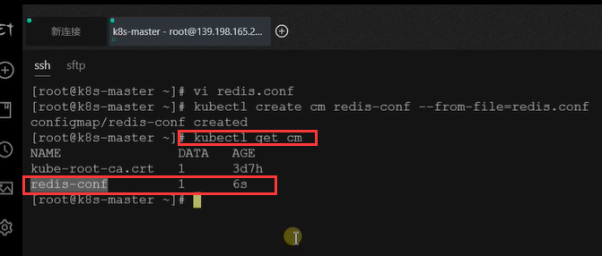
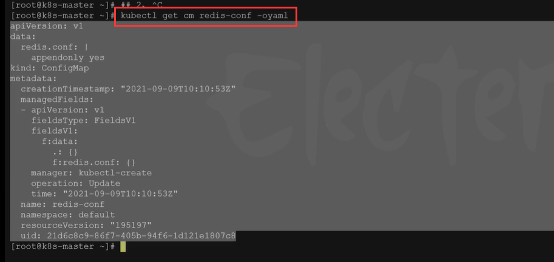
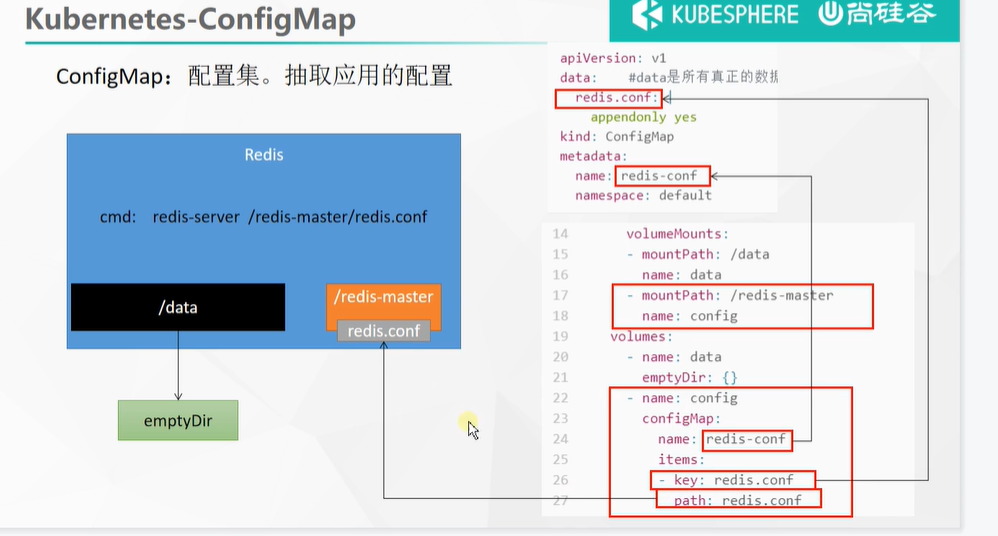
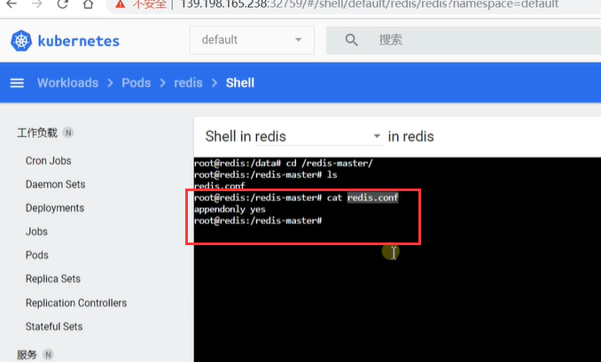
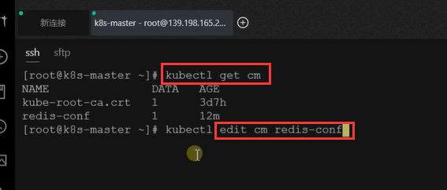
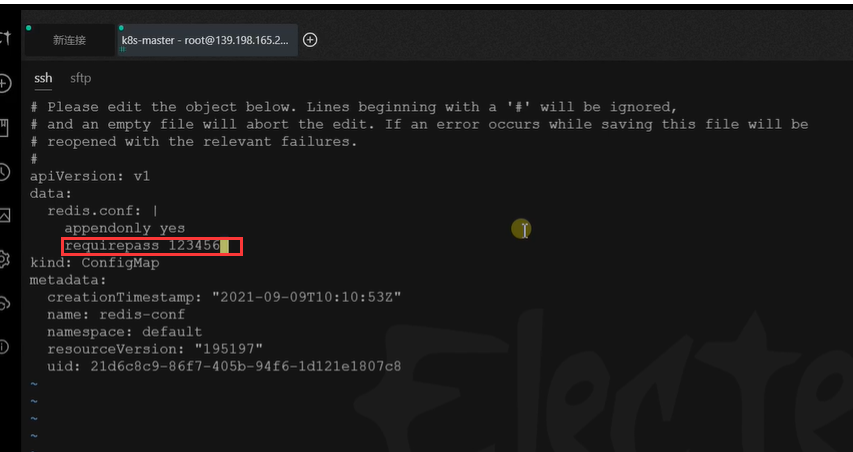
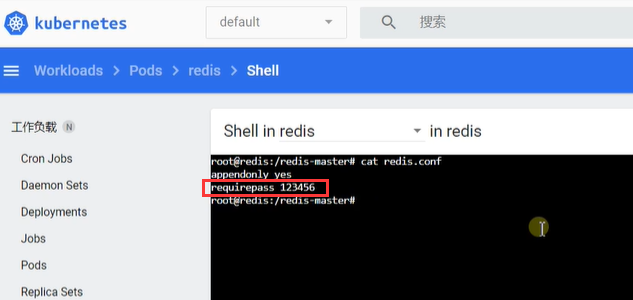
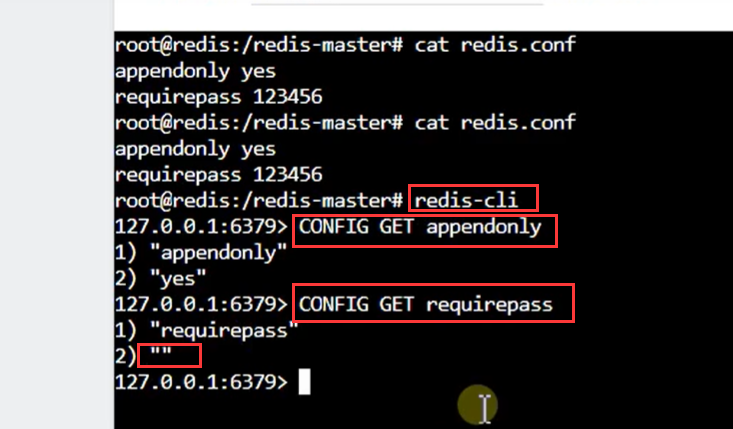

# 41.k8s核心实战-存储抽象-使用configMap抽取公共配置

​		之前我们了解到如果我们想把Pod的目录挂载到外部的话就可以使用PV和PVC进行对Pod的目录挂载，但也可以使用原生的方式直接挂载到文件服务器上。这种方式最大的特点就是--我们最好是在挂载目录的时候进行使用。


​		但是我们往往会出现这样的情况，例如以前我们使用docker部署的redis，我们希望把redis的配置文件也挂载出来，这样我修改了redis的配置文件让redis重启一下redis就可以使用到他最新的配置了。包括未来我们安装MySQL也会将MySQL的配置文件挂出来。为了方便修改我们都会把这些配置文件放出来


	#### k8s中挂载配置文件

#### 	ConfigMap：

​	在k8s中挂载文件夹使用PV与PVC，挂载配置文件的话使用ConfigMap--他可以抽取应用配置，并且可以自动更新。

​	以后想挂载配置文件，1.先把准备要挂载的配置文件创建为配置集,  2.然后在启动我们应用的时候创建Pod的时候引用一下这个配置集就可以了

​	这个configMap是专门来管理以后你的所有配置的。


#### 1、redis示例

​	把之前的配置文件创建为配置集

​	create cm--创建配置集

​	redis-conf配置集的名称

​	--from-file需要统一管理的配置文件路径及文件全称

```bash
# 创建配置，redis保存到k8s的etcd；
kubectl create cm redis-conf --from-file=redis.conf
```


​	我们使用**kubectl get cm**的时候也可以看到我们刚刚**创建的配置集**

​	创建的这个配置集其实是在k8s的etcd下这个档案库中，我们放心的创建我们的配置集只要k8s活着那么这个配置集就一定是存在的。




​	我们可以看一下，创建的这个配置集如果是yaml的方式的话内容是什么样的




​	name就是配置集的名称

​	data中是所有真正的数据

```yaml
apiVersion: v1
data:    #data是所有真正的数据，key：默认是文件名   value：配置文件的内容
  redis.conf: |
    appendonly yes
kind: ConfigMap
metadata:
  name: redis-conf
  namespace: default
  
```


#### 2、创建Pod

```yaml
apiVersion: v1
kind: Pod
metadata:
  name: redis
spec:
  containers:
  - name: redis
    image: redis
    command:
      - redis-server
      - "/redis-master/redis.conf"  #指的是redis容器内部的位置
    ports:
    - containerPort: 6379
    volumeMounts:
    - mountPath: /data
      name: data
    - mountPath: /redis-master
      name: config
  volumes:
    - name: data
      emptyDir: {}
    - name: config
      configMap:
        name: redis-conf
        items:
        - key: redis.conf
          path: redis.conf
          
          
```


​	我们用图表达一下这个挂载的关系

​	key指的是 data下的key，path指的是Pod容器中的文件名称




​		以后无论是redis或者是mysql等等，以后都是可以使用这种方式进行k8s的配置管理的


我们在应用了创建的Pod之后，我们进入容器查看一下是否这个redis的配置使用的我们配置集的配置

​		发现是的-里面有内容为appendonly yes




我们使用这个配置集挂载的另外优点就是，如果我们在外部把redis的配置文件修改了，他在内部也是可以自动改掉的。

​	我们修改一下配置集然后测试一下：




比如我们添加一行配置信息，设置密码




我们再来到容器中进行查看一下，差不多1分钟左右发现配置文件也是同步过来的




​		未来只要是我们想要挂载配置文件，我们都推荐这种ConfigMap的方式


#### 3.检查配置是否生效

​	我们进入容器，使用redis-cli客户端工具连接 执行一下 CONFIG GET 配置项

​		appendonly是生效的，而requirepass是没有生效的因为这个是后改的需要重启才可以

​	


```bash
kubectl exec -it redis -- redis-cli

127.0.0.1:6379> CONFIG GET appendonly
127.0.0.1:6379> CONFIG GET requirepass
```


#### 4.修改ConfigMap

```yaml
apiVersion: v1
kind: ConfigMap
metadata:
  name: example-redis-config
data:
  redis-config: |
    maxmemory 2mb
    maxmemory-policy allkeys-lru 
    
```


#### 5、检查配置是否更新

```bash
kubectl exec -it redis -- redis-cli

127.0.0.1:6379> CONFIG GET maxmemory
127.0.0.1:6379> CONFIG GET maxmemory-policy
```

检查指定文件内容是否已经更新

修改了CM。Pod里面的配置文件会跟着变


**配置值未更改，因为需要重新启动 Pod 才能从关联的 ConfigMap 中获取更新的值。** 

**原因：我们的Pod部署的中间件自己本身没有热更新能力**


**以后我们挂载目录用PV&PVC，挂载文件使用ConfigMap**


## 3、Secret

Secret 对象类型用来保存敏感信息，例如密码、OAuth 令牌和 SSH 密钥。 将这些信息放在 secret 中比放在 [Pod](https://kubernetes.io/docs/concepts/workloads/pods/pod-overview/) 的定义或者 [容器镜像](https://kubernetes.io/zh/docs/reference/glossary/?all=true#term-image) 中来说更加安全和灵活。


​	

https://www.bilibili.com/video/BV13Q4y1C7hS?p=65&spm_id_from=pageDriver


​		

​		


​		


