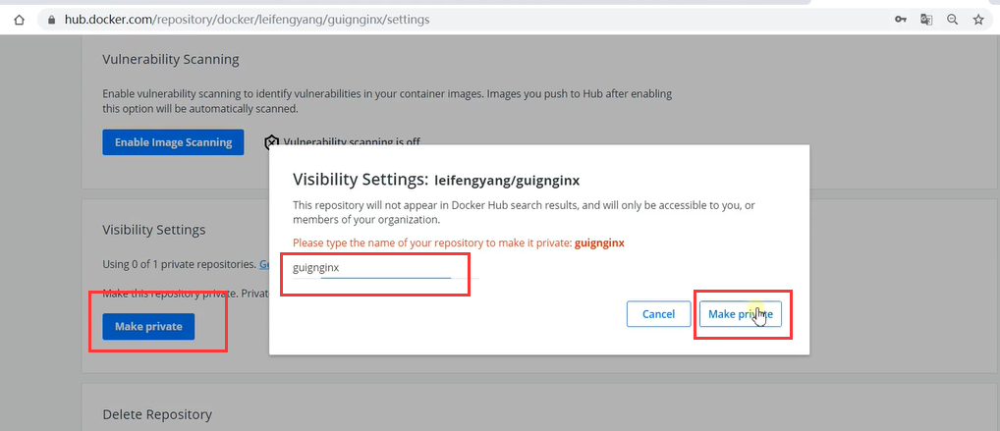
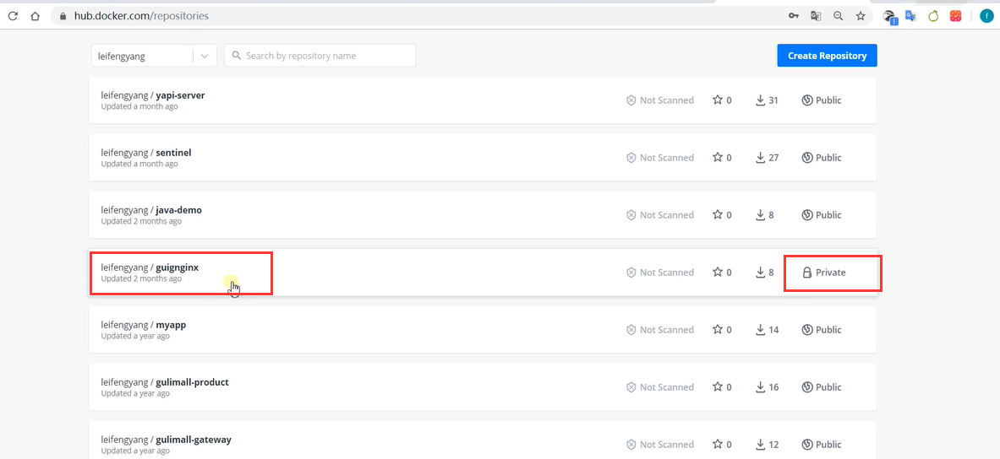
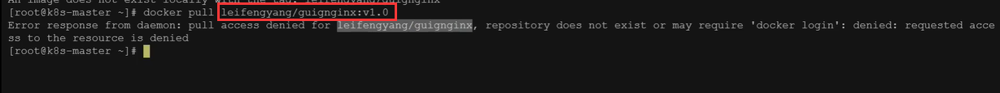
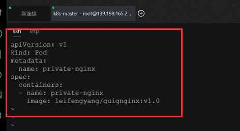
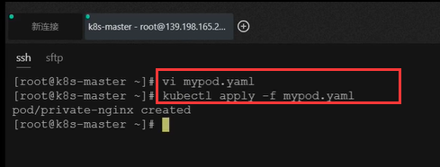
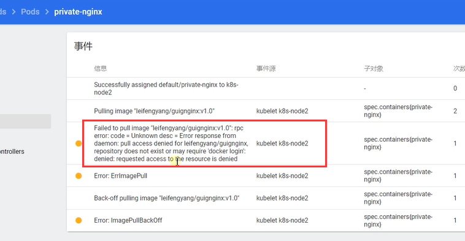
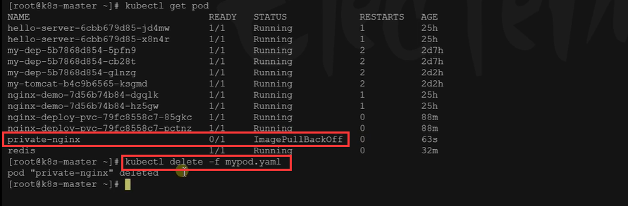
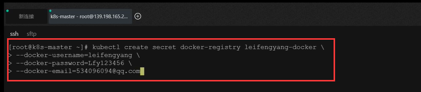
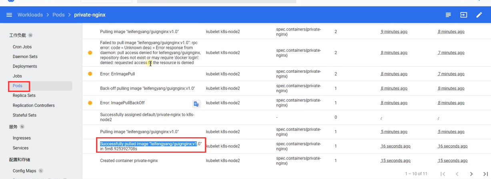

# 42.k8s核心实战-存储抽象-Secret场景示例


	#### Secret

​	Secret 对象类型用来保存敏感信息，例如密码、OAuth 令牌和 SSH 密钥。 将这些信息放在 secret 中比放在 [Pod](https://kubernetes.io/docs/concepts/workloads/pods/pod-overview/) 的定义或者 [容器镜像](https://kubernetes.io/zh/docs/reference/glossary/?all=true#term-image) 中来说更加安全和灵活。

​	其实他是区别于ConfigMap和ConfigMap的工作原理基本一样，只不过ConfigMap他是用来保存我们配置文件等等这些明文信息

​	


​		比如-我们现在要启动一个Pod，这个Pod启动期间肯定要下载一个镜像，但这个镜像我们以前都是从docker hub拉的公有镜像如redis，nginx等等公有镜像，但我们有的时候公司会创建一个自己的私有镜像仓库，比如把我们写好的微服务镜像都放到这个仓库，所以如果我们需要这个私有仓库的镜像的时候我们就需要登录了----那么就需要登录的用户名和密码了，如果我们把这个登录的账号信息写在这个Pod的配置文件里面的话，这样就会有些不安全容易泄露------所以我们现在可以使用k8s的 Secret的方式，先把我docker这些登录的信息保存起来，以后我在下载镜像的时候直接就可以使用了，我们就不需要输入我们docker仓库的用户名和密码了。


​	如，我们现在把这个公共的仓库先变为私有仓库




我们现在可以看到是私有的了




​	如果我们现在想下载这个私有仓库的镜像的话

​	提示我们访问拒绝，需要登录




​	如果我们现在要启动一个私有仓库的v1.0的话







​	现在我们在k8s的web界面可以看到，镜像是下载失败的---不存在这个镜像或者是需要登录




​	然后我们把这个创建Pod的yaml删除掉




​	现在我们创建一下Secret，里面加入用户名和密码的信息




 	我们现在载一下这个私有仓库的镜像试试，因为上面配置Secret的场景，这个K8s因为会携带用户名和密码然后登陆成功，下载成功这个私有仓库中的镜像了




 ```
kubectl create secret docker-registry leifengyang-docker \
--docker-username=leifengyang \
--docker-password=Lfy123456 \
--docker-email=534096094@qq.com

##命令格式
kubectl create secret docker-registry regcred \
  --docker-server=<你的镜像仓库服务器> \
  --docker-username=<你的用户名> \
  --docker-password=<你的密码> \
  --docker-email=<你的邮箱地址>
  
 ```


创建Pod的yaml

```
apiVersion: v1
kind: Pod
metadata:
  name: private-nginx
spec:
  containers:
  - name: private-nginx
    image: leifengyang/guignginx:v1.0
  imagePullSecrets:
  - name: leifengyang-docker
```


 


