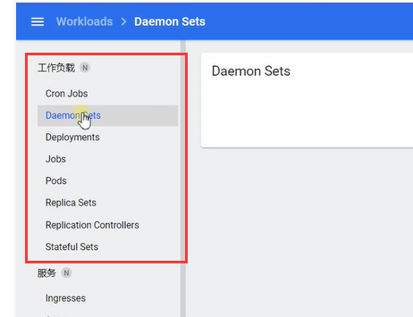
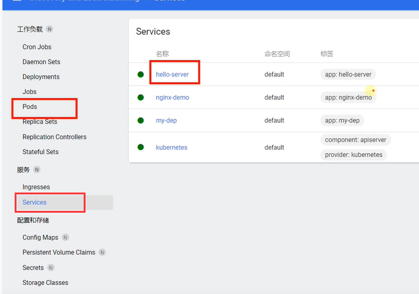
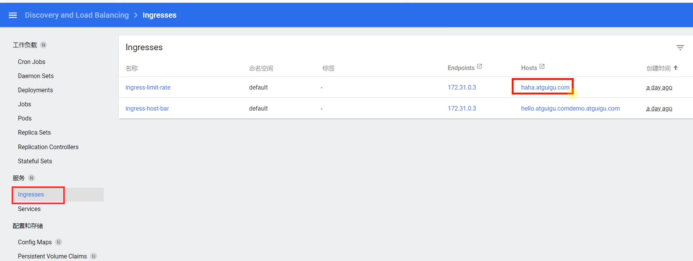
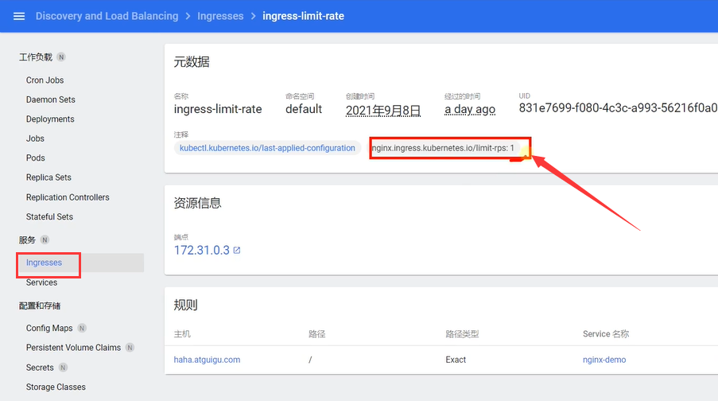
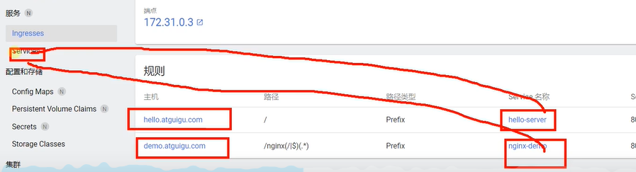
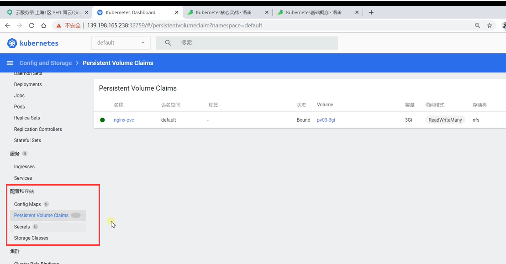
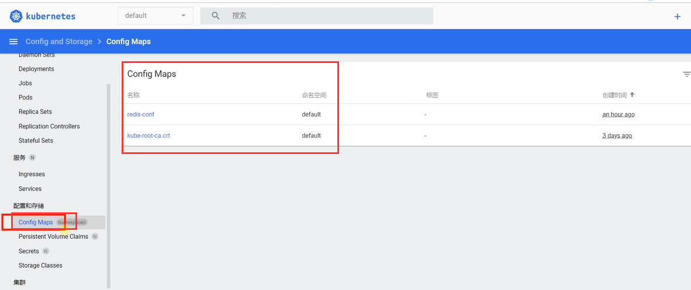
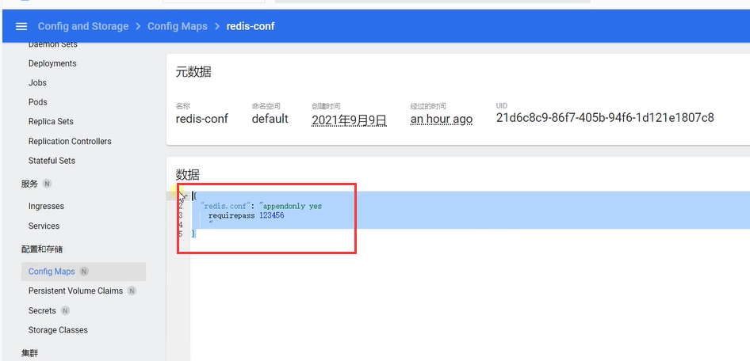
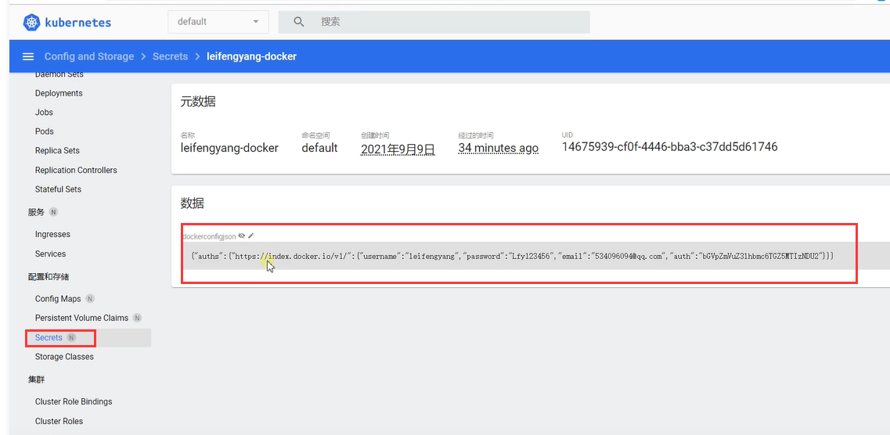
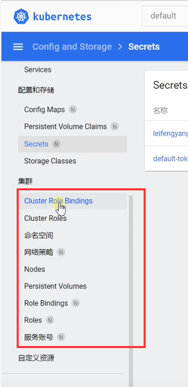

# 43.kubemetes-实战小结

​		我们做一个k8s的小结，首先是在 **工作负载**的部分我们学习了Deployments,我们以后部署的时候使用Deployements进行部署--因为他部署的应用有 自愈、故障转移、包括滚动升级等等优秀特性的优势。

​		deployements部署的应用实际上在底层运行的是一个一个的Pod，也就是说k8s里面的Pod是 最小的原子单位，也就是我们容器运行的最小单位，而Pod里面才是我们真正运行的容器

​		我们的工作负载也有其他的负载，如DaemonSets，如果使用DaemonSet部署Pod的时候就是每个DaemonSet都只能每个机器部署一个Pod--称为守护进程集

​		如果使用Stateful Set部署Pod的时候这些Pod会记录他的状态，我们称为有状态副本集。

​		Deployements为无状态副本集。

​	Pod直接其实是可以互相访问的，因为每个Pod都会有IP，而Pod如果直接来访问其实有点不是很合适，因为如果Pod宕机了，再被拉起来有可能会发生变化，所以如果我们想进行Pod的网络访问，我们可以在Pod的上层 使用 服务 Service

​		我们的Service可以利用这些Pod的标签，来选中一组Pod，我们把这一组的Pod暴露成一个公共的IP地址，或者说一个公共的服务，以后想访问这组Pod就可以访问我们的Service，由Service进行负载均衡的把流量发到每个Pod-----这是网络的Service

​		在Service之上呢，我们又说了Ingress，就是所有的流量请求都应该先通过Ingress，再由Ingress进行下发，比如Hosts设置是haha.atguigu.com，我们可以对这个域名做一个限流，在我们的Ingress中可以很方便的加一项注释配置就可以对他进行限流

​	Ingress加注释配置限流

​	Ingress并且具备路由的功能，如果这个域名配置访问的Service，我们就找到对应的Service，然后由Service找到对应的Pod完成请求流程。

​		这个Ingress还有更强大的功能，因为他相当于集群的统一网关入口，比如还可以截取访问地址，如把路径的nginx截取掉$2,

#### 3配置和存储

​	

​	以后我们的Pod如果想挂载数据推荐使用PVC写一个申请，我们先申请一个空间，然后我们这个空间绑定上来，而我们绑定的卷叫PV，挂载目录推荐使用PVC，PV这种机制

​	如果是要挂配置文件推荐使用ConfigMap，我们把配置文件写在ConfigMap里面

​	比如我们之前把redis的配置文件抽取过来，配置开启秘钥模式，而且如果修改配置文件会动态的修改挂载到容器Pod文件夹内

​	如果是一些秘钥信息就使用Secret，这里面存储的信息我们在k8s中看不到，会把这些加密成base64的结果，如果将这个拿出来使用base64解密的话就是我们现在看到的数据了，有一点的安全性

​	有了以上部分的基础学习我们就大致了解了k8s的操作和大体功能了。。

#### 4集群

​	

​	集群下的功能有，角色绑定关系 ，角色 做一些安全方面的，还有网络策略--流量那块可以访问那块不能访问等等，这些我们深入的时候再去学习，对于我们日常的使用了解以上的功能就够了

​	我们发现现在我们使用k8s的dashboard或者直接使用命令，我们未来如果真的上到一个大品牌公司，可能开发的微服务项目众多，几千几百个模块我们上到了整个平台要参与部署，我们一行一行命令的敲或者是一个一个的yaml文件来做配置是很麻烦的，所以我们现在需要一个完备的一站式平台，比如基于kubernetes的应用可以自愈可以扩缩容等等，如果有这种一站式的平台的话我们希望他给整合了自动化部署的所有技术特性，我们目前使用的是kubernetes的简易平台，我们未来会使用kubeSphere这个一站式平台。

​	kubeSphere是完全的可视化界面，而且是我们人类比较容易理解的方式，让我们点点点就可以把我们的应用部署到k8s平台上，并且具有我们刚刚想象的云平台一站式的能力。比如要做自动化的部署，要做应用的监控，要做日志的收集等等

