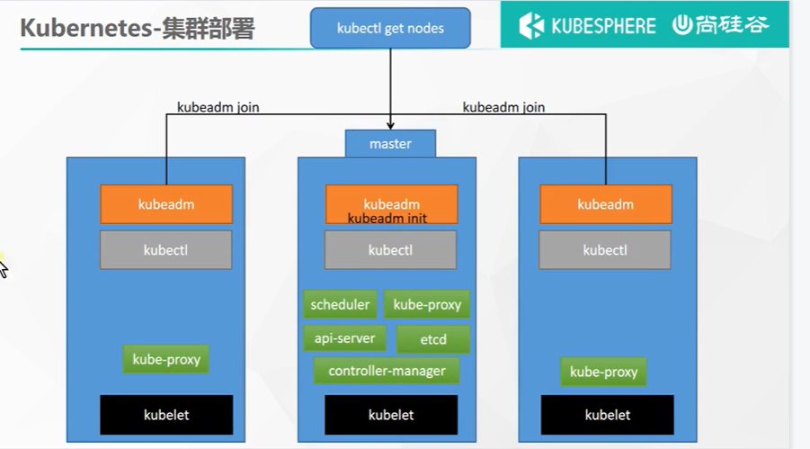
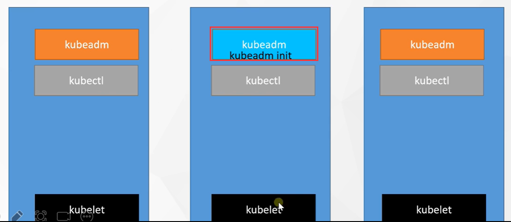
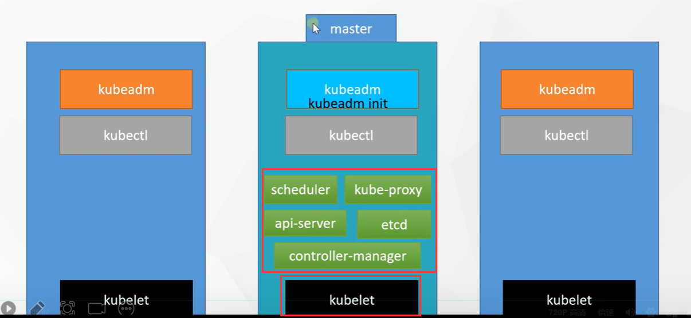
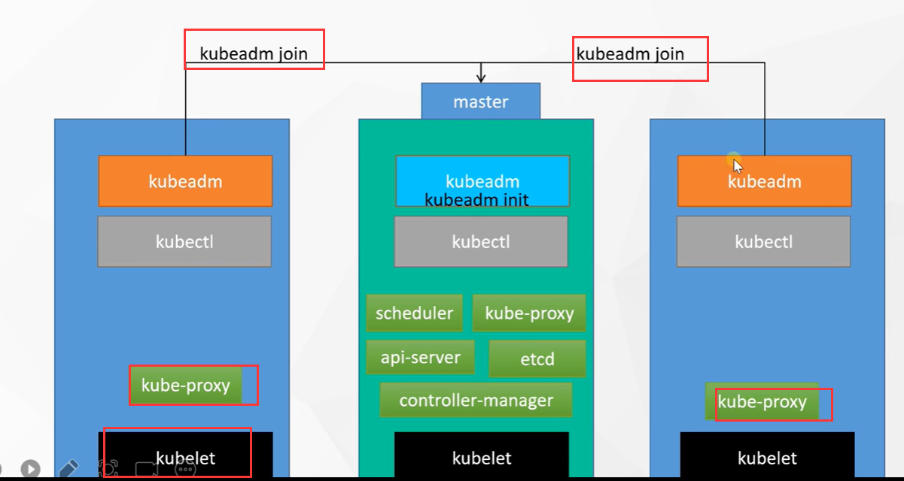

# 5.kubermetes基础-集群安装逻辑

比如我们现在有3台服务器，使用这3台服务器做一个k8s的集群

​	1.首先每个机器都需要安装docker，因为k8s是建立在容器之上的

​	2.每个机器都需要安装kubelet 也就是厂长

​	3.还需要安装kubectl-（kuberController）和kubeadm-（kuberAdmin）这些东西其实是协助我们程序员操作的，甚至在集群搞完之后都可以删除掉这俩个东西，kubectl---是我们程序员用的命令行，我们经常会给k8s发号施令就用的这个命令行，实际上这个kubectl装在master总部就可以了，因为只有master总部才有权利发号施令

​		第二个kubeadm--就是帮我们程序员管理集群的，安装了他之后接下来我们安装k8s集群就快多了，k8s的安装集群有很多方式，最快最简单的方式就是使用kubeadm还有就是二进制的安装方式。----帮程序员快速搭建k8s集群的用途

​	4.然后需要挑选一台机器，做为主节点master，然后使用kuberadm这个工具 调用一个kubeadm init 命令，就可以初始化一个主节点master，接下来kubeadm就可以帮你 把这个节点变为主节点

​	5.然后主节点需要安装很多组件，这些组件都由厂长kubelet来安装，厂长kubelet自己来下镜像，厂长负责把这些组件应用都启动起来--然后我们的总部master就完善弄好了

​	6.其他的机器只需要一个命令 kubeadm join 就可以加入到这个集群

​	7.只要加入集群 厂长kubelet就会在节点中安插一个门卫 kube-proxy

​		以上就是整个集群安装的逻辑思路

