# 6.k8s集群搭建-开通青云三个按量付费服务器

​	我们现在使用的是青云的服务器

​	需要创建3台云服务器（注意之前释放了的服务器，公网IP也需要释放，不然公网IP也是会收费的）

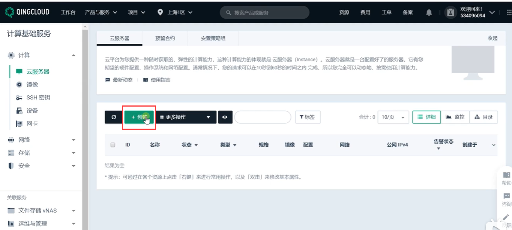

​	我们查看一下资源的配额--由于公网IP的配额只有1个，那么就需要申请工单增加公网IP的配额

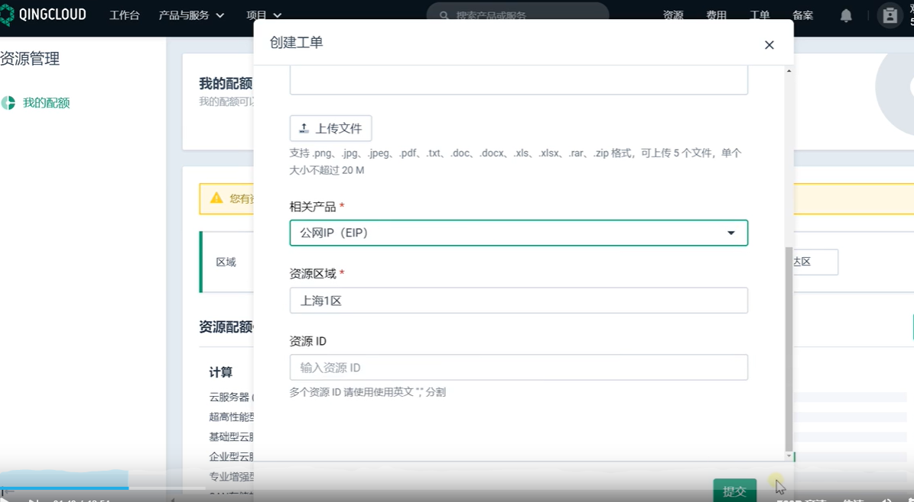

工单申请成功之后--公网IP就是3个了--可能工单的申请需要进行人工或者电话的沟通

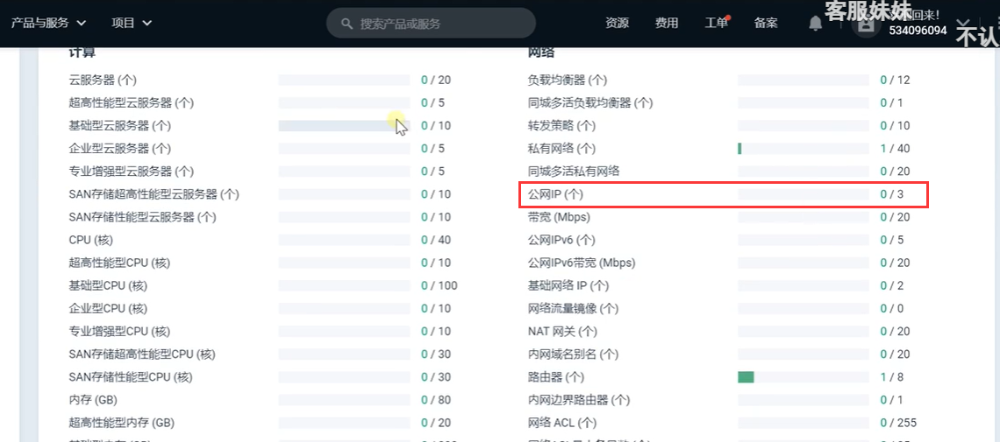

现在就可以创建服务器了，先开一个2核4G的

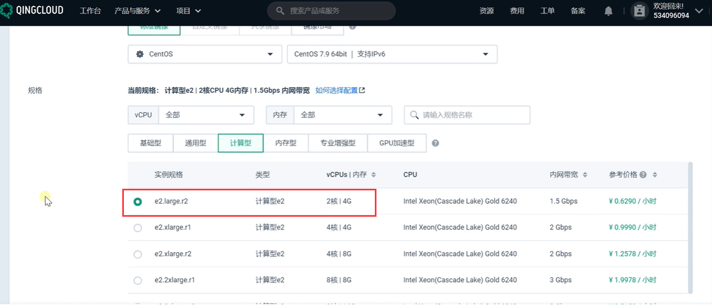

创建一个VPC的私有网络

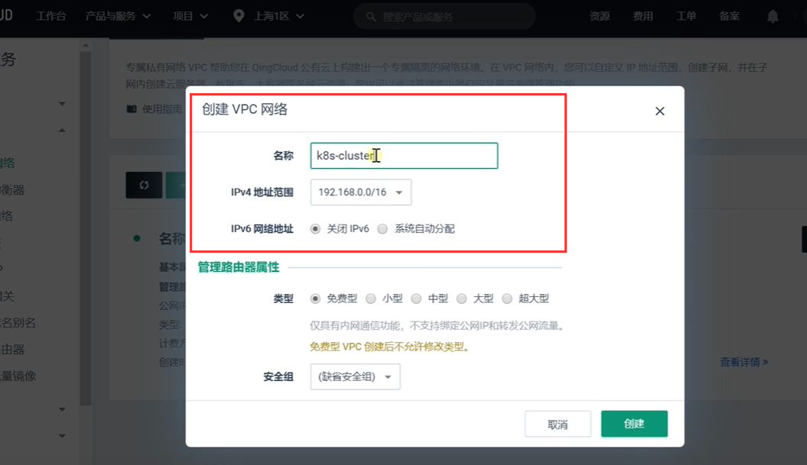

IP范围我们选择最后的--不要选择192开头的，原因后续再说

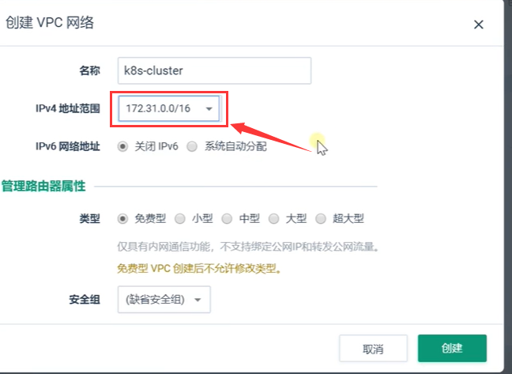

然后在这个VPC下创建一个交换机--因为这个VPC的范围很大，我们划分一下各个小范围的交换机

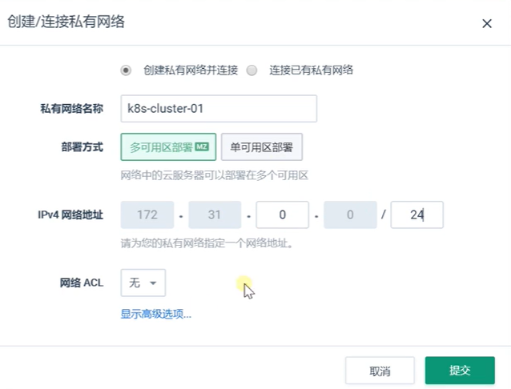

然后我们继续创建服务器，选择好我们创建的k8s的VPC私有网络

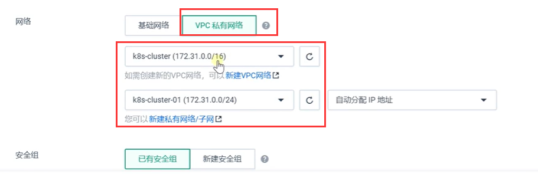

安全组--我们先把22-80-443端口开放一下

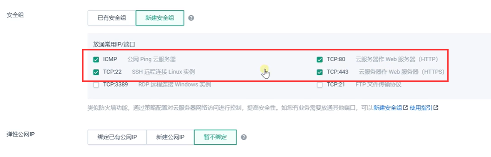

公网IP我们选择按流量付费的

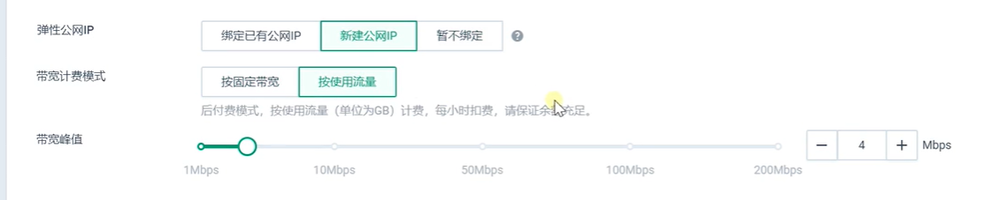

然后点击立即购买--那么3个服务器的集群就算开通了

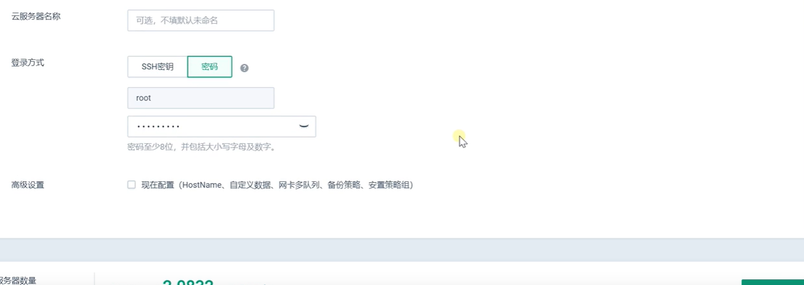

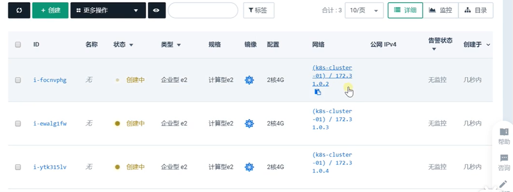

也可以到VPC的图形化查看结构

​		网络--通过安全组--进入到VPC私有网络中--然后进入VPC划分的第一个网络域--可以访问到下面有3台机器

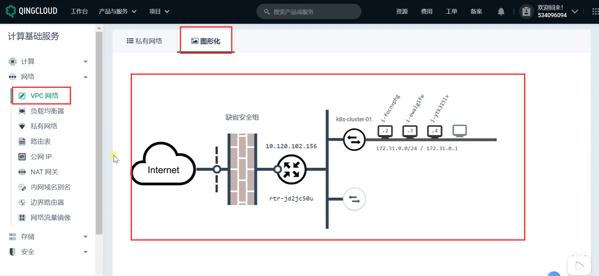

注意安全组： 无论我们使用默认还是自定义的安全组，都需要把安全组打开

​	将组内互信打开--因为组内的各个服务器需要进行沟通的时候如果不开是访问不到的

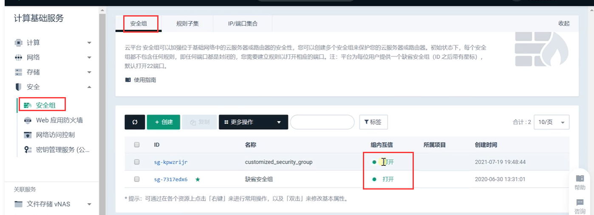

然后我们现在就可以连接服务器了

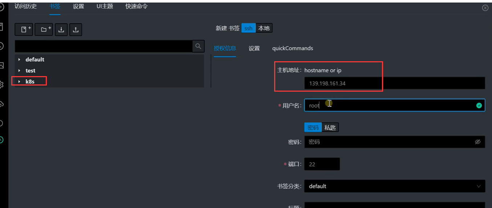

​	然后我们将主节点和 工作节点规划好，准备搭建项目集群

