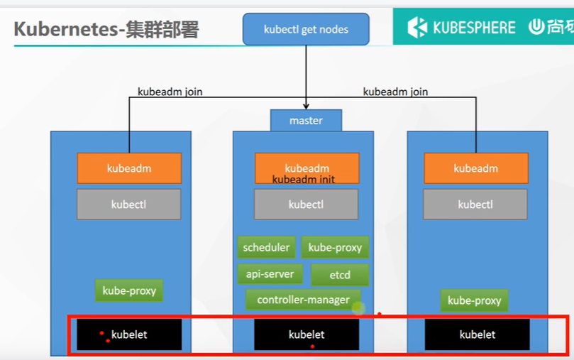
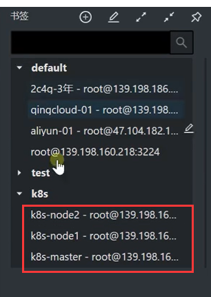
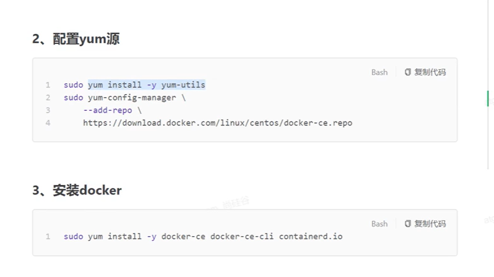
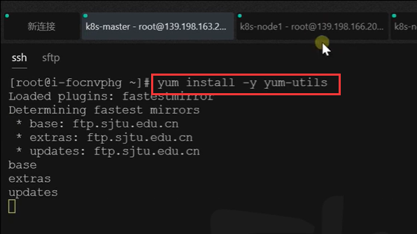
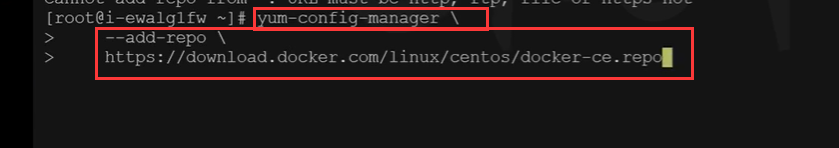
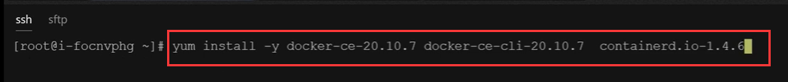
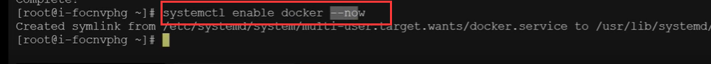
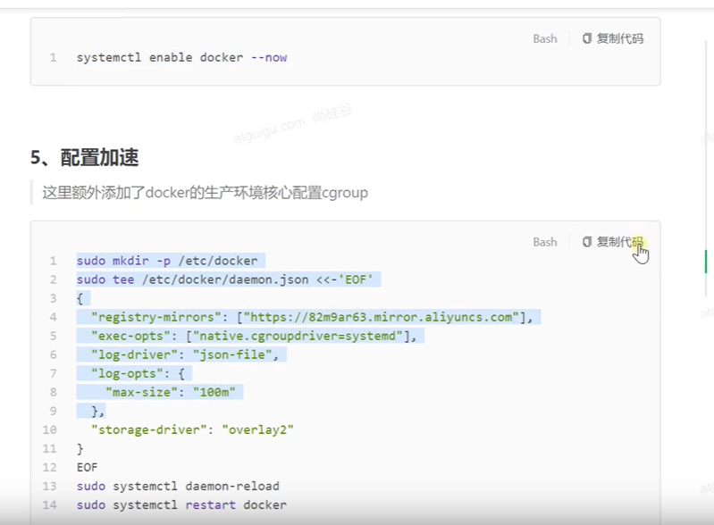
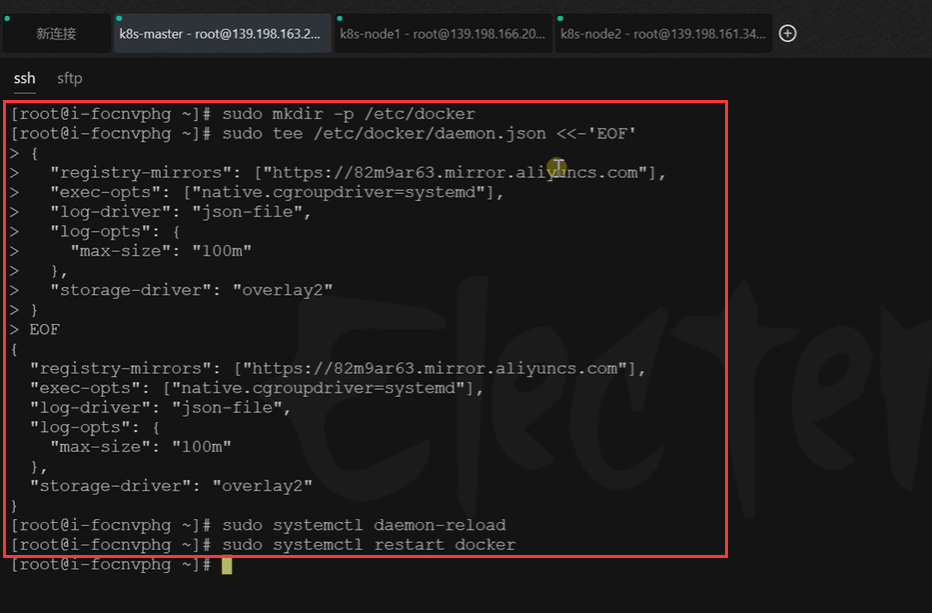
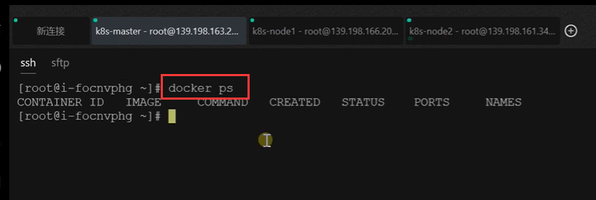

# 7.k8s集群搭建-docker容器化环境安装

​	搭建集群前我们先回顾一下这个图

#### 第一步：安装容器环境

​	连接3台服务器

​	

然后进行yum工具类的加载 和配置yum源

下载工具包

配置yum源

​	安装docker---我们现在需要安装一个指点版本的docker，因为这个版本会和k8s的版本兼容，docker的ce-cli也是同样的版本，还有docker的运行环境containerd.io也使用兼容的版本

​		每个机器大约需要下载400M的内容，可能需要等待一会儿

#### 第二步，启动

现在启动 并且要开机启动---3台服务器都执行一下

然后也可以使用命令 docker info 查看一下docker的信息有就没有问题

#### 第三步，配置加速

docker命令也正常使用，容器化环境安装完毕

https://www.bilibili.com/video/BV13Q4y1C7hS?p=32&spm_id_from=pageDriver

