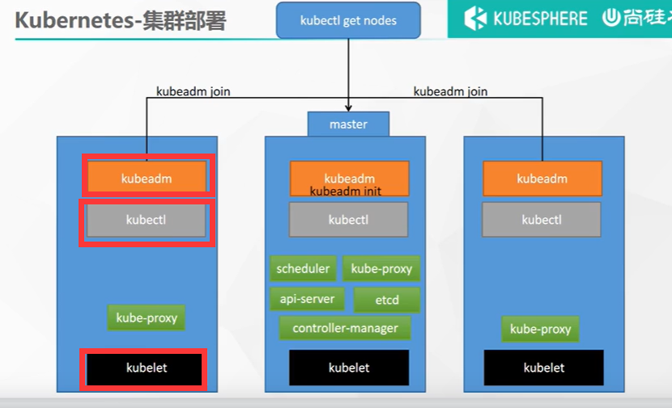
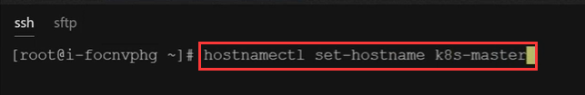
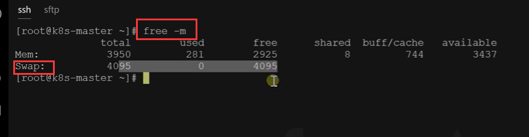
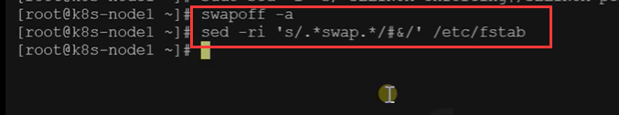

# 8.k8s集群搭建-所有机器预备环境准备完成

​	了解：一些文章说k8s要放弃docker了吗，我们为什么还要安装及学习docker，这个我们就直接下结论吧，因为docker是提供容器化环境的，k8s需要容器化的环境，以前是k8s为了适配docker写了很多代码，现在k8s希望docker能适配他自己，然后docker一定不会放弃这个大的市场，docker一定会做与k8s兼容的适配的，这样以后就不需要k8s过多的操心了。docker肯定是不会被抛弃的。


## 1.安装工具类

​	每台机器都安装好docker容器后，就需要安装一些集群的工具了




​	就是这三个工具--kubeadm、kubectl、kubelet，把这三个工具安装完成后，集群搭建就容易多了

**安装有个要求：**

​	1.就是所有的Linux主机系统版本，都是常规Linux的发行版本，因为要通用的指令。

​	2.机器的内存必须是大于2G内存的。

​	3.机器需要2核CPU或者更多

​	4.集群中的所有机器网络必须是互通的--比如VPC网络组内互信

​			设置防火墙放行规则

​	5.节点之中不可以有重复的主机名、MAC 地址或 product_uuid。请参见[这里](https://kubernetes.io/zh/docs/setup/production-environment/tools/kubeadm/install-kubeadm/#verify-mac-address)了解更多详细信息。如root@***各个主机都不重复

​			设置不同的hostname 起个好理解的名字

						

​	6.开启机器上的某些端口。请参见[这里](https://kubernetes.io/zh/docs/setup/production-environment/tools/kubeadm/install-kubeadm/#check-required-ports) 了解更多详细信息。

​			**内网互信**

​	7.禁用交换分区，为了保证kubelet正常工作，你必须禁用交换分区。

​			**永久关闭**

​		**什么是交换分区**free -m查看 SWap 必须都是0 0 0




​	关闭SWap分区




​	


## 2.基础环境

所有机器执行以下操作

```bash
#各个机器设置自己的域名
hostnamectl set-hostname xxxx


# 将 SELinux 设置为 permissive 模式（相当于将其禁用）
sudo setenforce 0
sudo sed -i 's/^SELINUX=enforcing$/SELINUX=permissive/' /etc/selinux/config

#关闭swap
swapoff -a  
sed -ri 's/.*swap.*/#&/' /etc/fstab

#允许 iptables 检查桥接流量，因为可能有一些IPV6的流量桥接到IPV4上面，统计方便，统计的数值也精确，这是k8s官方让要求我们做的
cat <<EOF | sudo tee /etc/modules-load.d/k8s.conf
br_netfilter
EOF

cat <<EOF | sudo tee /etc/sysctl.d/k8s.conf
net.bridge.bridge-nf-call-ip6tables = 1
net.bridge.bridge-nf-call-iptables = 1
EOF

# 让以上配置生效
sudo sysctl --system


```


那么 以上我们系统中整体配置都生效后，我们的预备环境就准备完成了。。。

### 		


