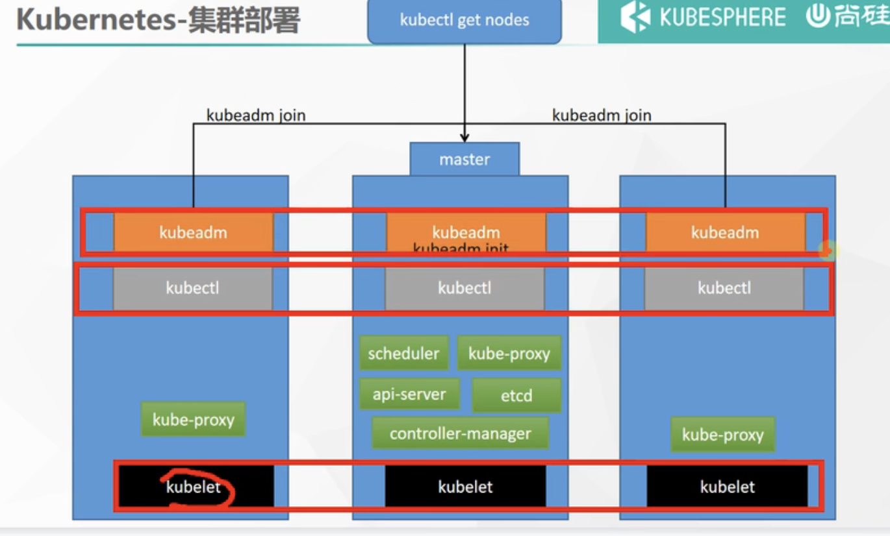
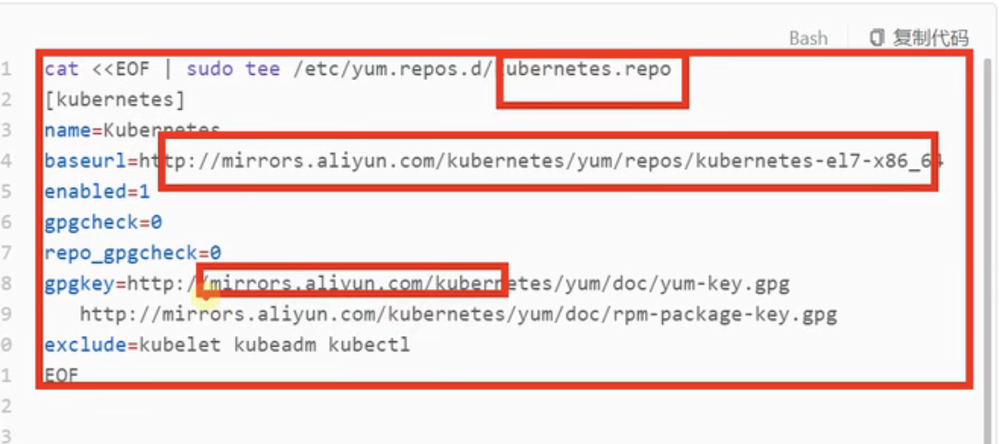
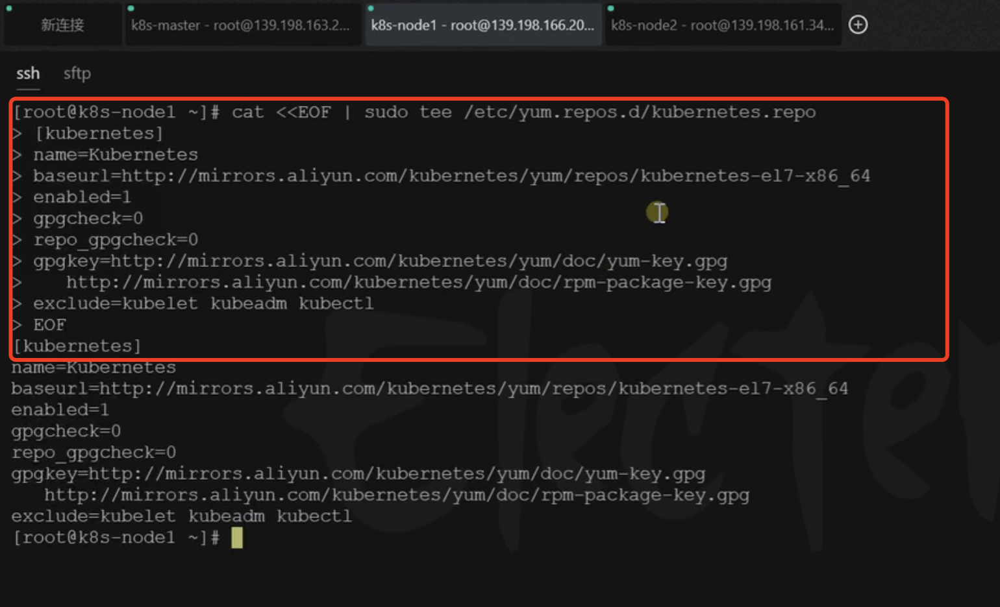
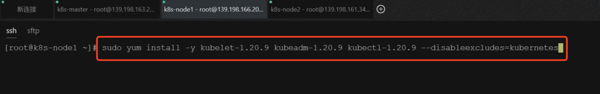
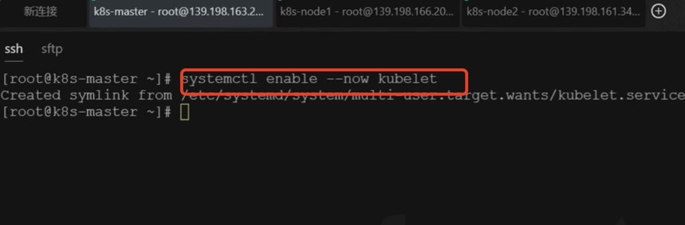

# 9.k8s集群搭建-安装三大件

​		我们的预备环境安装完成后才可以进行集群三大件的安装

​	三大件：指的就是 1、kubelet：相当于厂长，2、kubectl：敲命令行使用的命令，3.kubeadm：是引导我们创建集群的




#### 2.安装kubelet、kubeadm、kubectl

​	首先，我们使用一个linux命令指的k8s的yum源 kubernetes.repo，及地址，gpgkey指定为阿里云的镜像，从EOF开始到EOF结束，这是一个简单的配置。



```bash
cat <<EOF | sudo tee /etc/yum.repos.d/kubernetes.repo
[kubernetes]
name=Kubernetes
baseurl=http://mirrors.aliyun.com/kubernetes/yum/repos/kubernetes-el7-x86_64
enabled=1
gpgcheck=0
repo_gpgcheck=0
gpgkey=http://mirrors.aliyun.com/kubernetes/yum/doc/yum-key.gpg
   http://mirrors.aliyun.com/kubernetes/yum/doc/rpm-package-key.gpg
exclude=kubelet kubeadm kubectl
EOF

# 这里是安装k8s集群的三大件
sudo yum install -y kubelet-1.20.9 kubeadm-1.20.9 kubectl-1.20.9 --disableexcludes=kubernetes

# 最后让系统所有人启动kubelet
sudo systemctl enable --now kubelet
```


 #### 执行命令：

​	第一步操作：设置yum源--所有集群机器都配置




​	第二步操作：安装三大件

​	


第三步操作：启动kubelet 所有机器都启动起来--先让各个厂长都就位




