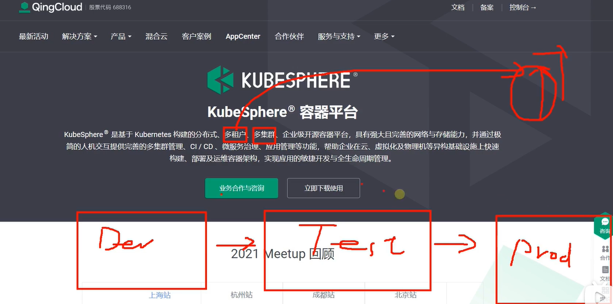
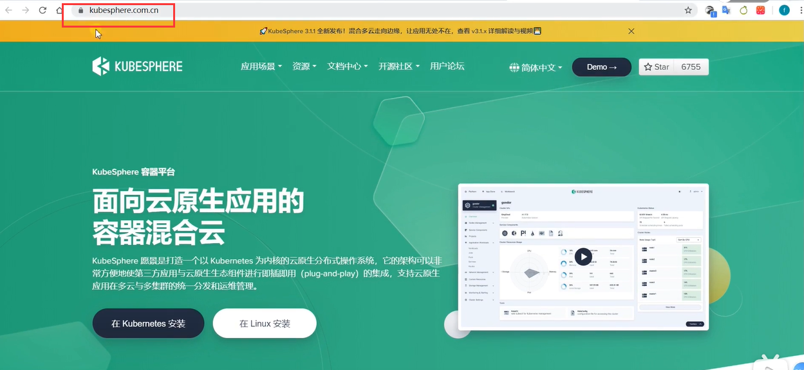

# 1.kubeSphere-平台安装-简介

#### 1.什么是kubesphere？

​	kubesphere是由青云公司开发的，kubesphere是基于kubernetes构建的分布式，多租户，多集群，企业级开源容器平台，具有强大且完善的网络与存储能力，并通过极简单的人机交互提供完善的多集群管理，CI、CD、微服务治理、应用管理等功能，帮助企业在云，虚拟化及物理机等异构基础设施上快速构建，部署及运维容器架构，实现应用的敏捷开发与全生命周期管理。

​		**kubesphere是容器平台**

https://kubesphere.qingcloud.com/

​	而且kubesphere是遵循阿帕奇2.0协议的，所以无论我们二次开发或商用都是非常友好

​	什么是容器平台：首先Kubernetes是一个容器编排系统，kubesphere是基于kubernetes的，所以整个kubesphere的容器编排功能是由k8s提供的，所以往小了说kubesphere是kubernetes的可视化界面，但是kubesphere不止只是一个可视化的界面，而是一个可以打通整体应用上云的所有环节。

​	如我们之前使用的k8s可视化界面dashboard他这个可视化界面就太简单一些了，不能够完成我们项目上云的整体操作，而kubesphere就应运而生了实现了云原生。

​	比如kubesphere拥有的多租户能力，什么是**多租户**？我们以前在登录dashboard的时候我们需要拿到官方给我们的令牌才可以登录进去，而不能允许我们用户的登录注册这个流程。多租户就是我们用户可以自定义注册进来，然后我们甚至可以给用户一些集群操作权限--然后就可以操作集群了。所以呢kubesphere打通了多租户系统。

​	kubesphere还有多集群的管理功能--比如未来我们有开发的时候开发的一套k8s集群，我们还有开发完成的一套测试k8s集群--而真正到生产还有一套k8s集群，而这多个集群可能都是需要管理的，为了管理方便我们也可以安装kubesphere让他一站式帮我们管理多集群。

​	并且因为他有多租户授权功能，所以不可能导致我某个用户从dev集群来到生产集群把生产集群搞出一些问题的顾虑。

#### 2、另外的一些功能

​	自动化部署的功能：比如CI、CD的功能kubesphere也有整合。

​	微服务的治理：服务网格

​	

​	应用管理：应用商店等等

​	然后kubesphere也有完整的集群告警功能，日志收集处理等等。

​	也就是说未来，应用上云的一系列解决方案kubesphere基本是一站式帮我们整合进来了，kubesphere是非常好的应用上云的生产力提升大神器

​	安装文档：https://kubesphere.com.cn/

​		我们参照官方文档来安装，在这个官方文档中我们可以学到很多知识，全栈的 Kubernetes 容器云 PaaS 解决方案

