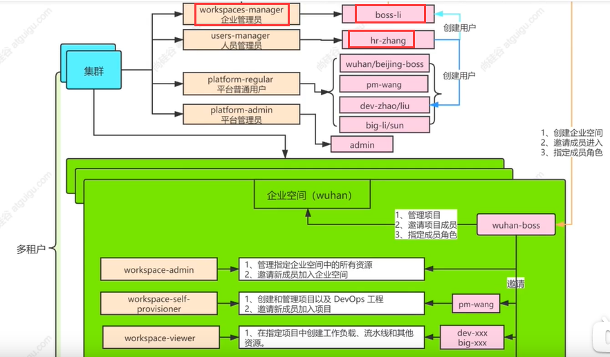
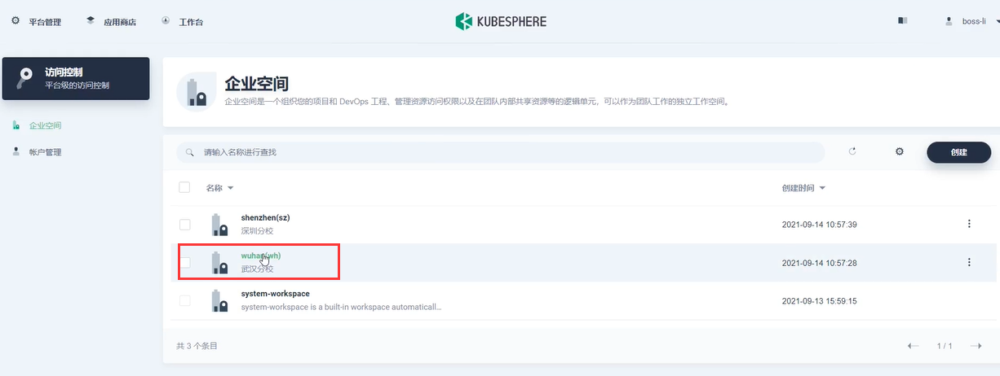
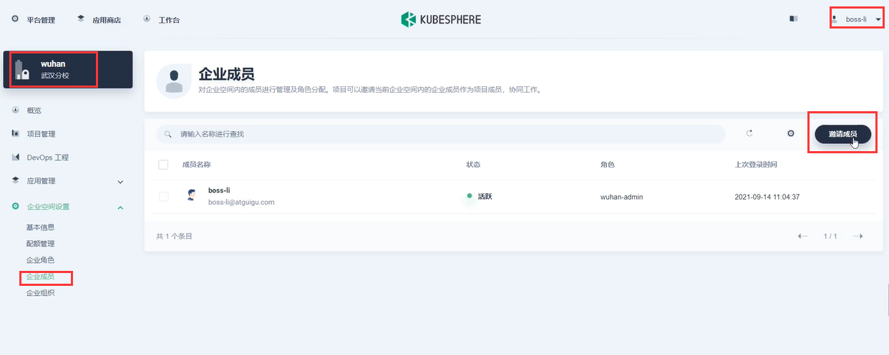
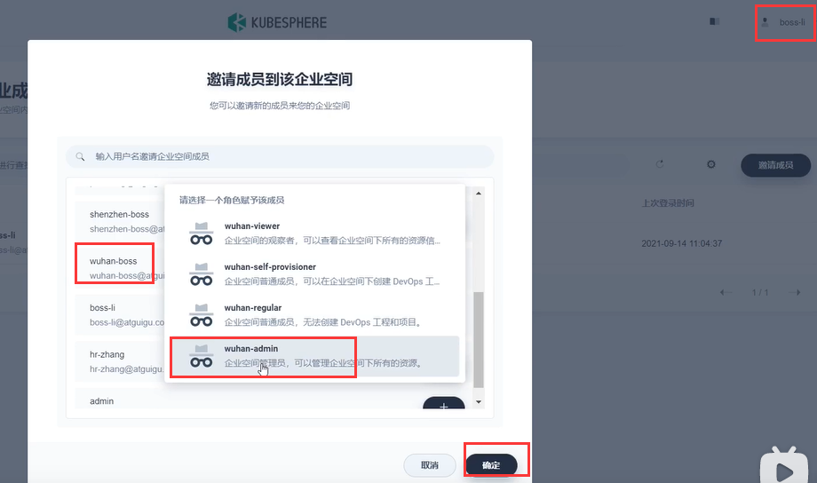
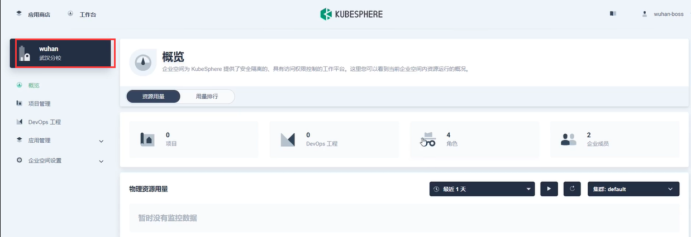
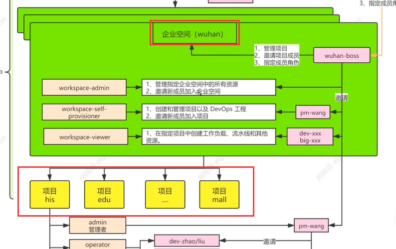
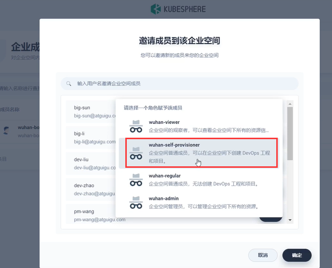
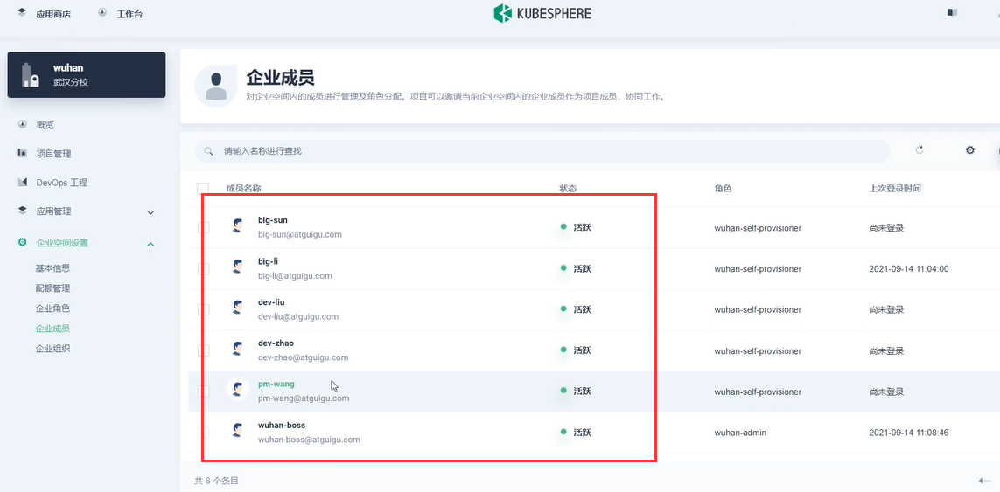

# 10.kubesphere-多租户-wuhan-boss邀请其他用户进入企业空间

​		如果我们用普通用户登录的话，目前是什么都不能干的，因为没有任何权限

​	

​		然后我们现在就来实现 多租户的第二个实战环节，首先我们的Hr已经为我们创建了很多用户了，接下来就是由我们的企业空间--我们之前企业空间是由boss-li这个用户创建的

​	那么现在就由boss-li进入这个武汉的企业空间

​	然后是在武汉这个空间-点击企业成员--然后邀请成员

点击邀请--然后在企业空间里面邀请用户的时候会给他赋一个权限--这个权限是针对这个企业空间的，例如我们给武汉这个企业空间设置一个管理员

​	然后我们使用wuhan-boss来登录--他目前的权限是武汉企业空间的管理员

​	我们可以看到他只能看到武汉分校这个的**企业空间**，这就是我们说的第二个层级叫企业空间

 

在企业空间里面就会有一个个的项目，这就像我们的公司一样，比如我们北京的分公司我们会研发的做几个项目，在武汉分公司也会有几个不同的项目，每个分公司可能有不同的业务和任务，所以说我们真正的项目是属于在企业空间之下建立的。

​		我们现在是每个集群下面可以有多个企业空间，每个企业空间下面可以有多个项目

​	我们现在使用wuhan-boss这个企业空间的管理员，把所有的成员都邀请进来

​		viewer：观察者，只能查看资源

​		self-provisioner：普通成员，可以创建一些项目和devops--一般给开发人员

​		regular：普通成员，无法创建项目

​		admin：是企业空间的管理员

​	邀请了很多成员：相当于邀请了很多成员加入到我们的分公司

https://www.bilibili.com/video/BV13Q4y1C7hS?p=77&spm_id_from=pageDriver

