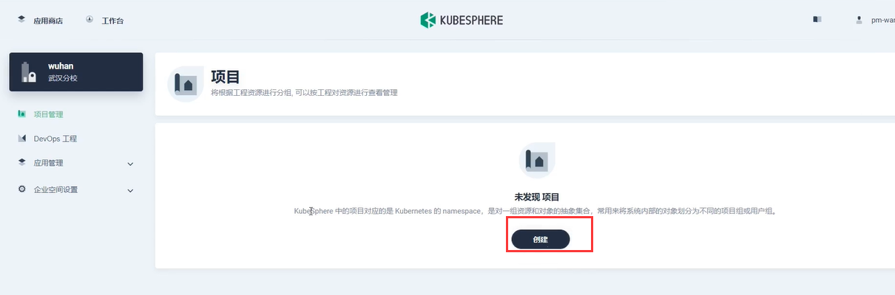
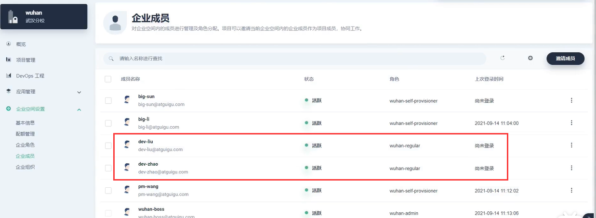
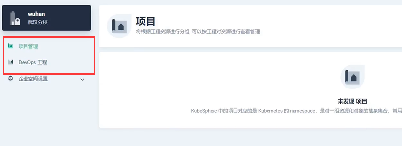
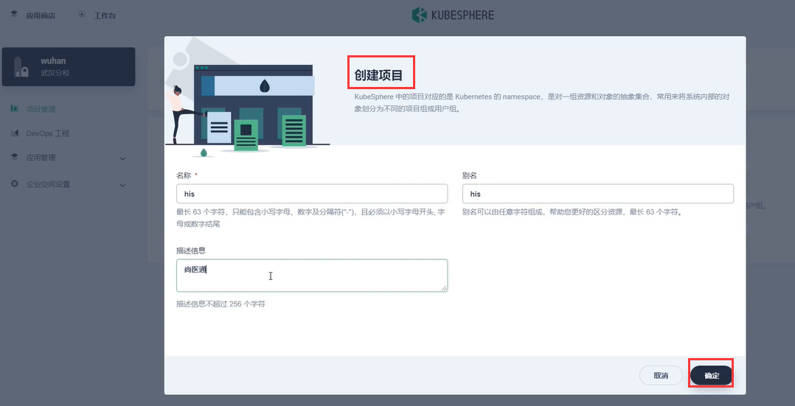
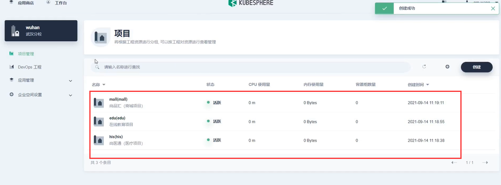
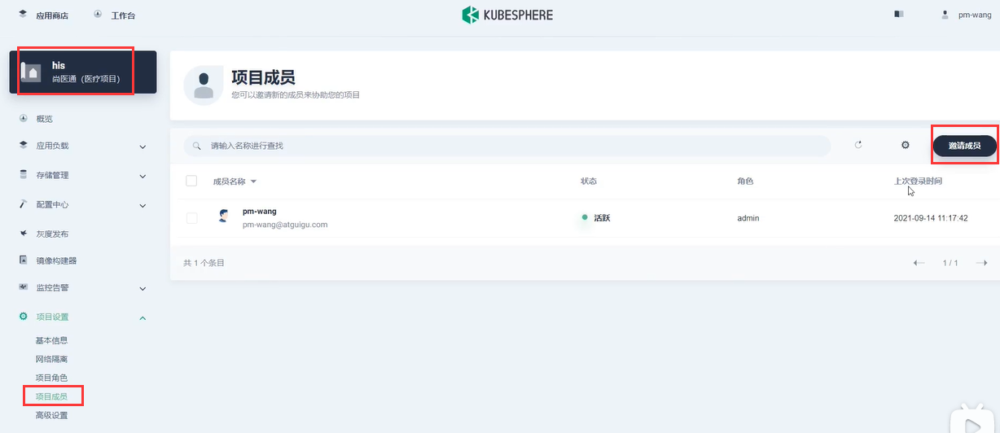
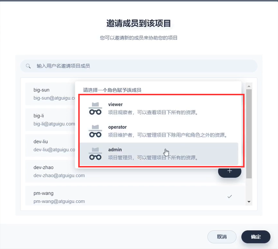
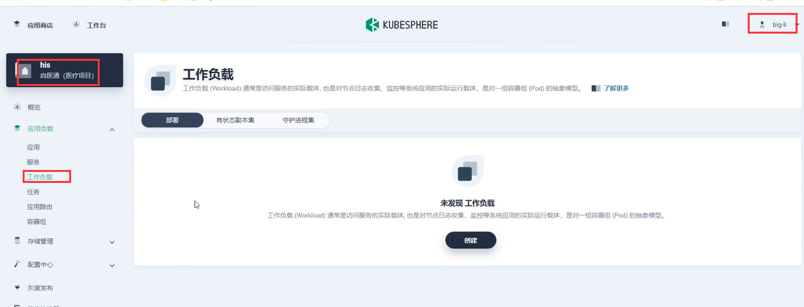
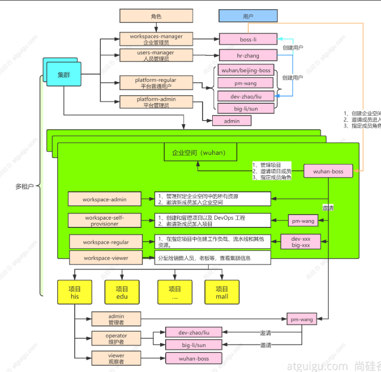

# 11.kubesphere-多租户-pm-wang创建项目&邀请用户进入项目

​		之前我们实战了使用wuhan-boss把人员都邀请加入到武汉的企业空间，并且设置为普通用户权限。

​		我们现在使用pm-wang普通用户登录进来看一下：他可以创建项目，但是不具备邀请人员加入企业空间的功能，只要企业空间的管理员才可以邀请进入企业空间如wuhan-boss

​	但是我们现在想要再严格控制一下，王总监pm-wang因为他是项目总监，所以我们到底有多少个项目是由他创建的，而项目里面要部署什么资源是由开发人员再来部署的，所以我们再登录一下wuhan-boss来设置一下权限，我们将开发人员设置为不能创建资源的普通用户

​		我们使用普通成员的账号登录一下看一下big-li，他的权限是regular，他是没有办法创建项目和devops的。

#### 创建项目

​	我们使用王总监pm-wang来创建项目--他的权限是self-provisioner

​	比如--我们未来会有很多的项目，我们在武汉这个企业空间可能会开发his系统，edu系统等等

创建完后的项目列表

​	比如我们点击进入his这个项目，在这每个项目里面由我们的pm-wang总监，再来添加项目的成员

​	并且可以给这个项目的人员设置权限--一般的开发者选择operator这个角色

​	我们现在使用big-li登录，可以看到他只能负责这个his项目，而且在企业空间里面也并不能做更多的事情，他可以在项目中部署一些应用或者创建一些工作负载等等，我们后续想部署什么就可以在可视化界面来做了。

​	这里主要的了解一下，这个图对应的三个层级，每个层级都有不同的权限

https://www.bilibili.com/video/BV13Q4y1C7hS?p=78&spm_id_from=pageDriver

