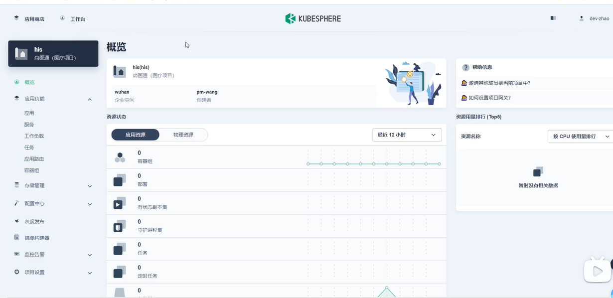
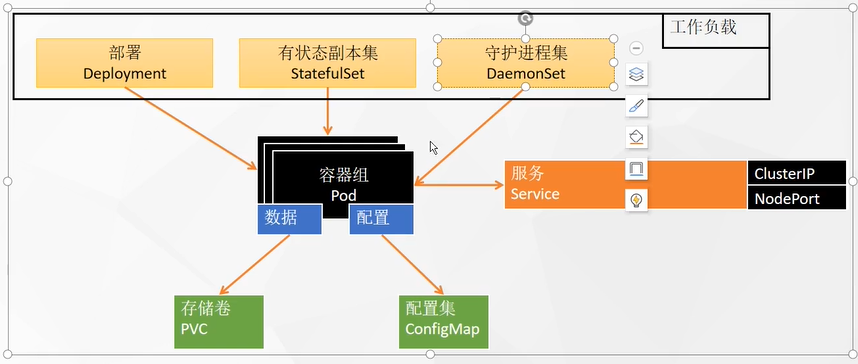
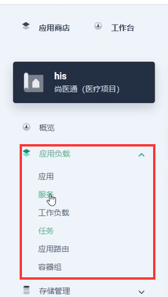
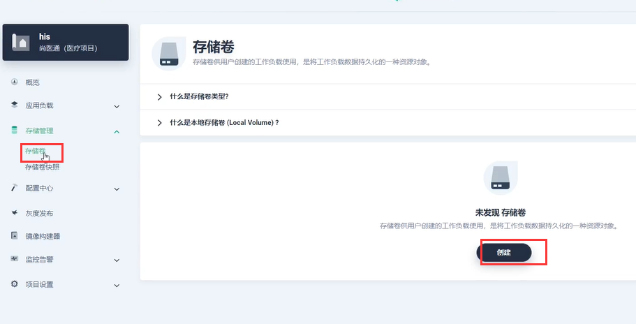
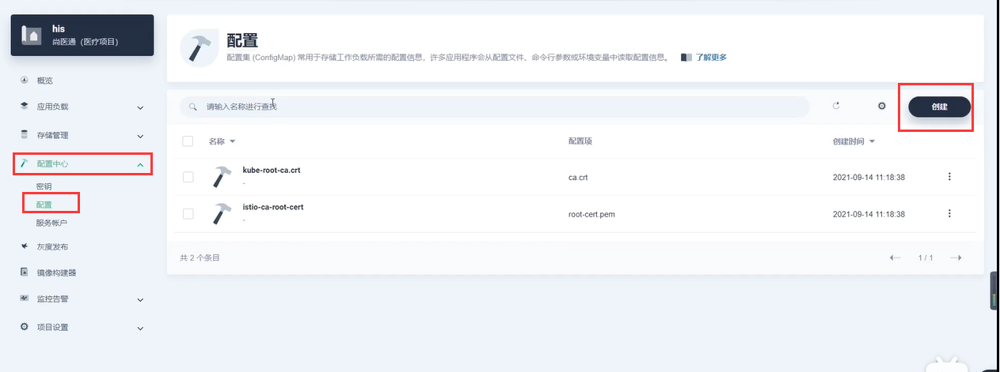
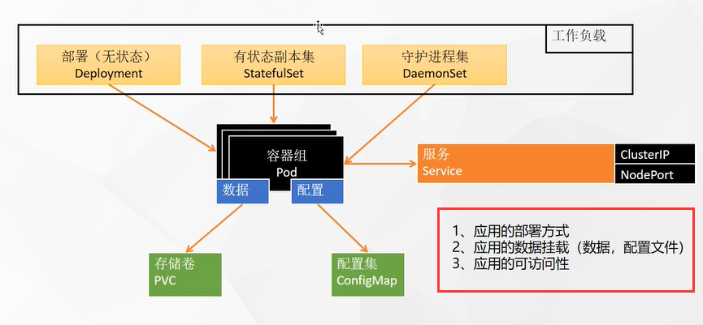

# 12.kubesphere给kubernetes上部署中间件-应用部署三要素

​		我们如何在kubesphere平台上部署一些应用，我们先以中间件为例，比如我们先部署一些中间件上去如MySQL、Redis等等

​	

​	我们使用dev-zhao这个开发用户登录进来

​	我们现在思考一下，我们在云上部署应用该是一个什么样的方式，我们部署应用需要考虑哪些问题，首先我们要在云上部署应用我们要想清楚这个应用要以**什么样的方式部署**--工作负载（部署-无状态，有状态副本集，守护进程集）

​		项目或微服务项目--一般都是无状态的部署

​		有状态的比如Mysql的部署，如果宕机重启还可以恢复数据（一般的中间件都属于有状态的）

​		守护进程集--DaemonSet比如日志收集工作，收集每台机器的日志，每个机器都需要安装一个日志收集器，对于类似这样的日志收集器每个机器都需要部署一份的我们使用守护进程集

​	如果我们是想部署我们的一些微服务，就使用部署，因为微服务算无状态应用

​	应用部署完后还需要部署一个Service用来进行通信，这个服务就是创建我们k8s负载均衡网络的。

​	

​	重点就是：工作负载，服务，容器组这三个重要的功能

​			任务：就是一些定时的任务

​			应用路由：其实就是k8s的igress

​			应用：相当于一键的方式帮我们部署应用

​	我们的整个部署都是参照 **应用负载** 下面的功能

​	如果我们的应用需要将文件挂载出去，比如MySQL，我们就需要创建**存储卷**--对应k8s的PVC的概念

​	还有就是应用的配置，如MySQL的配置文件，Redis的配置文件等等，如果我们需要将配置文件抽取或者是挂载，我们就可以使用 配置中心 ---配置 进行创建，这块的配置其实就是k8s的ConfigMap

#### 我们部署重要的三要素

​	1、先搞定我们部署的应用是使用什么方式部署

​	2、我们部署的应用的数据和配置文件要挂载到什么地方

​	3、我们最终这个部署的应用 网络该如何访问

​	

https://www.bilibili.com/video/BV13Q4y1C7hS?p=79&spm_id_from=pageDriver

