# 14.kubesphere给kubernetes上部署中间件-部署MySQL负载均衡网络

​		接着之前的部署MySQL，现在我们把MySQL做成可在集群外部访问的应用

​		因为之前我们创建的有状态副本集，他默认给我们创建了一个服务，有状态服务只能在集群内部访问

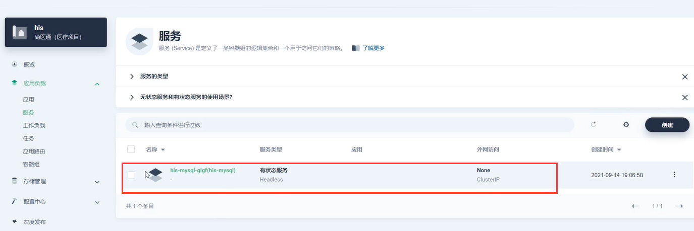

​	我们验证一下是否是集群内部可以访问--是可以的

​		-h加dns是连接指定远程的mysql，是可以连接成功的

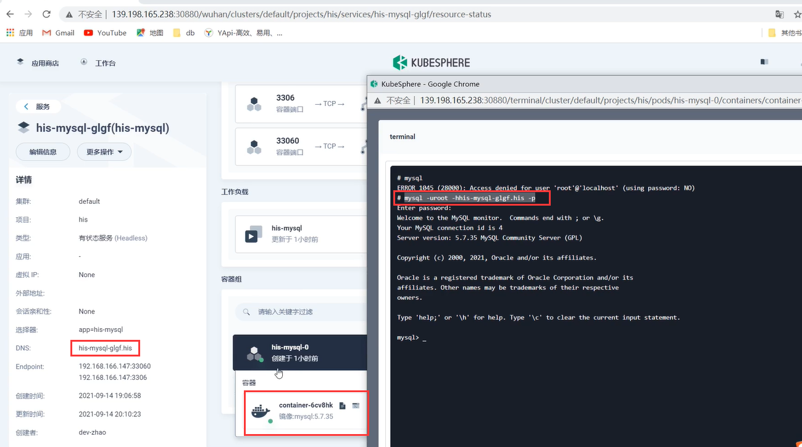

#### 集群外部进行访问MySQL

​	我们在kubesphere中的服务下，创建一个服务，我们都使用指定**工作负载**的方式进行创建服务

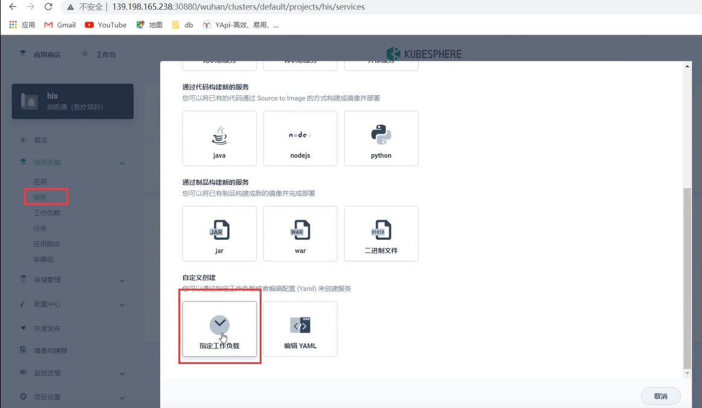

​		设置服务基本信息

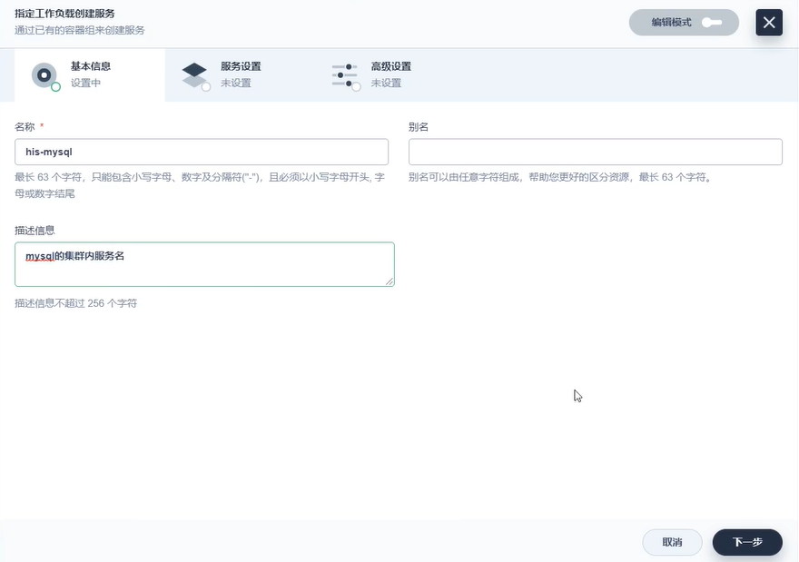

​	设置访问类型，然后指定工作负载，然后设置端口

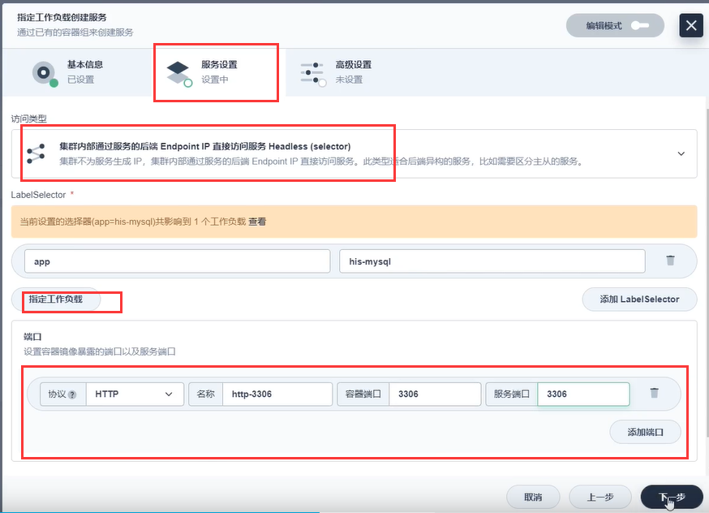

​	配置外网访问方式--点击创建--我们发现报错了--因为我们上一步选择的访问类型是 **集群内部通过服务的后端Endpoint IP 直接访问 Headless**这种方式--这种方式是不可以暴露外网访问的

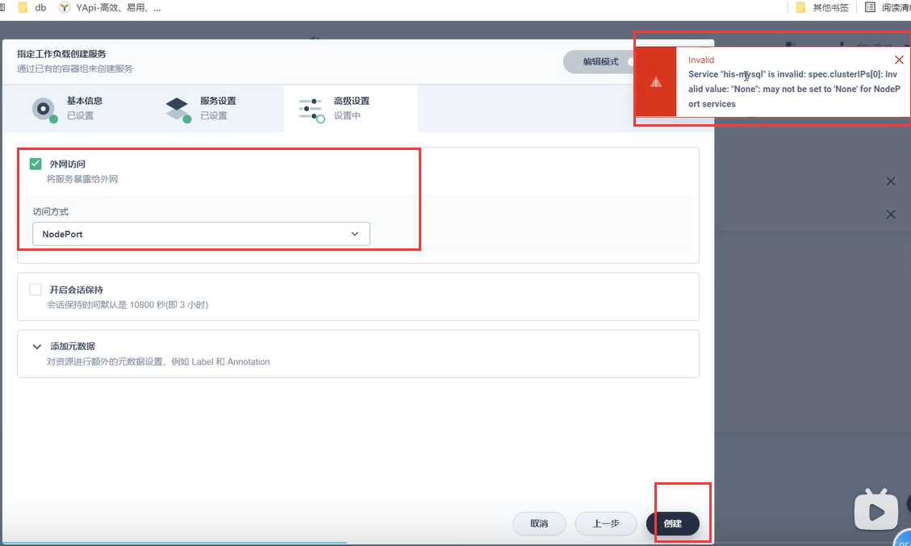

​		我们使用的访问类型为 **集群内部的Ip来访问服务Virtual IP**就可以设置外网访问了

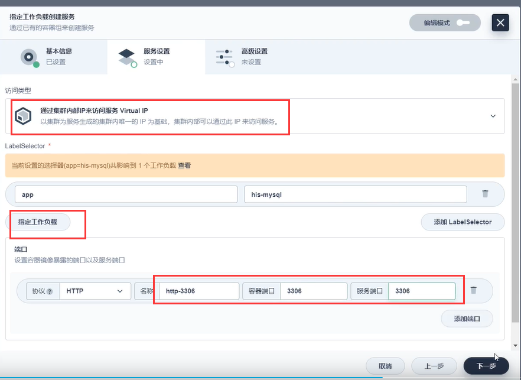

​		然后设置外网访问

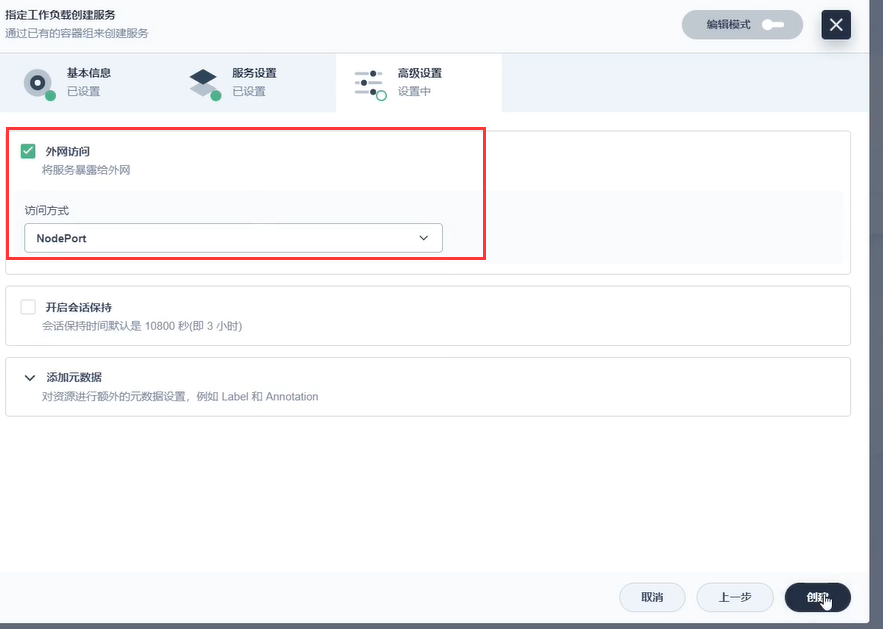

​		然后就创建好了--可以看到外网访问的类型是NodePort，这个节点暴露了一个31840的端口

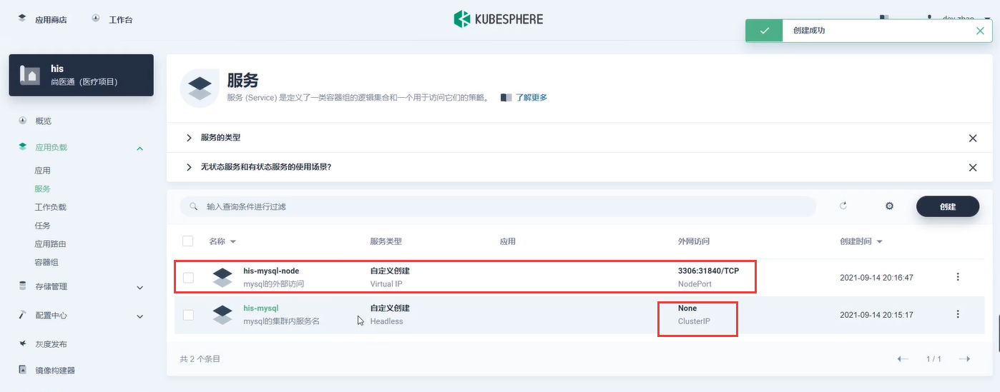

​		想要使用外网来访问，前提是我们的端口已经开放了，并没有限制--安全组

​	我们使用外网连接一下，发现没有问题可以连接上

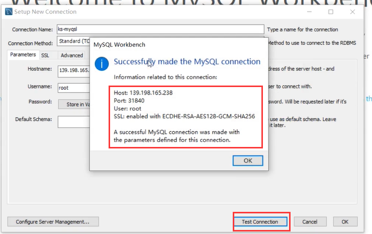

​		如果我们是在生产环境的话---除非我们需要从外部访问连接生产的数据库，否则我们就可以把对外开放的服务删除掉，为了安全起见--我们保证集群内部的服务是畅通的就ok了

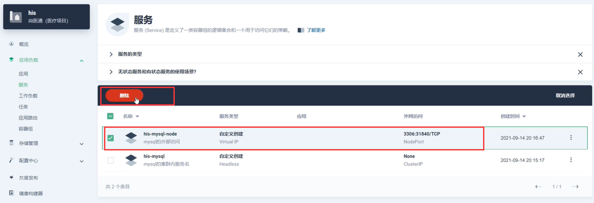

https://www.bilibili.com/video/BV13Q4y1C7hS?p=81&spm_id_from=pageDriver