# 17.kubesphere-应用商店-部署RabbitMQ

​		之前我们手动的部署了MySQL，Redis，及ElasticSearch，但是在未来我们的使用场景里面，我们这些中间件其实是一个非常固话的部署过程---就是无论我们部署上一次或10次流程都是一样的，那么有没有什么方式能够一键的把这些应用都部署上来，其实我们就可以使用kubesphere的应用商店，在kubesphere中把我们常见的应用都放在了应用商店里面。

​	比如以RabbitMQ为例----

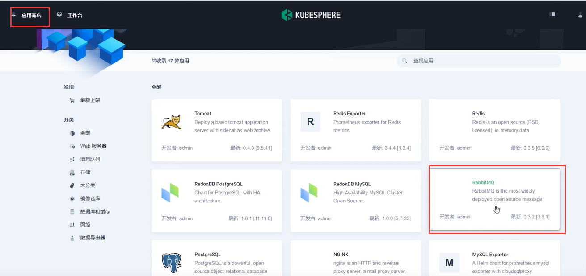

​		然后我们点击部署

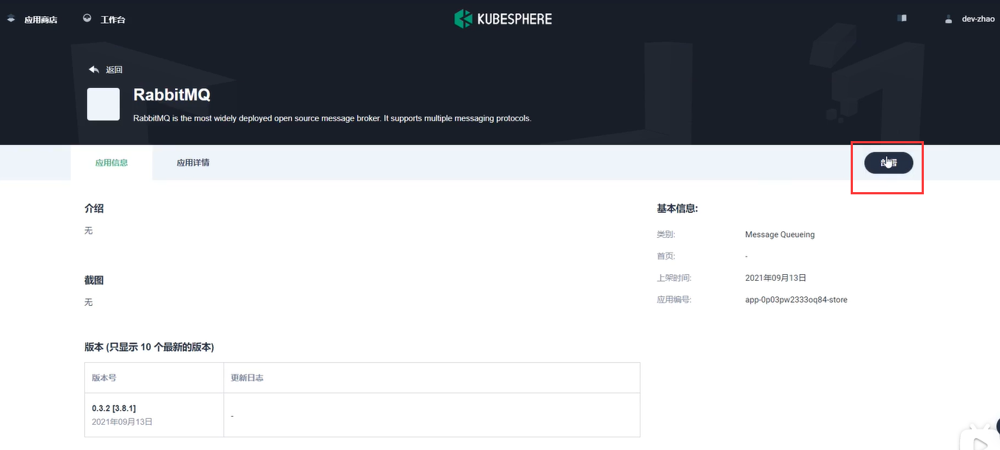

​		我们选择版本--然后选择部署位置--然后下一步

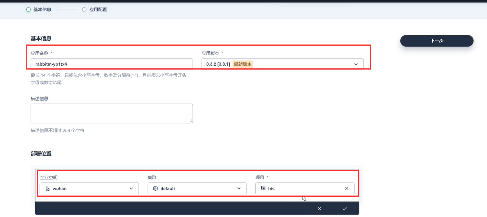

​	

​	这里是RabbitMQ的可视化配置界面--比如打开持久化存储

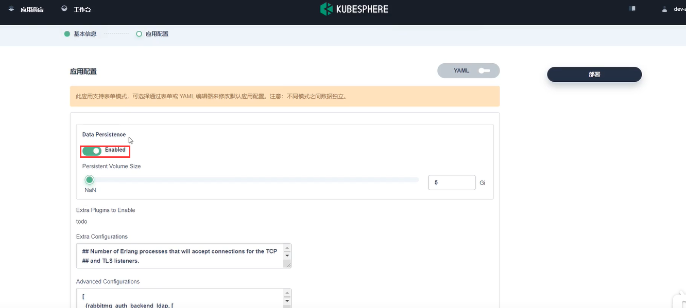

​	还有RabbitMQ的账号和密码设置---然后点击部署就可以了

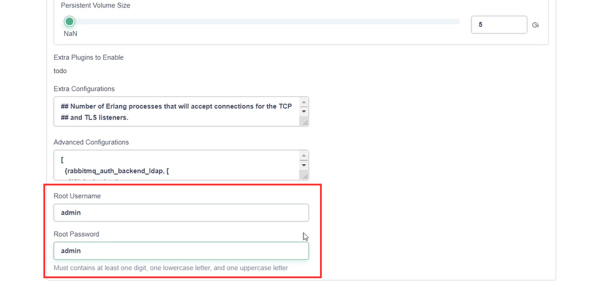

​	从应用商店部署的应用，我们就可以在应用里面看到了

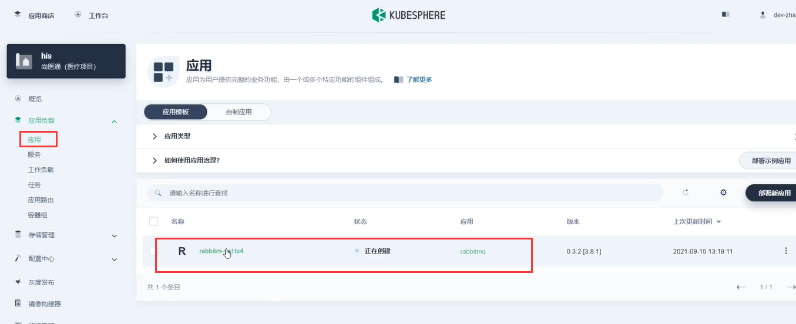

​	当然创建了应用，在工作负载中也会显示

​	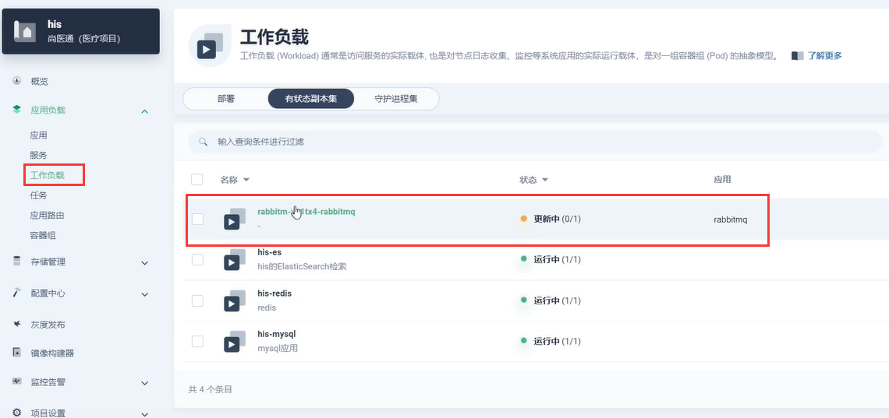

服务也是自动创建的--但是是集群内可访问的

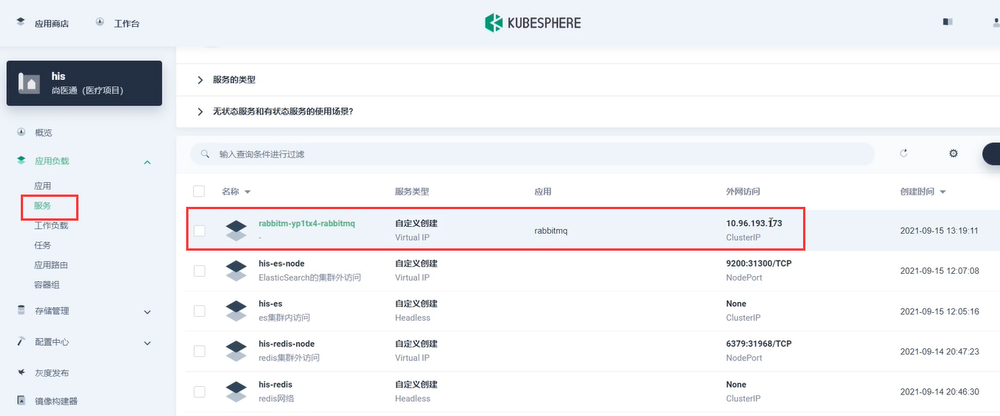

​	如果我们想让外网可访问--那么就编辑一下服务--选外网可访问

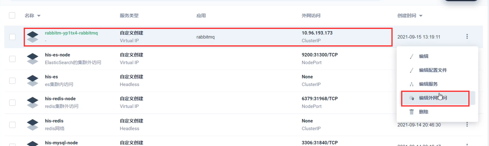

​	设置为NodePort就可以了

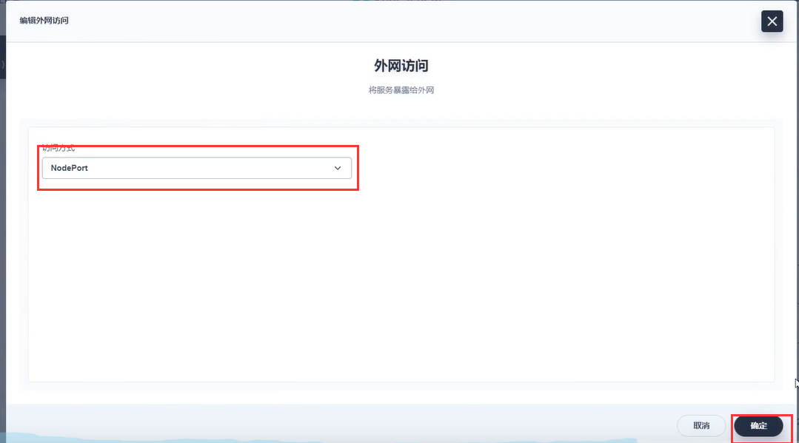

​		此时就开放外网访问了，我们主要看15672端口，目前对应的是30375端口

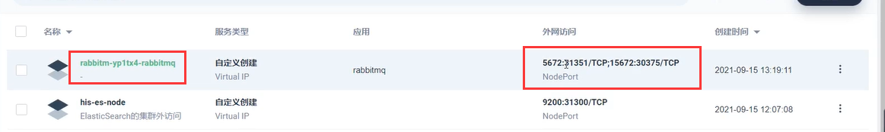

​	外网可以访问

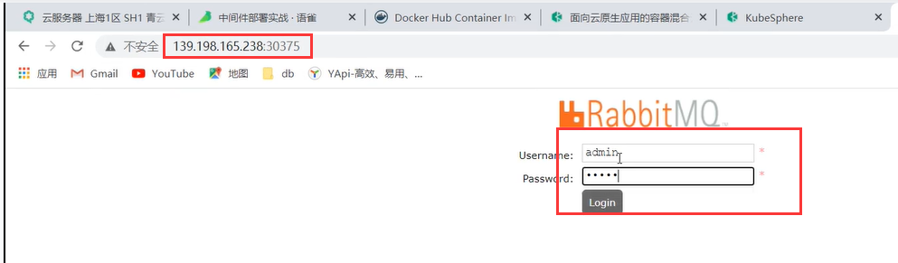

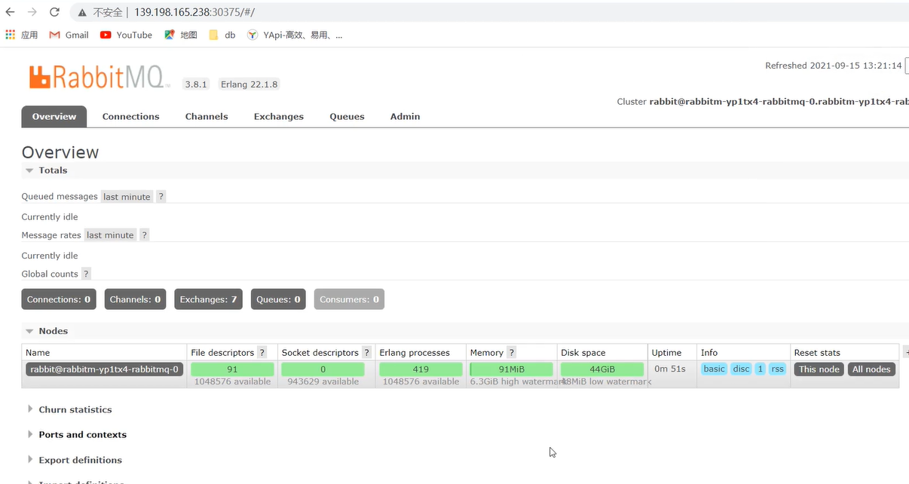

pvc的存储卷也是自动创建好了

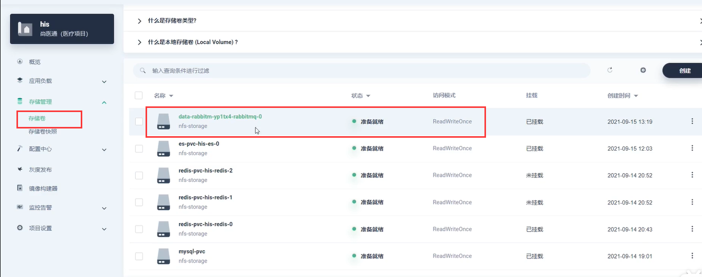

​	所以说如果有一些常用的应用需要部署，也可以到应用商店进行一键的部署，当然我们发现应用商店可能收录的应用可能比较少，如果我们想部署更多的应用怎么办，其实我们还可以添加应用就是应用仓库我们后续说。

https://www.bilibili.com/video/BV13Q4y1C7hS?p=84&spm_id_from=pageDriver

