# 18.kubesphere-应用仓库-从应用市场部署Zookeeper

​	由于应用比较少--所以我们可能需要到应用仓库来添加应用

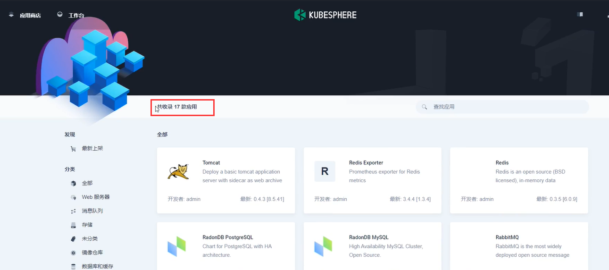

​	有一个helm这个是kubesphere的包管理工具，类比其实就是docker的镜像我们到dockerhub中下载，而k8s想部署的一些应用呢也是需要一些yml文件，而这些yml文件的仓库就是helm

​		我们把k8s里面所有的包起名叫Charts

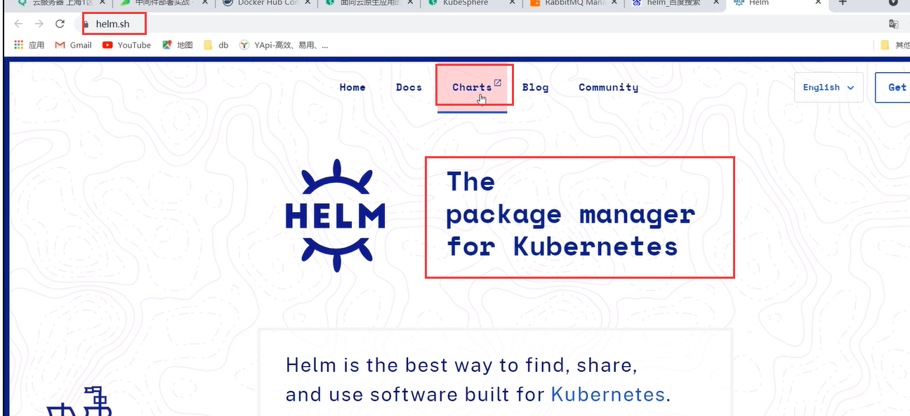

比如我们想部署MySQL我们就搜索MySQL

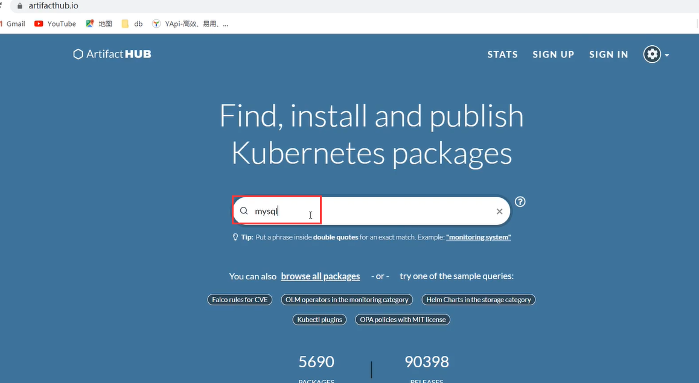

​		这里有很多MySQL--这就和我们以前去dockerhub里面搜索镜像其实是一样的，只不过我们在这里搜索的都是k8s部署的那些yaml一些核心配置

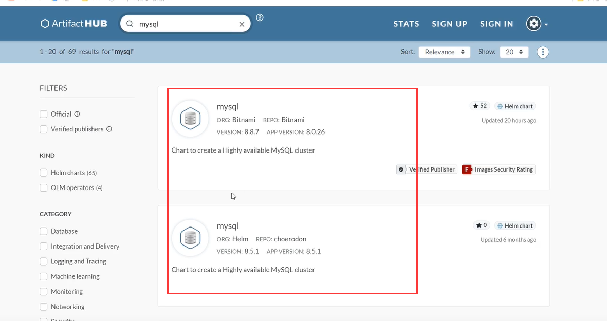

​	所以我们现在就可以添加一个应用核心仓库，比如我们随便选择一个应用如redis，然后我们拷贝他的仓库位置--比如这个是bitnami公司的仓库位置

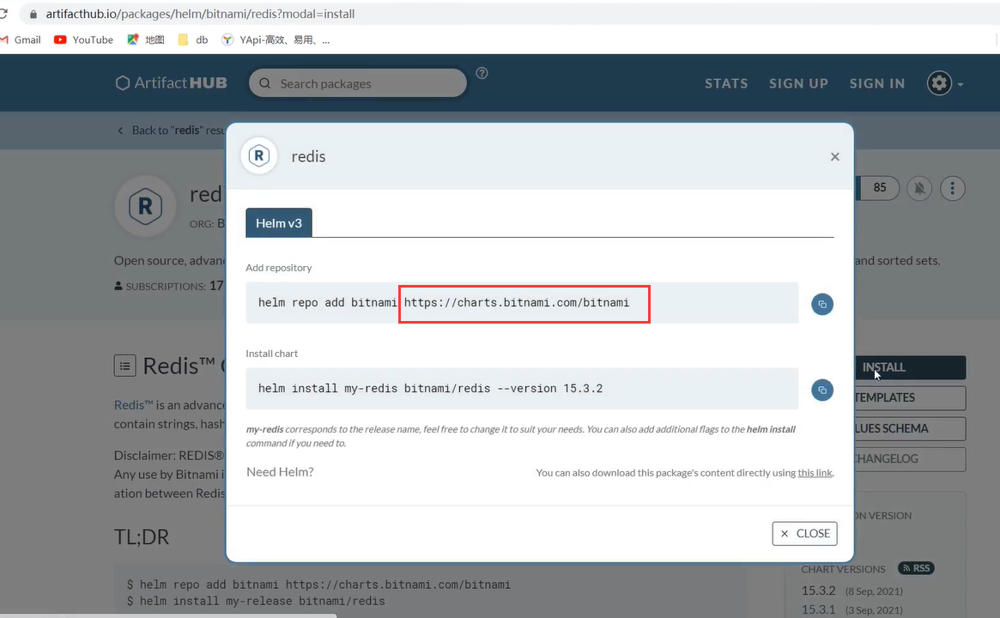

​	如果我们想在kubesphere中部署更多的应用，我们就需要使用应用仓库，但是需要有操作企业空间的权限才可以有此功能---如我们之前的wuhan-boss这个角色

​	应用管理-应用仓库

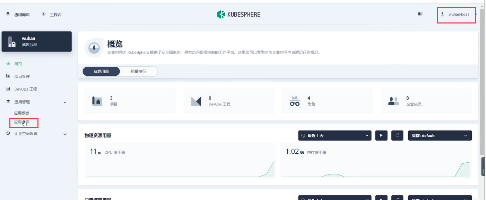

​	然后添加应用仓库--一定要点击验证保证是对的

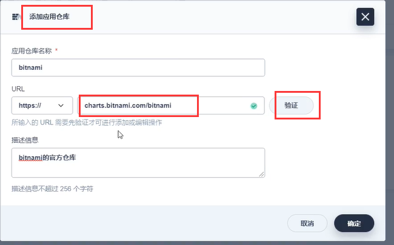

​	然后就开始同步这个bitnami公司的软件仓库的内容

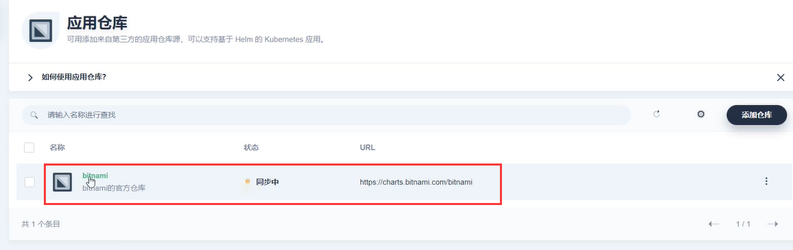

现在我们重新使用dev账号来登录

​	我们现在可以在应用中-应用模板--部署新应用

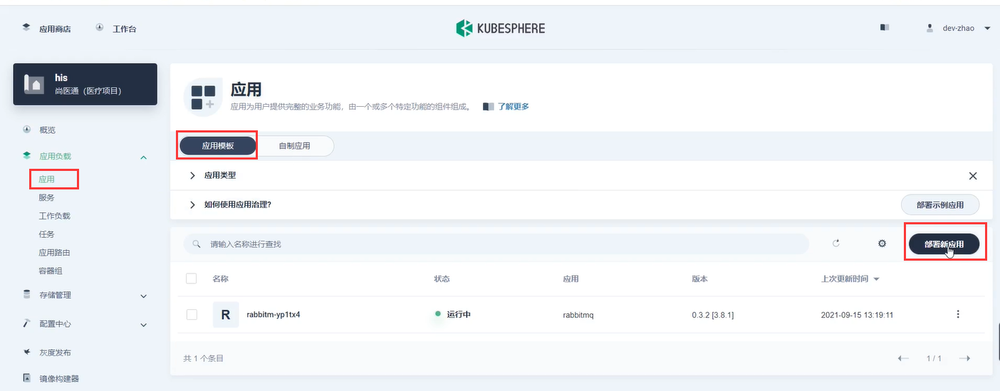

​	然后选择来自应用模板

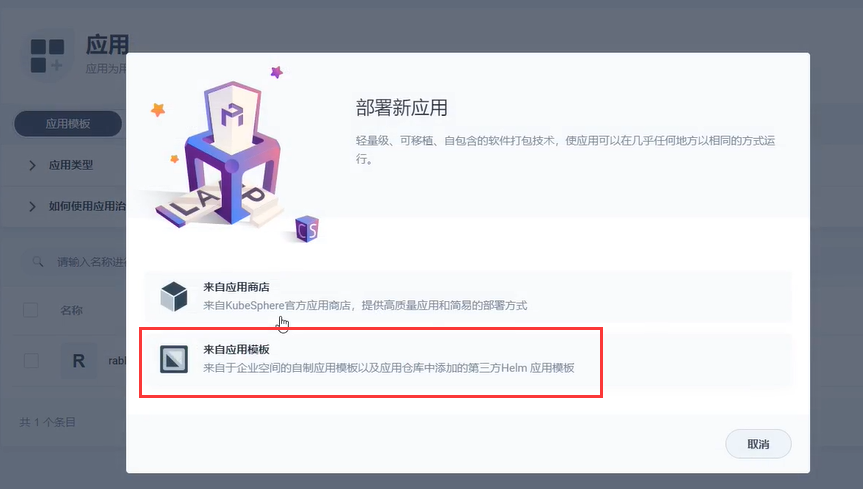

​	选择我们刚刚的应用仓库--然后就会刷出很多应用

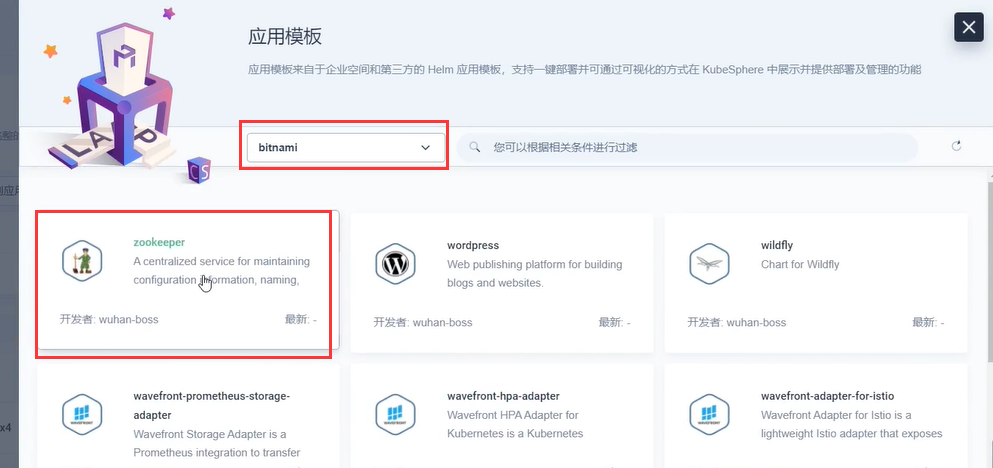

​	比如我们想部署一个zookeeper--点击部署

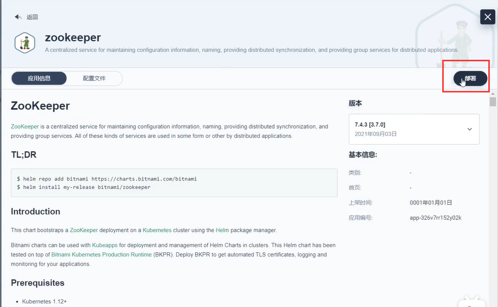

​	然后下一步

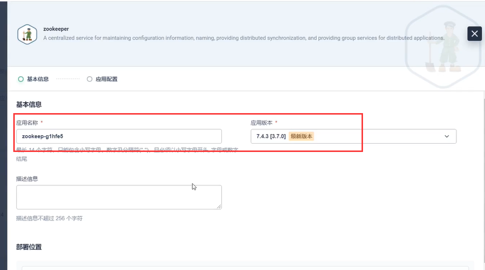

​	设置应用配置--根据需求做改动--我们这里是什么也不改--然后点击部署

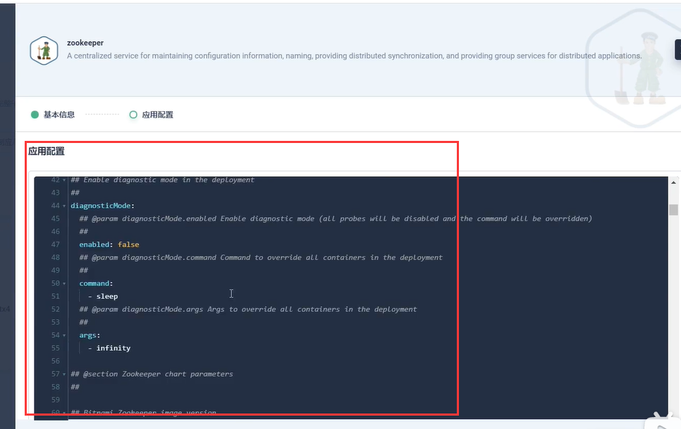

​	正在创建应用

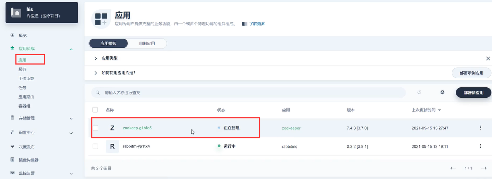

​	这样zookeeper就部署成功了，未来相当于这个官方仓库有多大我们就可以部署多少的应用，这里面的应用都可以部署--这也是kubesphere里面非常方便的部署方式

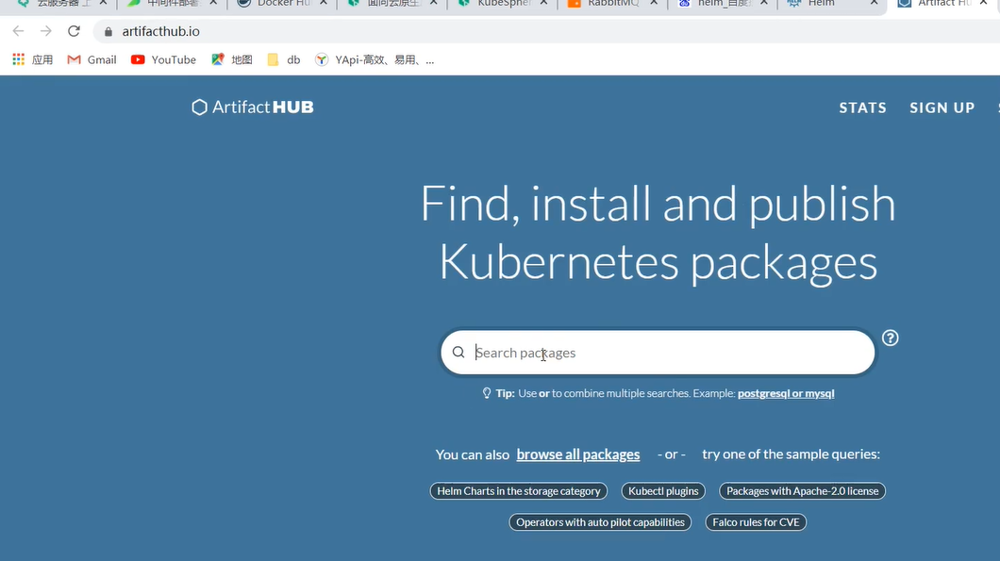

​	当然他们这样部署的应用和我们之前手动部署的应用也是一样，无非就是他们帮我们创建了存储卷和服务，而且服务都是集群内访问的--这个我们可以修改为外网可访问

​	如果我们删除东西误删除了，比如我们删除了一个服务为外网服务想恢复

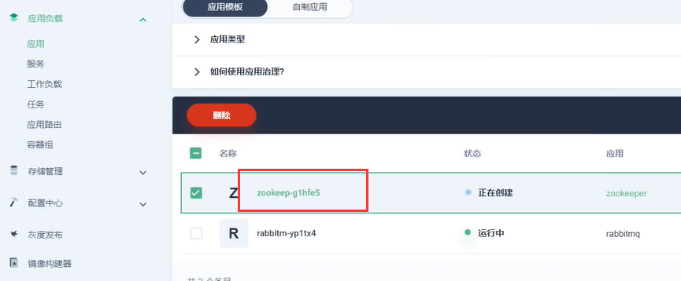

​	点击进入重新部署--如果没有重新部署的功能，我们就重新来一次

​	测试外网访问--2181端口对应外网的30299

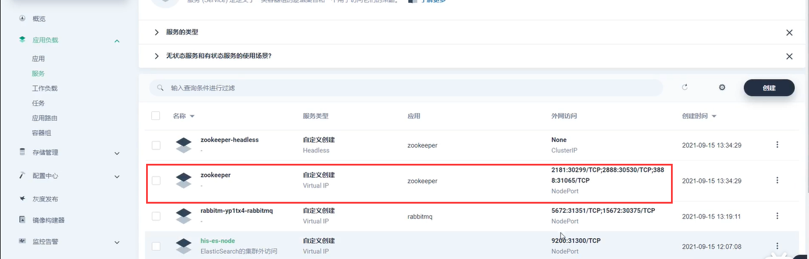

​	

https://www.bilibili.com/video/BV13Q4y1C7hS?p=85&spm_id_from=pageDriver

