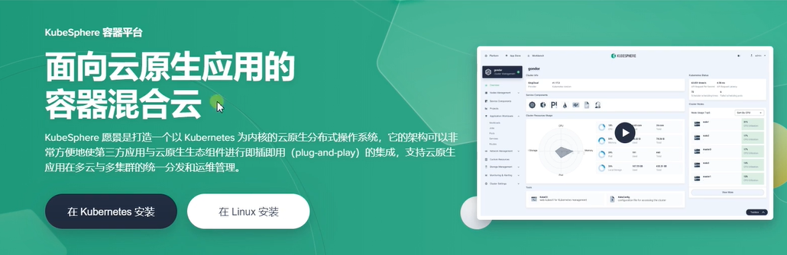
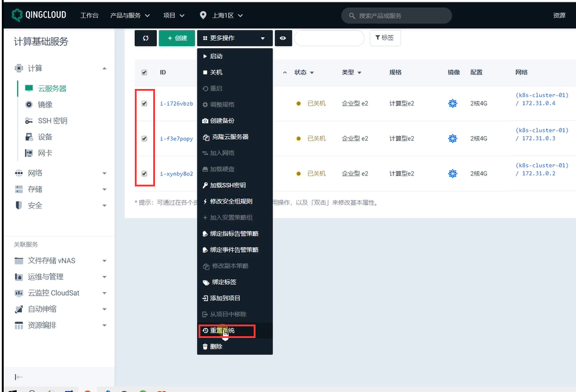
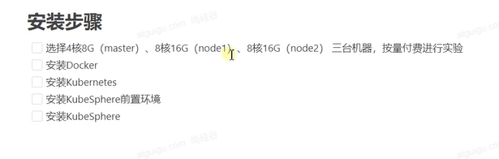
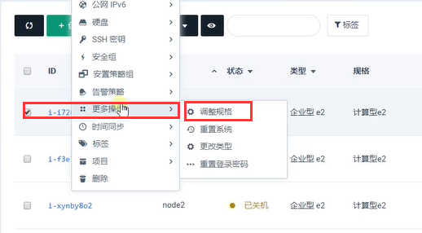
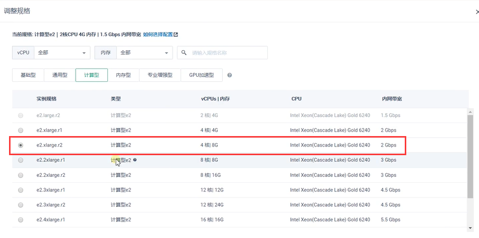

# 2.kubesphere-平台安装-升配与重置系统

​	

​		首先kubesphere安装有分各种不同情况，如在kubernetes上安装，也就是说如果现在我们已经有一个kubernetes集群，之前有些机器已经在kubernetes上搭建好集群了，想在已有的集群上安装kubesphere容器平台，其实只需要一段代码就可以搞定

​		第二种就是在linux上安装，比如我们现在刚开了3个新的机器，就是纯的linux系统没有其他的东西，kubesphere也给我们准备了一个小工具也可以让我们的linux系统一键的把我们一整套平台需要的东西安装上。

​	这俩种方式我们后续都会去实践一下

​	

#### 安装：

​		我们先把之前练习的节点都重置一下--重置系统

​	接下来就是需要给我们的机器升一个规格，因为接下来我们的实验是安装kubesphere全功能平台，我们会把kubesphere的所有功能都打开，然后我们会部署很多的应用到我们kubesphere平台上，并且测试它的整个功能该如何使用----所以我们对整个集群的机器能力要求比较高--大约至少为4核8G的机器

​	在青云上升级配置：

​			在节点上右键--更多操作--调整规格

​		选择大小

https://www.bilibili.com/video/BV13Q4y1C7hS?p=69&spm_id_from=pageDriver

​	

