# 20.kubernetes应用部署实战-ruoyi-cloud-本地环境-导入数据库

​		我们现在给ruoyi-cloud里面导入一些初始化数据，这些数据在项目的sql文件夹下，我们先看ry-config这里面的一些表名称其实就是nacos的一些表名

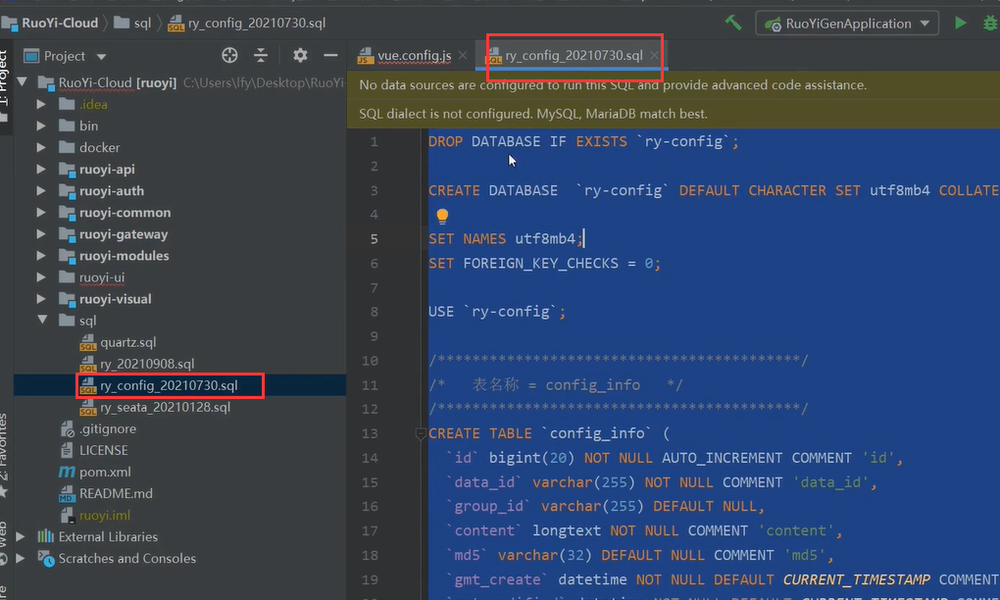

​	这个脚本会创建一个ry-config的数据库

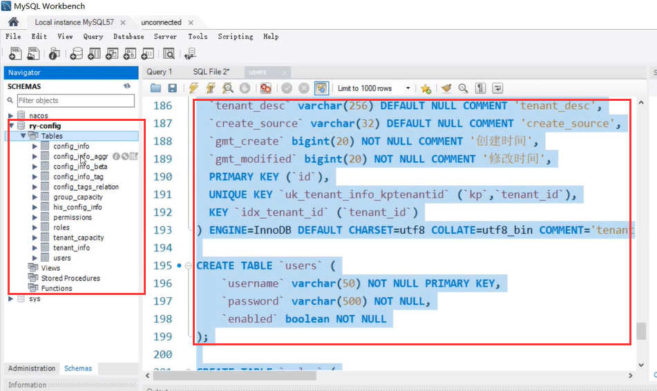

​	所以这块如果改变了呢，那我们的nacos就得改变一下了，使用ruoyi-config这个数据库

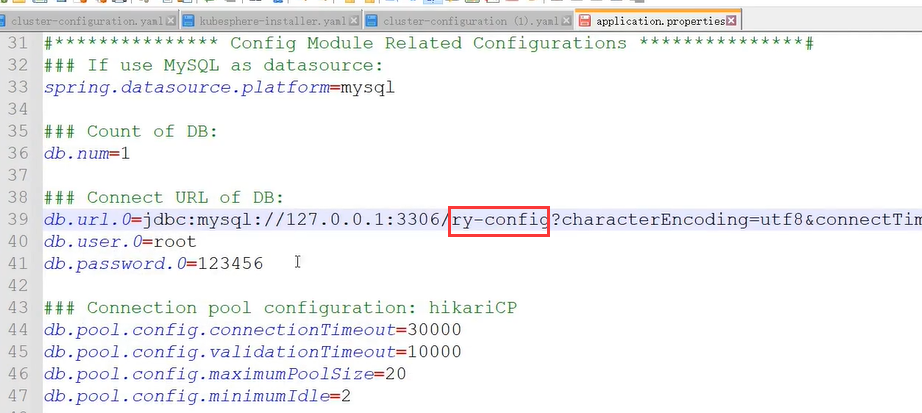

​	我们重新登录nacos发现会有很多的配置文件--这些配置文件就是将来我们若依每个应用要使用的配置文件

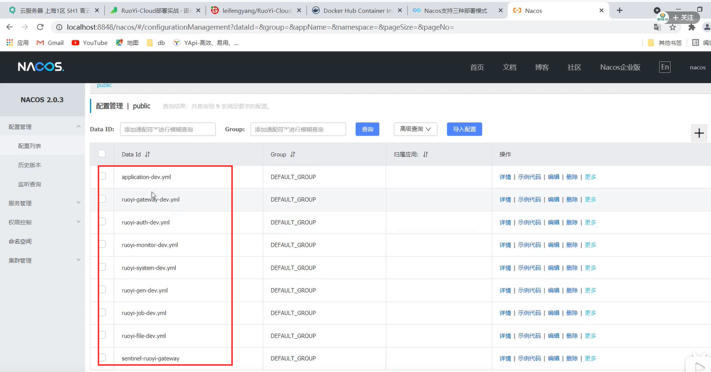

​	比如我们可以看到有一些数据源的配置

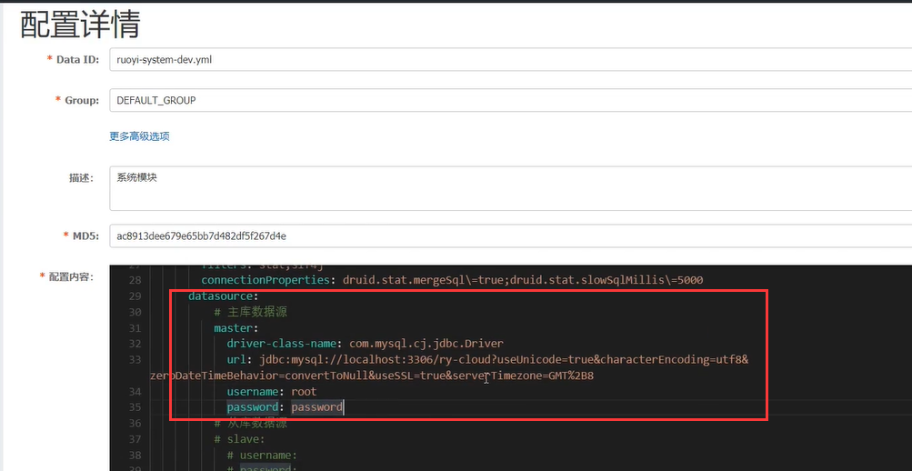

​	那我们接下来就是把若依的整个数据库搞定，先看一下这个脚本，这个库没有写库名，还得我们自己发现一下，我们通过上面的配置发现库名叫 ry-cloud

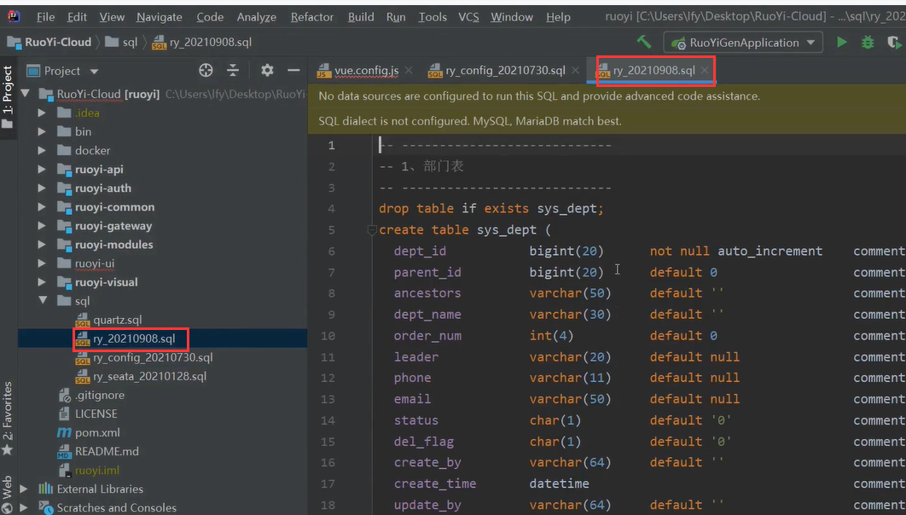

创建数据库ry-cloud并且执行数据库脚本

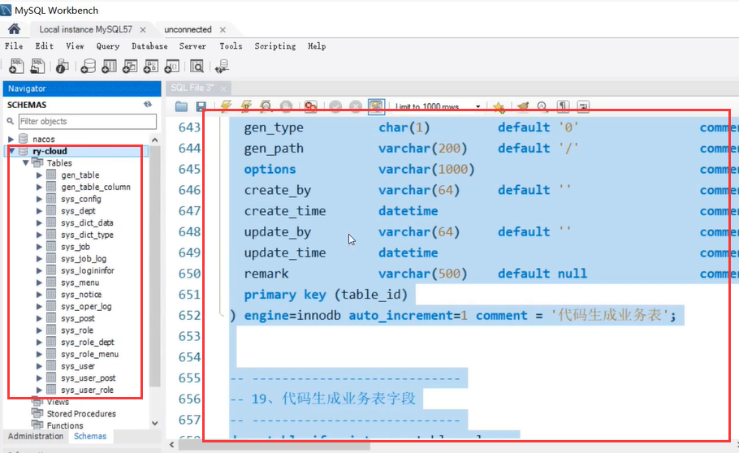

​	还有一个quartz.sql做任务调度的sql，我们看一下任务调度的配置文件连接的库是哪个，还是ry-cloud

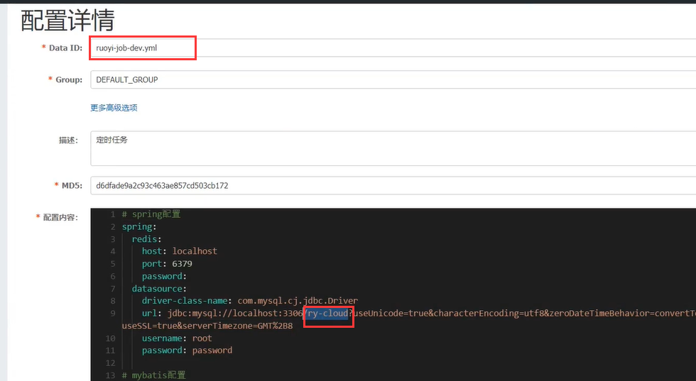

​	copy脚本继续执行

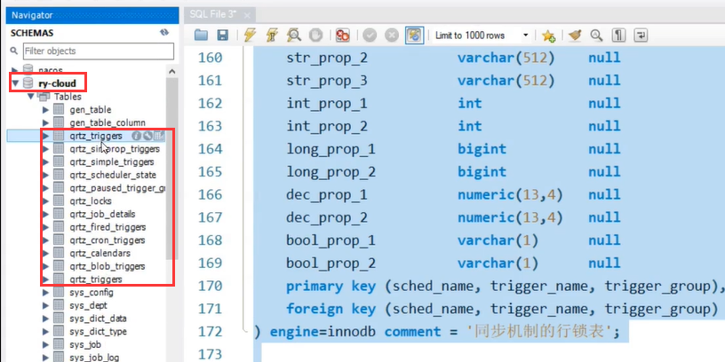

​	还有一个ry-seata这个脚本，这个是分布式事务的，他会自己创建一个库，他的分布式事务是实验seata框架的

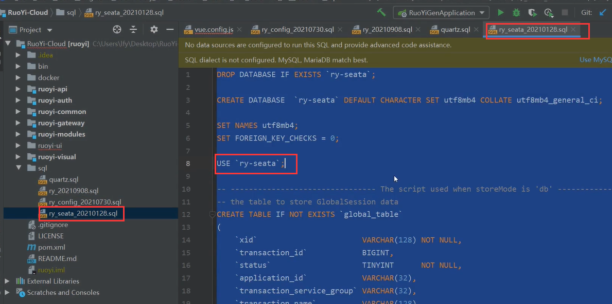

​	好了，我们的这些核心数据库都整好了

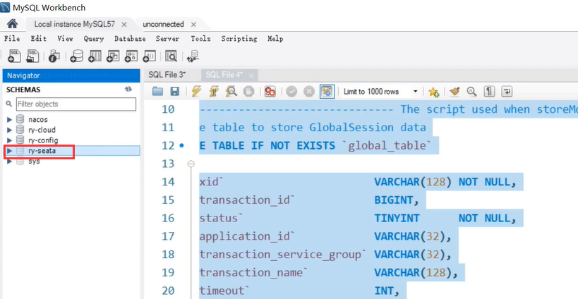

​	一共是三个库

​	然后我们现在就是来查看一下nacos中的配置哪些是使用到数据库的，我们检查是否需要修改数据库信息，比如用户名和密码 比如job这个配置

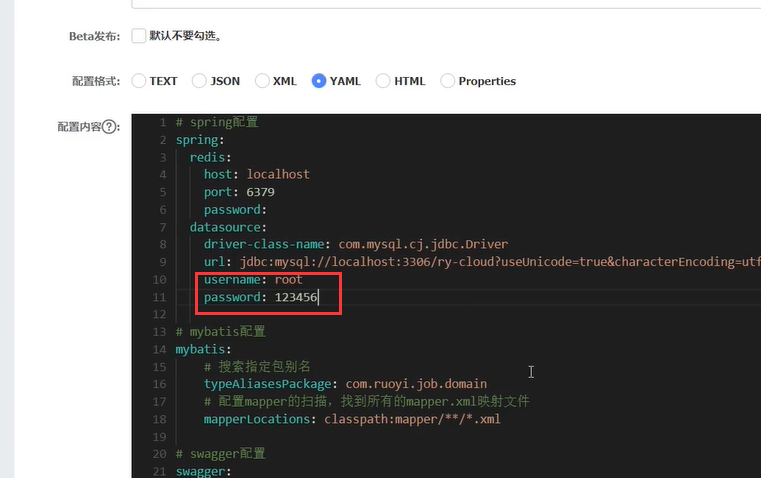

​		

https://www.bilibili.com/video/BV13Q4y1C7hS?p=87&spm_id_from=pageDriver

​	

