# 21.kubernetes应用部署实战-ruoyi-cloud-本地环境-启动完成

​	之前我们把ruoyi的核心数据库已经导入了，接下来我们把若依的前端项目启动一下

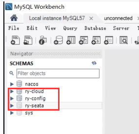

## 启动ruoyi前端项目

​	按照官方文档-前端项目属于ruoyi-ui 80端口，然后我们找到ruoyi-ui，控制台进入到此目录下

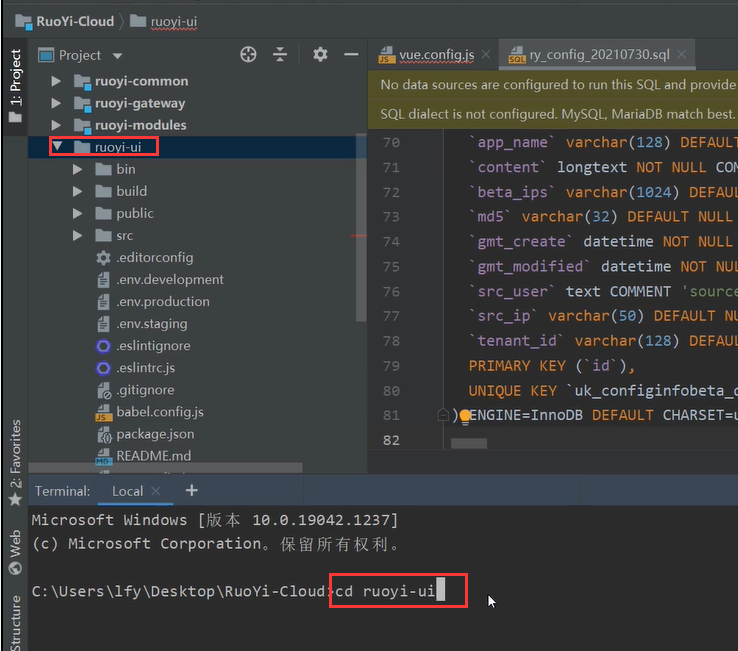

​	因为是前端项目--所以我们需要先安装node.js--如果没有下载参照官网下载，然后我们看若依的ruoyi-ui官网的文档，然后我们就是安装依赖--使用阿里淘宝的镜像

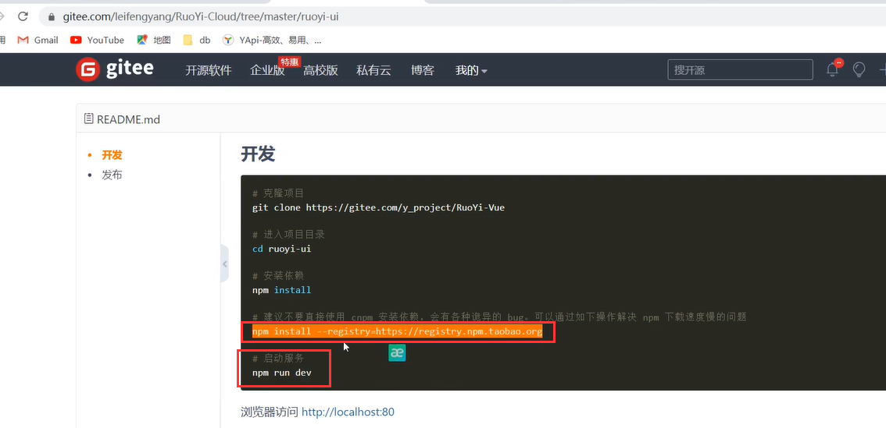

​	安装依赖

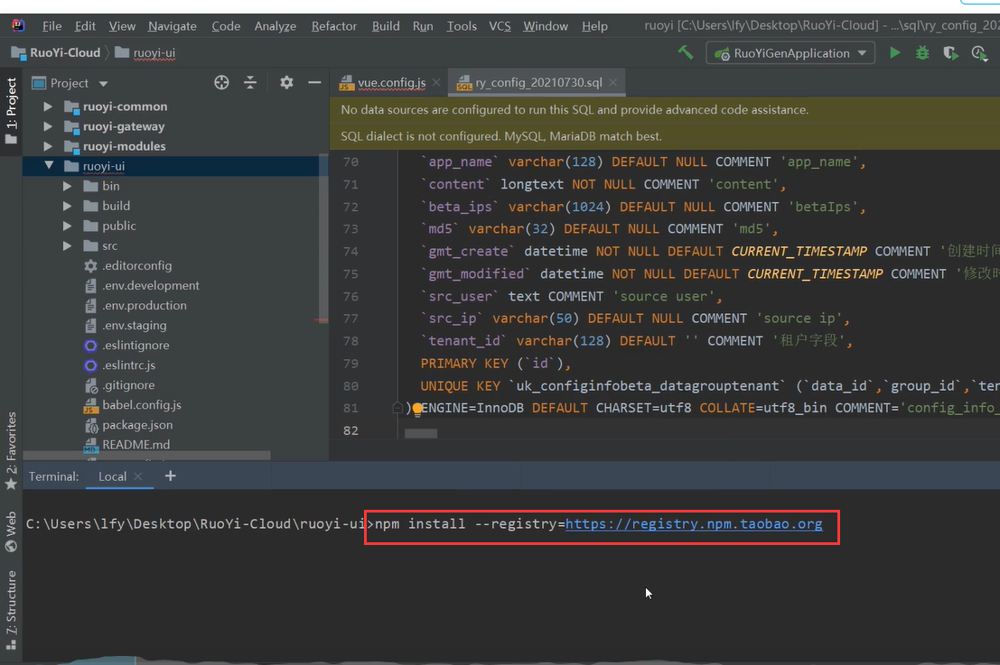

​	启动前端项目

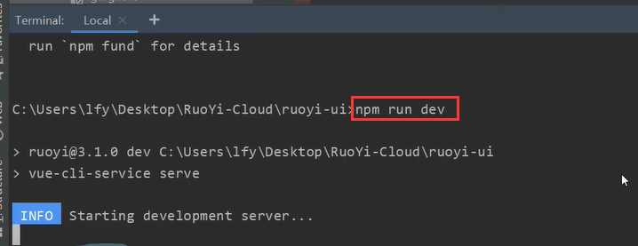

​	前端项目启动成功

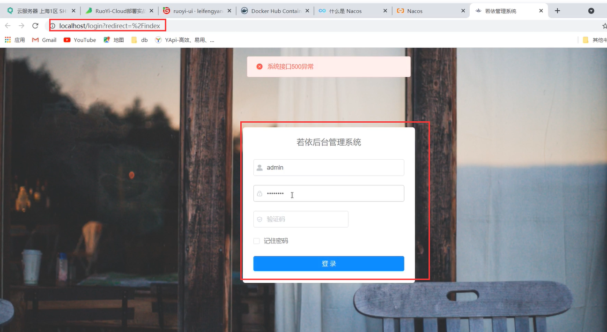

​	因为前端项目要交互网关--所以报接口异常500，因为会发这个dev-api/code这个请求，而这个请求就会代理到网关

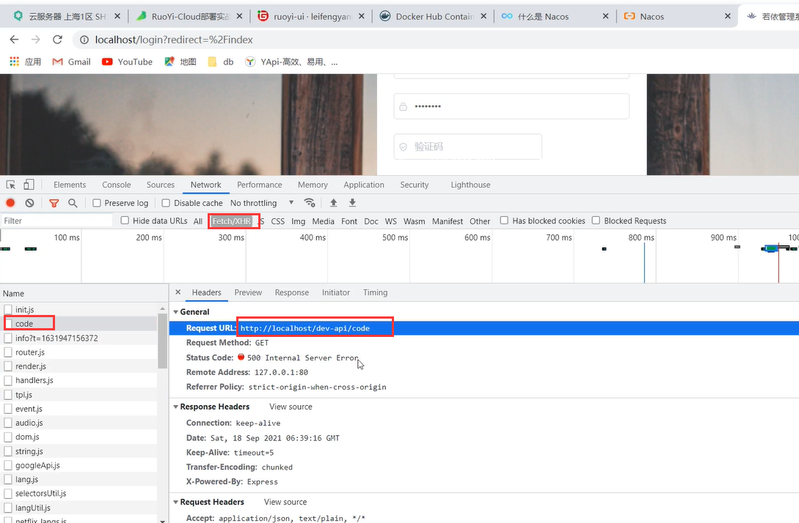

​		那么接下来我们就需要启动网关getaway，但是启动网关之前我们又得连接redis，因为我们之前在nacos的网关配置中看到需要连接redis

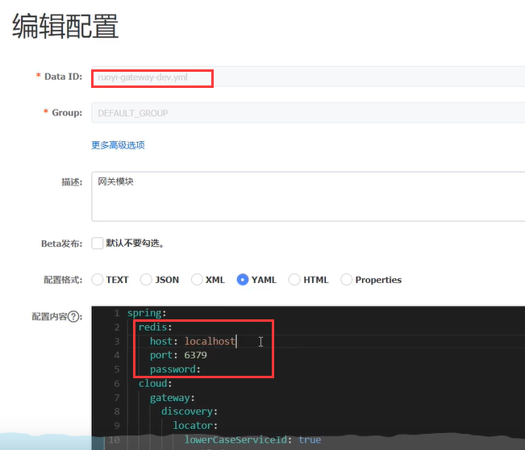

​	而这个redis我们现在没有安装windows版的，我们先使用一下之前的云平台的redis，对外31968端口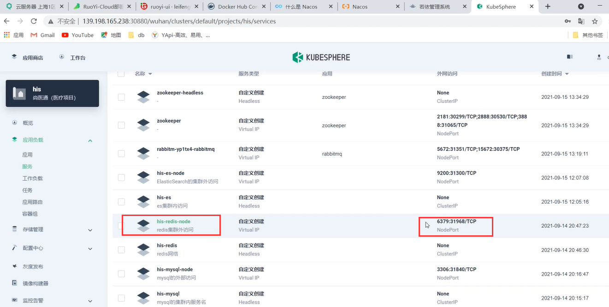

​	我们把nacos的网关配置修改一下--然后发布

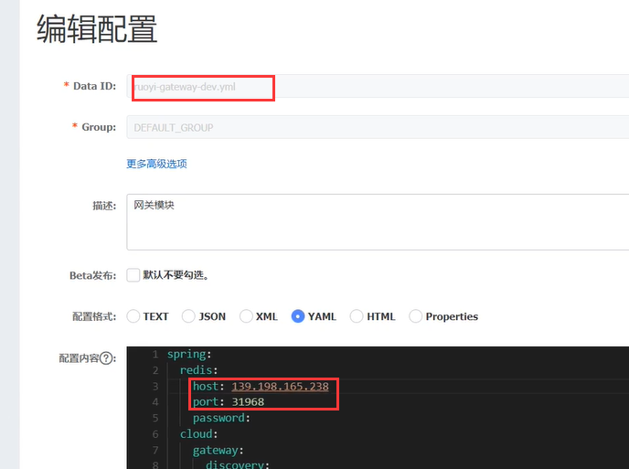

​	现在来启动一下我们的网关

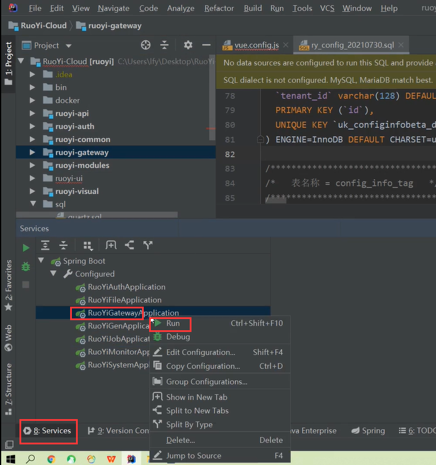

​	网关启动没有问题，，然后就是选中其他的几个微服务--全部run启动一下

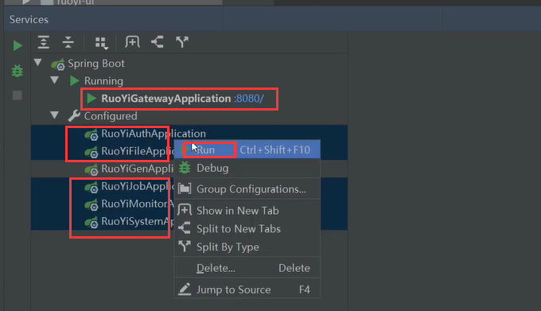

​	对了因为我们之前只改了网关的redis地址，所以其他使用redis的也都需要在nacos中修改，比如auth认证的配置等等--system，job都需要修改

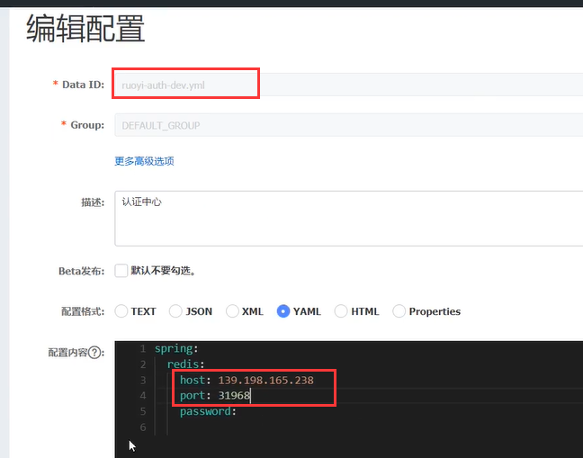

​			现在是ruoyi-system这个模块启动有问题，我们重新启动一下

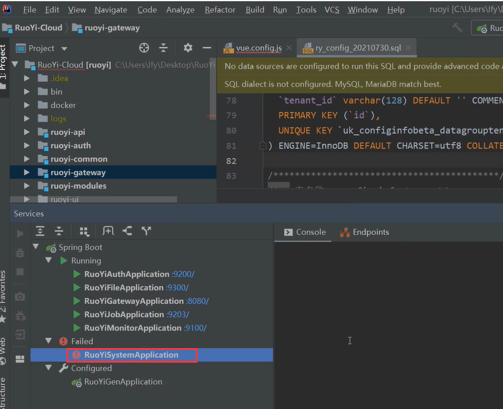

​	都启动成功了--刚刚错误应该就是redis的问题

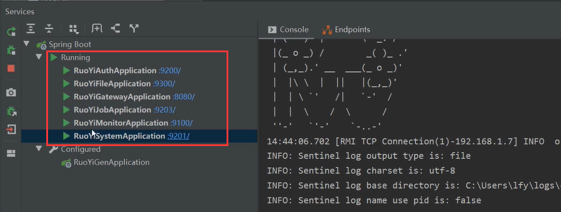

 至此我们相当于把ruoyi这个项目的前后台都启动起来了

现在我们刷新页面，验证码也可以刷新出来了

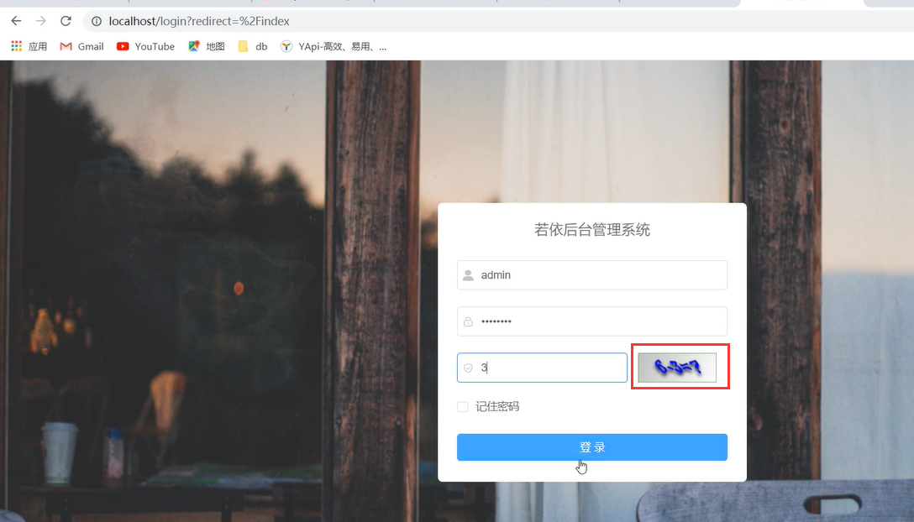

​		可能会报redis 6379连接不上，原因是网关没有重启，因为网关的nacos配置修改过了，还有auth也是需要重新启动的

​	好了成功登录

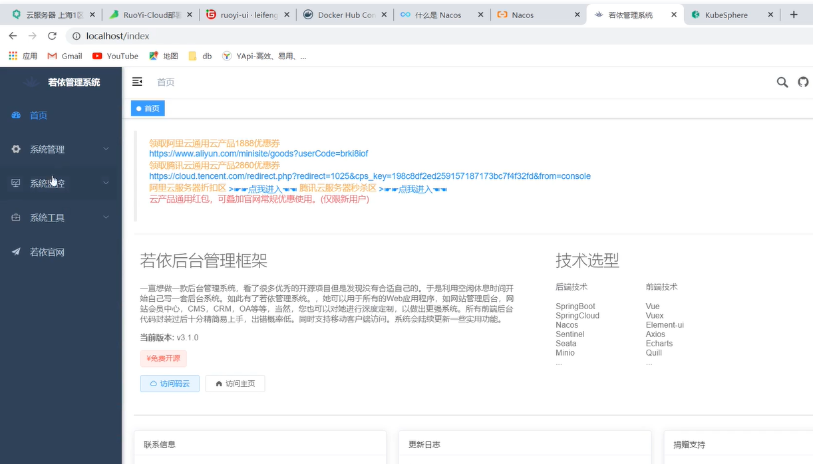

​		这里还可以看服务的监控---用户名和密码从nacos中查看

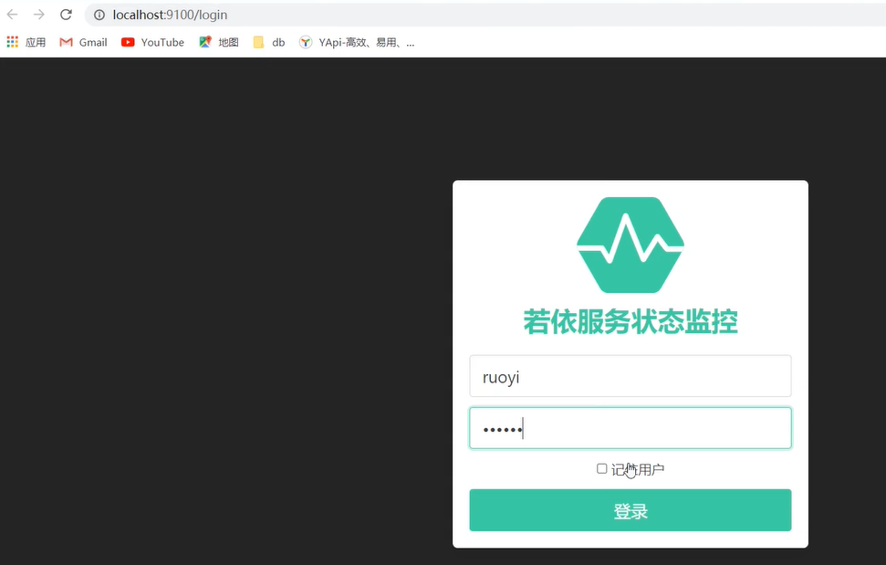

​	这里相当于我们上线了6个微服务

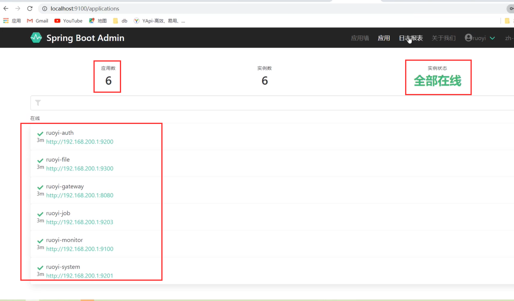

​	应用墙

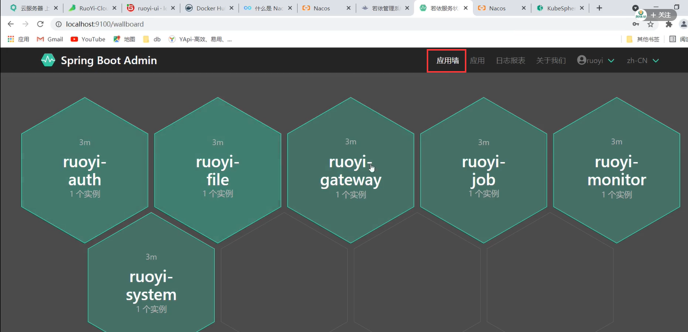

​	每个应用都可以进入查看详细信息

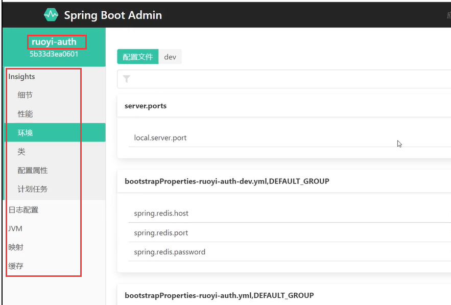

​	稍微总结一下：就是我们本地想要启动ruoyi这个项目，首先需要把这些数据库都导入进去，然后还需要配置一下redis，还需要配置一下nacos，剩下的就根据文档启动就可以了。

​		接下来我们就是把若依的项目手动的上云部署了

https://www.bilibili.com/video/BV13Q4y1C7hS?p=88&spm_id_from=pageDriver

