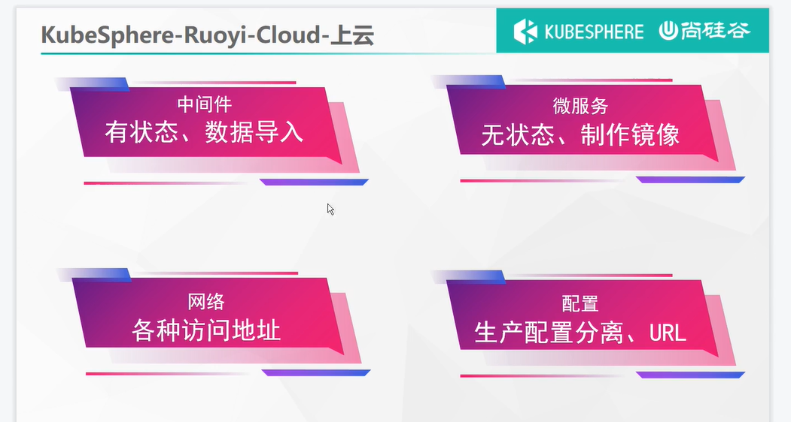

# 22.kubernetes应用部署实战-ruoyi-cloud-上云部署-关注的要素

​		之前，我们在本地部署了ruoyi-cloud接下来我们就把ruoyi-cloud搬上云，任何项目的上云，大家思考好几个点就可以了。

​		1.比如我们现在要思考的一个点我们这个项目用到了多少个中间件（有状态，数据导入）有些中间件可能需要导入一些默认数据。

​		2.我们要上云那么肯定这些微服务都要部署上去，而微服务模块的上云就需要考虑清楚首先他们是无状态的应用，以无状态的方式部署，我们要自己制作每一个微服务的镜像，在自己制作镜像的过程中又会出现一些问题，我们后续体会和解决这些问题

​		3.上云以后各个组件，微服务他们的网络模型也就是各种访问地址，一般都是使用内网ip或域名的方式访问

​		4.配置，特别是一些微服务，一旦上云可能又是一套配置，生产环境的配置要和开发环境配置分离，这块需要我们考虑怎么去做，还有每个配置中牵扯的url，比如配置中心地址url

