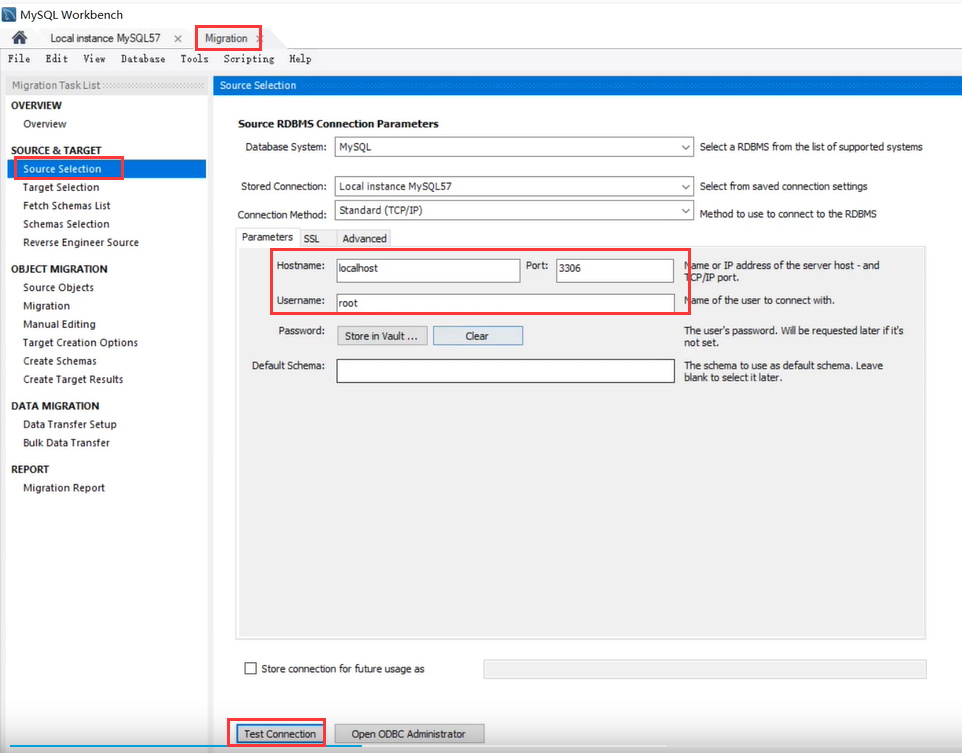
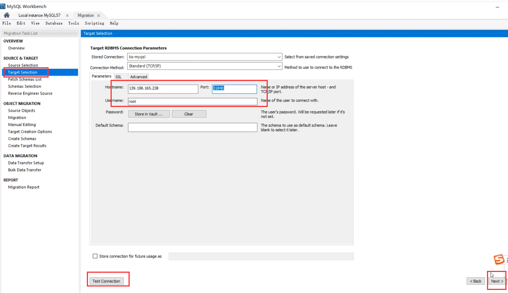
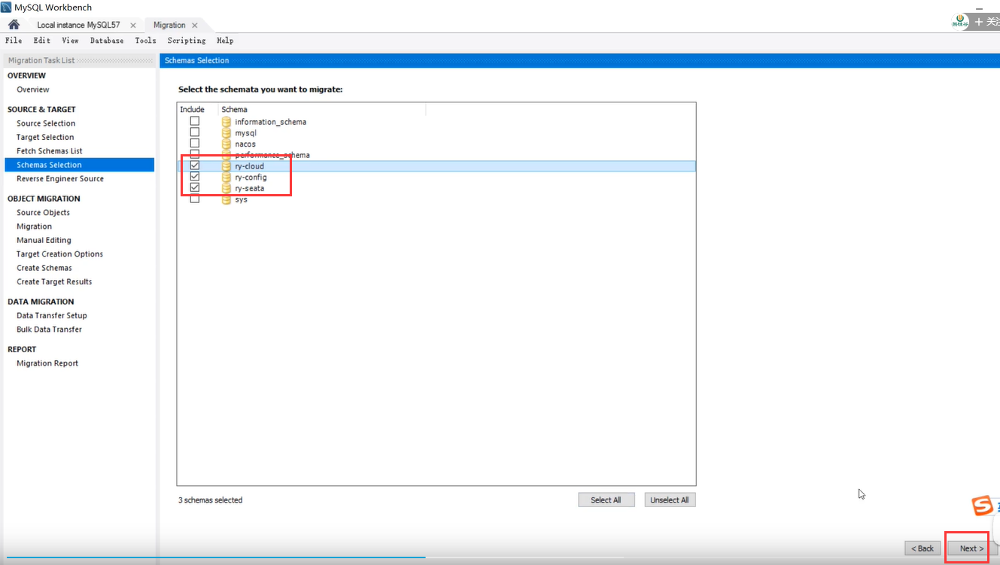
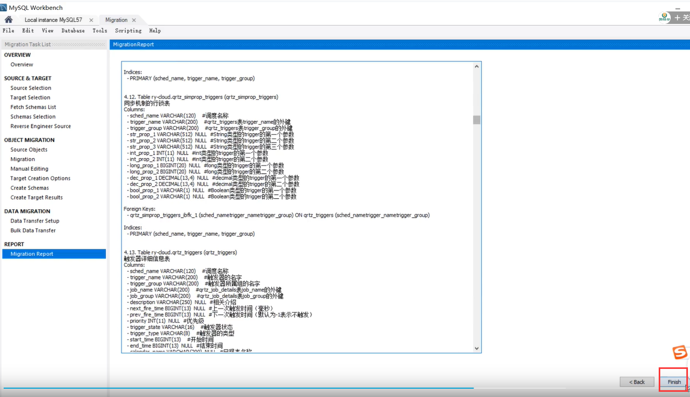
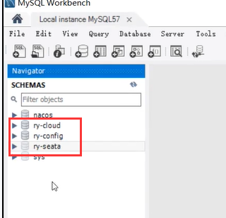
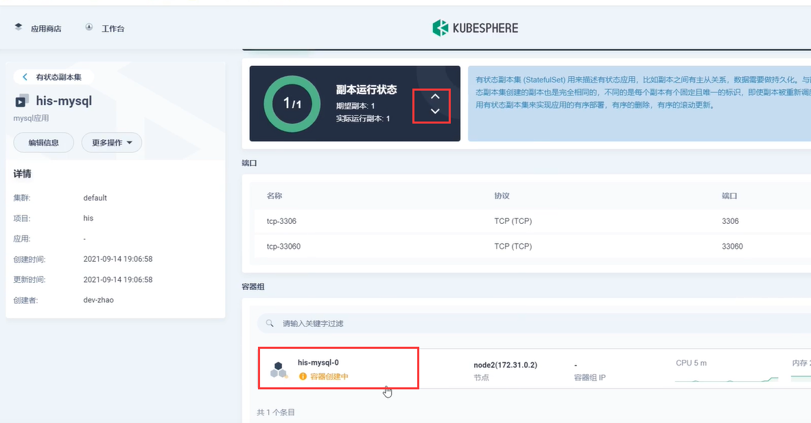

# 23.kubernetes应用部署实战-ruoyi-cloud-上云部署-迁移数据库

​			首先我们先部署中间件，之前我们部署过redis了，mysql也部署了，nacos还没部署。

​		我们现在把ruoyi的核心三个数据库先导入到云数据库中，我们使用workbench

​	我们先使用migration测试本地的数据库正常连接

​		然后是下一步--指定云上的mysql测试连接下一步

​	我们选择好这三个库然后下一步

​	然后一直下一步下一步--最后finish完成就可以了

​	然后我们远程连接检查一下发现也没有问题

​	而且如果我们重新创建mysql副本中间件的话，数据也是不会丢失的

https://www.bilibili.com/video/BV13Q4y1C7hS?p=90&spm_id_from=pageDriver

