# 24.kubernetes应用部署实战-ruoyi-cloud-上云部署-nacos上云分析

​			我们之前已经完成了数据库上云的操作，接下来我们部署一个中间件Nacos。

​		之前我们是单机部署过nacos

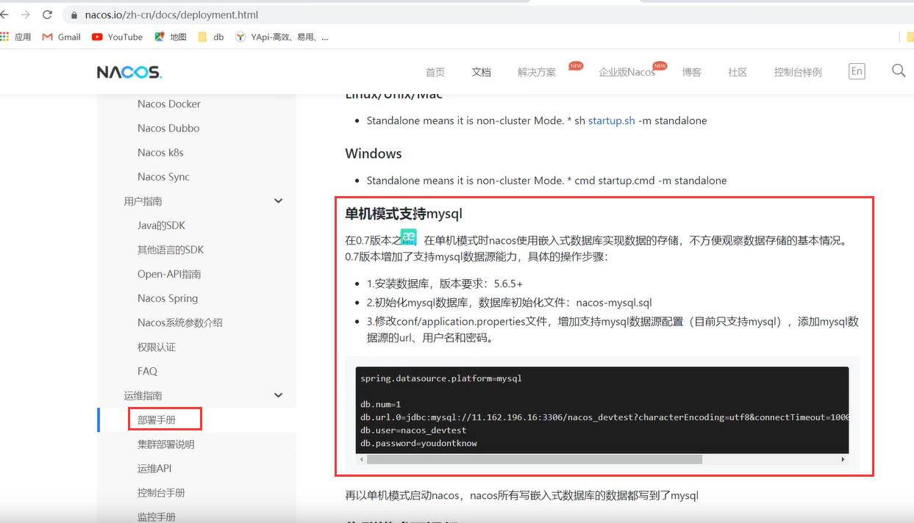

​	那么上云呢，我们现在从官网进入 集群模式下运行Nacos

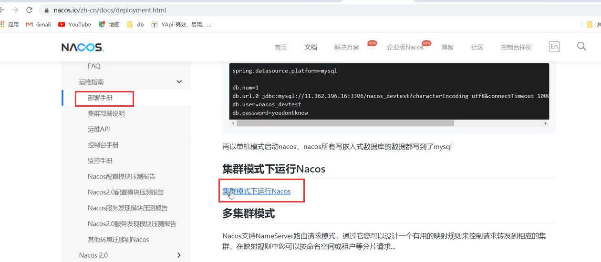

​	我们看集群模式的Nacos架构图，部署多个Nacos相当于多个Pod，然后这些Pod对外暴露一个**内网SLB**（Service-load-Balance）服务负载均衡，这种其实就是k8s的Service---相当于这个Service选中这3个Pod，然后Service统一暴露一个IP地址或域名

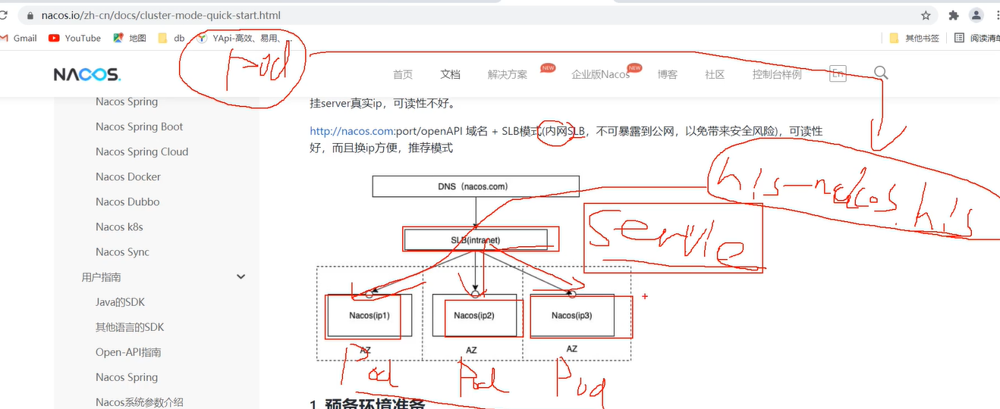

​	我们现在集群的架构有了我们部署Nacos还应该注意什么？

​			配置集群文件--需要配置cluster.conf这个文件，里面的内容就是所有的集群nacos的ip和端口都要配置进来

​		当我们Nacos上云后，其实配置这三个nacos的ip其实是有问题的，因为我们上云后部署了3个Pod，k8s的优势是Pod的故障转移能力，假设其中一个nacos的Pod炸了，他转移到其他机器了，那么就有很大可能这个故障转移后IP地址就发生改变了，所以这个cluster-conf文件难道要经常改变吗？

​		所以我们部署Nacos的时候我们要使用有状态的部署，这个有状态的部署起码可以保证一点，ip地址不能保证变不变但是我们的**Nacos能有一个稳定的访问域名**，即使Pod奔溃了，故障转移到其他集群的机器上了，我们使用固定的访问域名还是可以访问的。

​		我们未来在这个cluster-conf文件里面，写的不是IP地址而是固定域名+端口

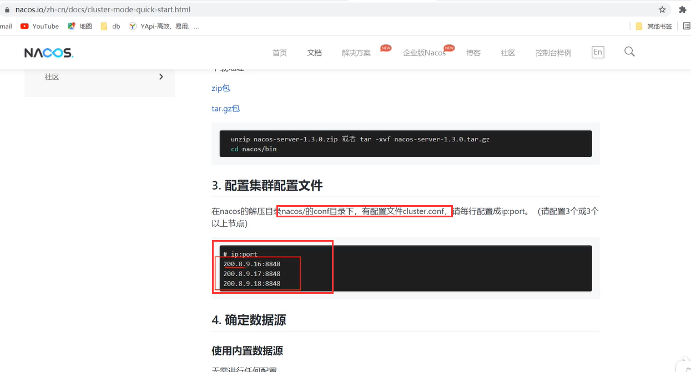

#### 部署Nacos

​	我们从这个服务--里面创建

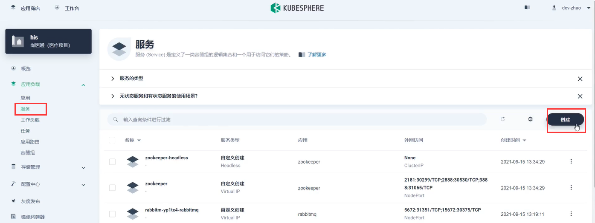

​	有状态的服务

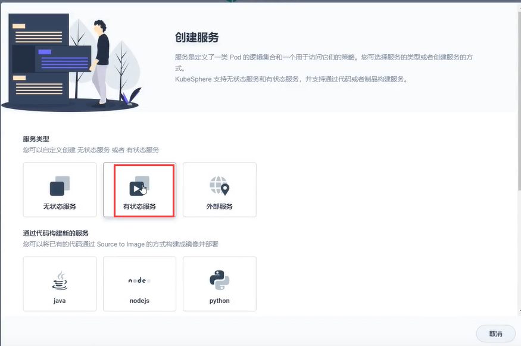

​	基本信息填写

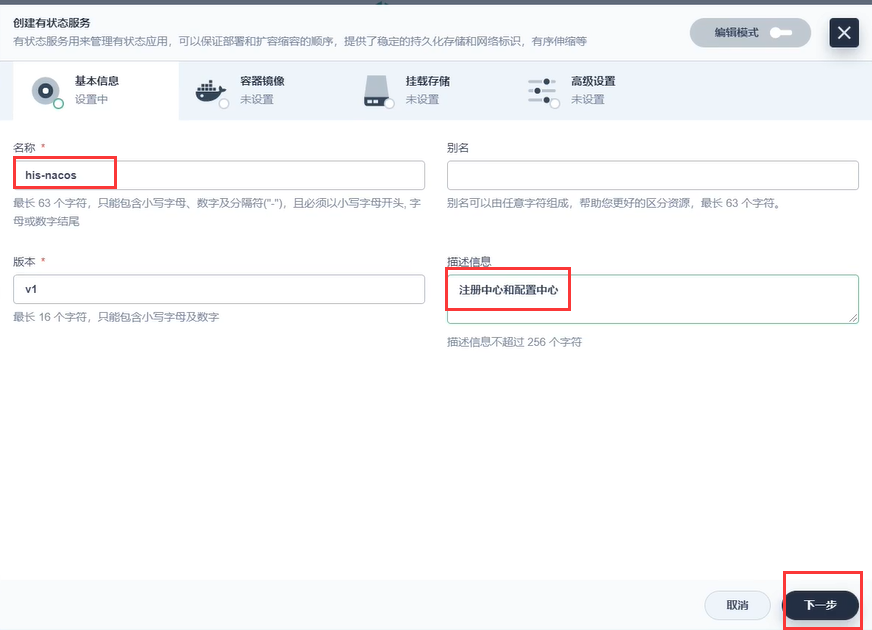

​		选择Nacos的镜像

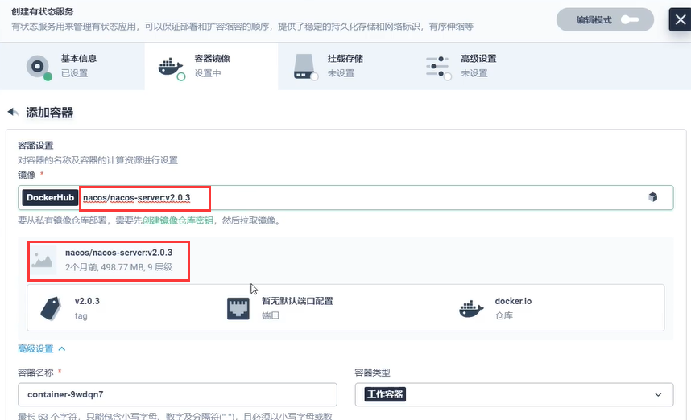

​	指定端口8848

​	同步主机时区-下一步

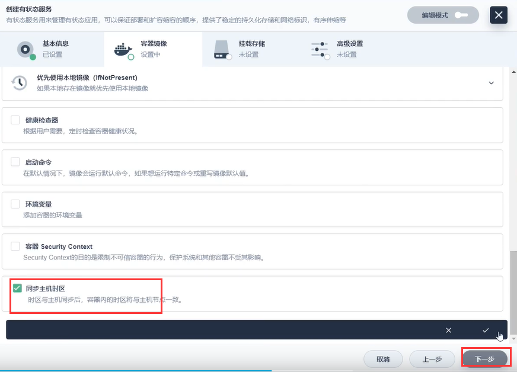

​	因为Nacos存储在MySQL所以不需要存储卷，然后配置文件先不挂载的部署跑一下

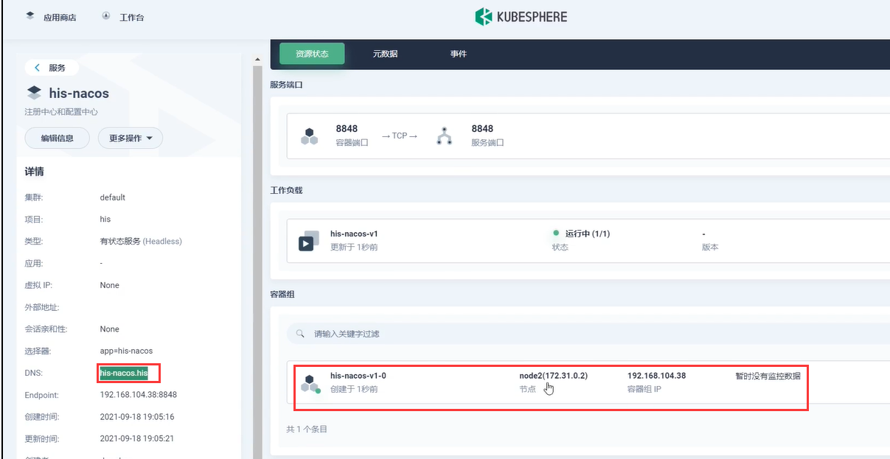

​	我们想验证一下如果起多个副本是什么样的

​			新启动的副本域名也是新的，如果当前的宕机，在其他机器重新拉起一份域名是不变的

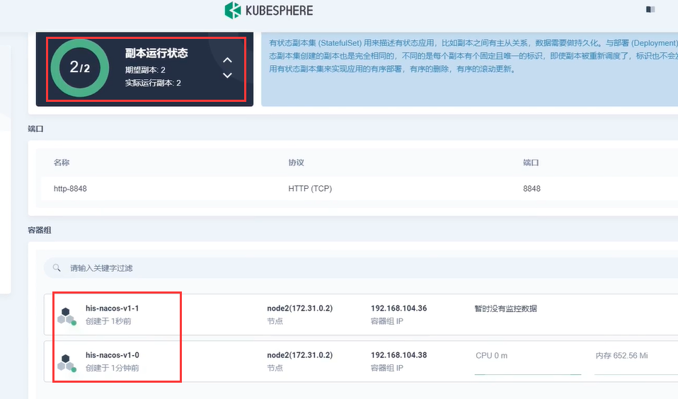

​	部署分析图解

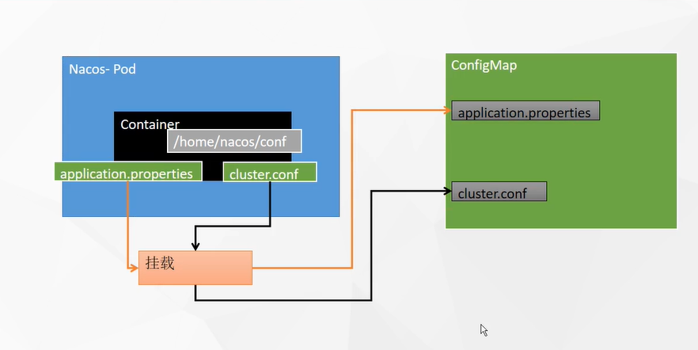

https://www.bilibili.com/video/BV13Q4y1C7hS?p=91&spm_id_from=pageDriver

