# 26.kubernetes应用部署实战-Java微服务上云-云上环境Dockerfile配置


​		之前我们部署好了一些ruoyi使用的中间件，如nacos，redis，mysql

​		接下来我们就该部署微服务这层内容了--有客户端，网关，及核心服务

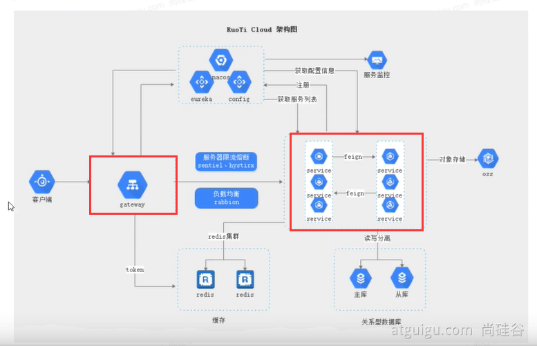


​		整个部署的架构是这样的

​			服务治理层Sentinel是流量的控制--这个ruoyi-cloud里面实际有引用但是现在没有开启相关的功能

​		我们的部署遵循自底向上的部署方式，先部署好底层模块，比如数据层的中间件，然后是微服务治理层，然后是微服务层，等微服务都部署好了我们再部署ruoyi的网关，网关部署好了之后我们再部署前端应用。

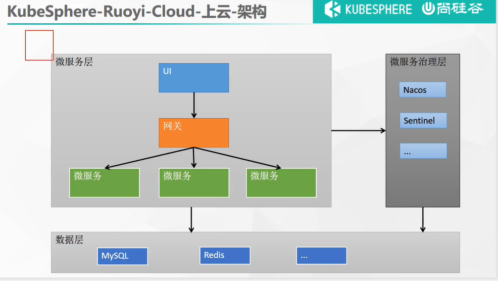


​	那么我们现在就准备开始部署微服务这层东西

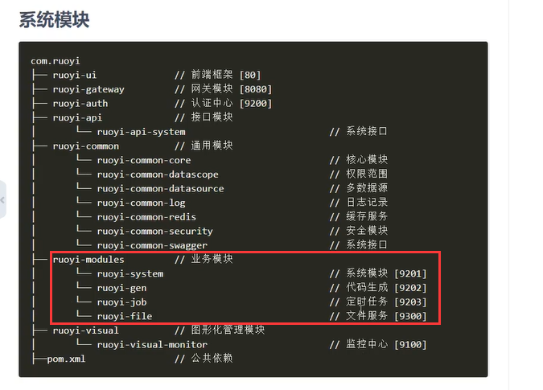


​	其实在ruoyi里面已经帮我们写好了docker的一些镜像怎么打包了，因为我们整个上云部署最起码得有一个镜像，有了镜像后我们k8s才能产生一个Pod进行部署

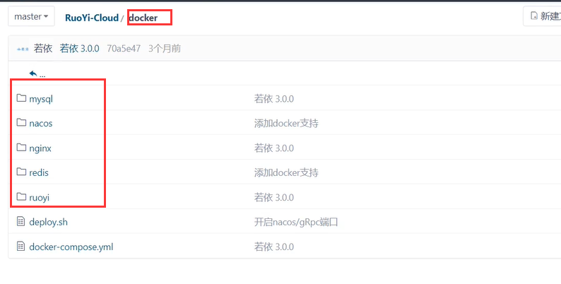


​	我们的微服务层有这些内容

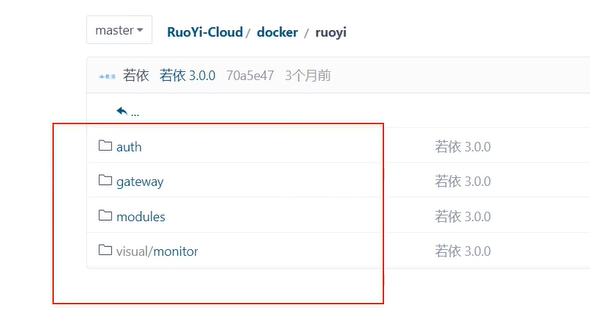

​	

​	其实就是在我们项目中把这些微服务打成一个可执行的jar包，放到这个jar文件夹里面，然后使用docker，利用这个dockerfile构建镜像就可以了

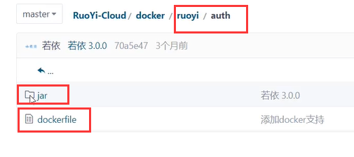


​	比如这个dockerfile是如何构建镜像的？

​		首先是基础镜像openjdk：8jre--相当于使用java8的基础环境

​		VOLUME：挂载目录，相当于目录可以让你挂载出去

​		run markdir：创建目录

​		COPY：./jar拷贝这个同级目录的jar文件夹里的内容---到另一个文件夹下

​		ENTRYPOINT：这个就是打包好镜像后最终我们要docker run 的内容，启动命令

​				我们java写的启动命令就叫 java -jar ruoyi-auth.jar

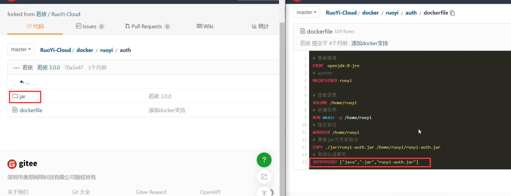


​	按这个docker镜像部署的话其实我们还是需要修改一些东西的，因为这个镜像在生产环境部署整个配置还是有点不足--我们参照下面的镜像配置	

```bash
# 我们基础镜像选择JDK，万一生产环境有些问题需要排查我们可以需要进入到容器使用jdk的一些命令--比如查看线程的活动
FROM openjdk:8-jdk
LABEL maintainer=leifengyang


# ENV PARAMS是环境变量，这个PARAMS最终会在ENTRYPOINT 启动命令中会有引用"/bin/sh","-c"的后面相当于是一个启动命令，这个命令的${}中会引用这个环境变量

#docker run -e PARAMS="--server.port 9090"
ENV PARAMS="--server.port=8080 --spring.profiles.active=prod --spring.cloud.nacos.discovery.server-addr=his-nacos.his:8848 --spring.cloud.nacos.config.server-addr=his-nacos.his:8848 --spring.cloud.nacos.config.namespace=prod --spring.cloud.nacos.config.file-extension=yml"

# 这里是修改了镜像运行的时区--这样的话我们这个镜像也会默认的使用上海这个时间，就算我们不勾选部署的同步时区时间也是我们中国的标准时间
RUN /bin/cp /usr/share/zoneinfo/Asia/Shanghai /etc/localtime && echo 'Asia/Shanghai' >/etc/timezone

# 拷贝target下面所有的jar包--因为未来我们打包的jar都在target下，把这些jar包都拷贝到/app下面--根目录
COPY target/*.jar /app.jar

# 暴露8080端口，因为每个服务都是一个Pod所以IP也不一样都使用8080端口不冲突
EXPOSE 8080

#
ENTRYPOINT ["/bin/sh","-c","java -Dfile.encoding=utf8 -Djava.security.egd=file:/dev/./urandom -jar app.jar ${PARAMS}"]
```


因为每个微服务的Pod都是一个容器，所以在生产环境我们都可以使用同样的端口，每个Pod的IP都不一样

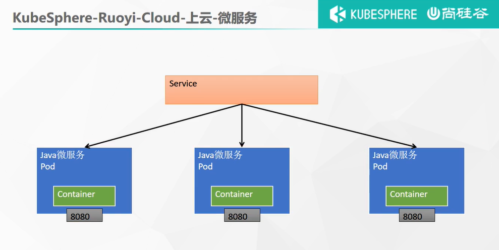


规则：

1、容器默认以8080端口启动

2、时间为CST

3、环境变量 PARAMS 可以动态指定配置文件中任意的值

4、nacos集群内地址为 ` his-nacos.his:8848 `

5、微服务默认启动加载 nacos中  ` 服务名-激活的环境.yml ` 文件，所以线上的配置可以全部写在nacos中。


spring.profiles.active=prod

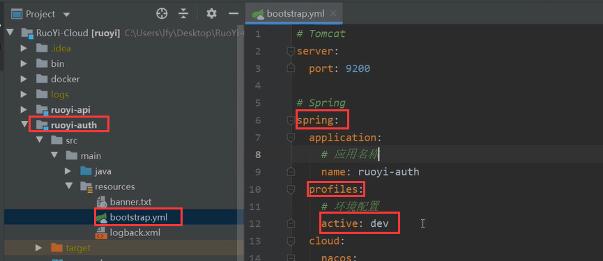


如果是生成环境

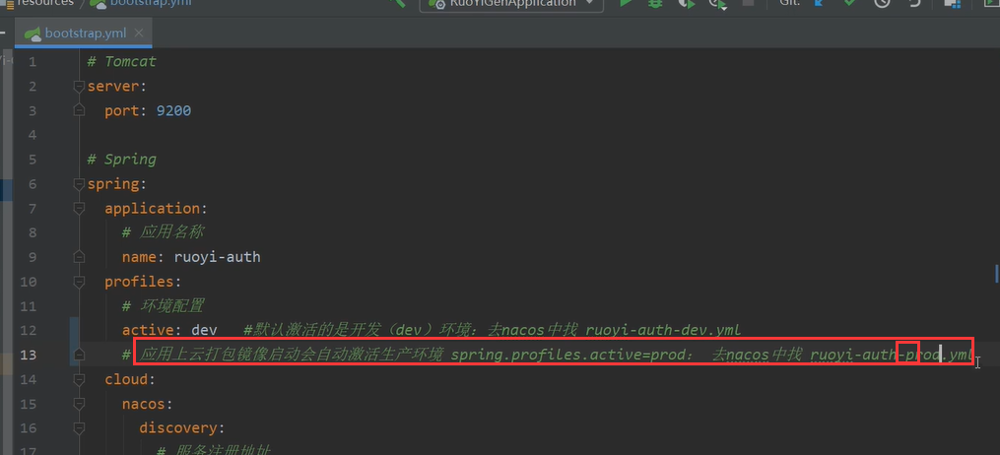


​	我们现在需要做的就是生产环境的配置应用抽离，我们在Nacos中配置命名空间

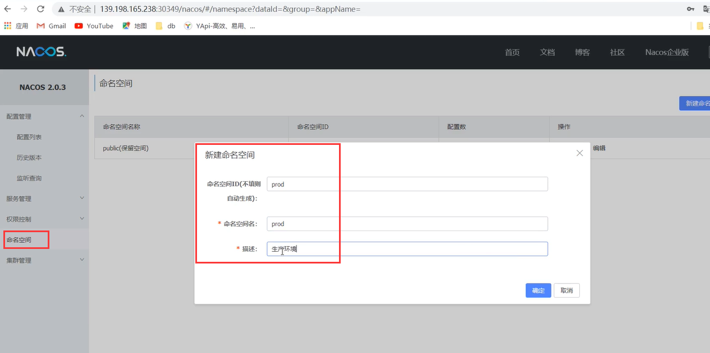


​	然后克隆配置--可乐门道生产环境、然后把所有的dev改为prod文件名称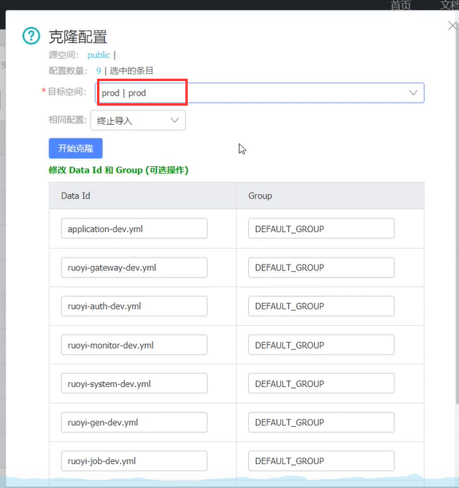、


​	这样在谋陷方面也提供了生产环境的安全性，开发人员甚至不需要关心配置

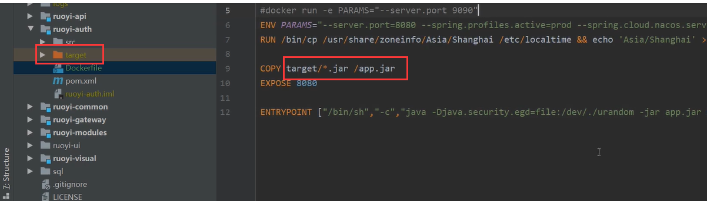


https://www.bilibili.com/video/BV13Q4y1C7hS?p=94&spm_id_from=pageDriver


