# 27.kubernetes应用部署实战-Java微服务上云-微服务上云流程分析

   整个微服务上云的过程我们梳理一下，java微服务上云。

​		1.打包：maven打成可执行的jar包，上传给服务器(指k8s服务节点)，让服务器帮我们打成docker镜像

​		2.制作镜像：docker根据Dockerfile把包打成指定的镜像

​		3.推送镜像：将镜像推送给docker hub--由于docker hub是外网访问地址比较慢，我们可以使用阿里云的镜像仓库---公司里面也可以搭建私有的镜像仓库如huber

​		3.应用部署：给k8s部署应用，比如在node1节点部署，那么node1就需要下载镜像，而镜像一般都是从应用仓库下载的，如果上传jar包到master节点制作好镜像，node1从仓库里下载不到镜像--所以需要加入一个中间环节就是 推送镜像到镜像仓库

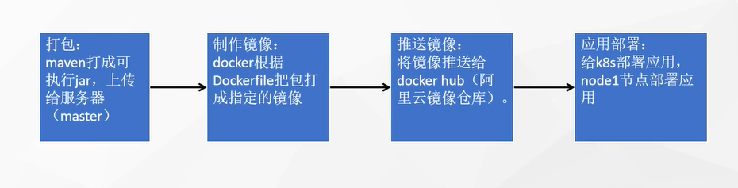

#### 1、打包

​		我们在ruoyi的根路径下，maven选中clean和package，注意勾上闪电标志是跳过测试，然后点击运行--会先clean然后package

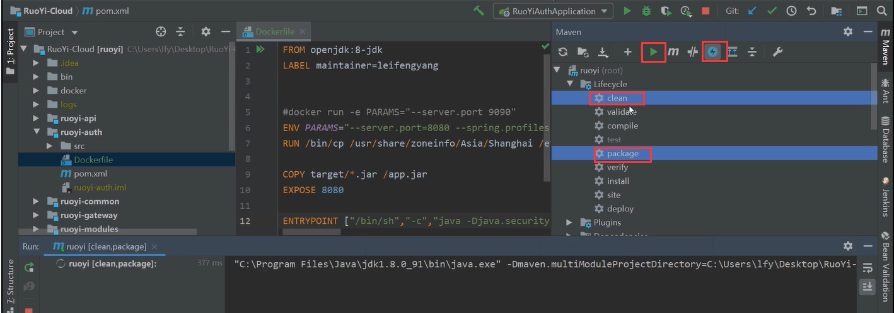

​	对了我们打包前也最好确认一下，我们的项目编码是utf-8的

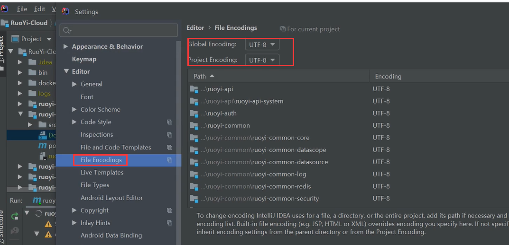

​	我们的包打好了

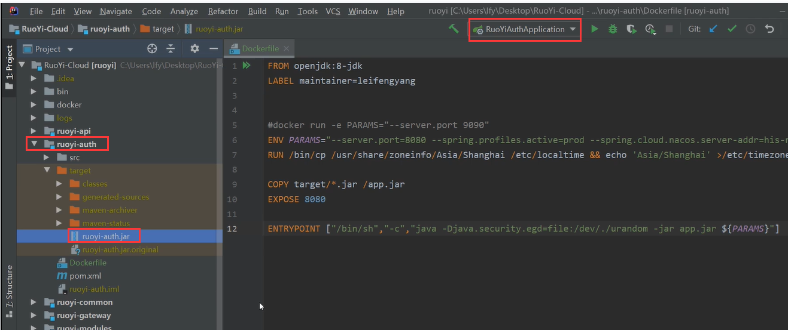

​	我们打好的包推荐一定要实验一下能不能启动运行，要不然辛辛苦苦打了一堆包结果不能运行就比较麻烦了

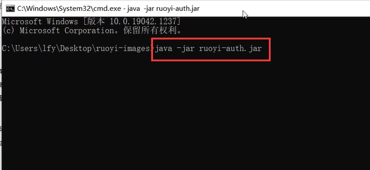

​		如果有发生关于java.nio.charset解析Nacos中的yml配置文件出现字符集的问题的话，那么就添加启动参数设置为utf8，启动就没有问题了

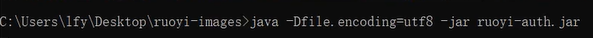

​	我们在Dockerfile文件中也加入这个参数

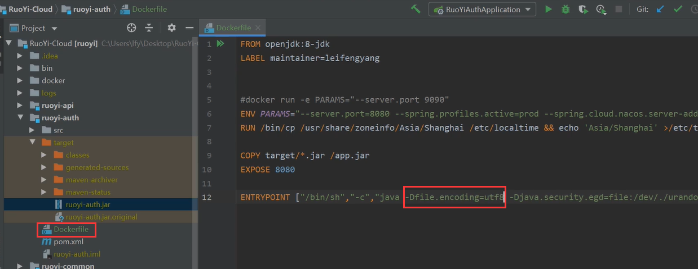

​	我们在桌面新建各个微服务我文件名，然后放入Dockerfile文件，再创建target文件夹，因为我们的dockerfile文件里是需要copy  target路径下的jar包的

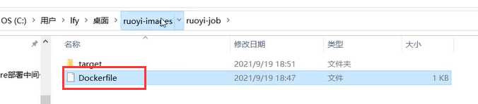

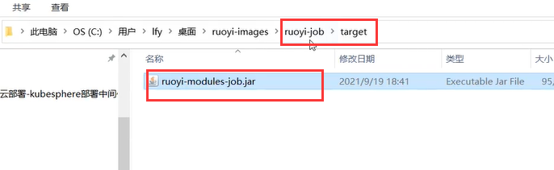

​	将项目的所有微服务都按以上操作，这就是我们需要上传的jar包及dockerfile

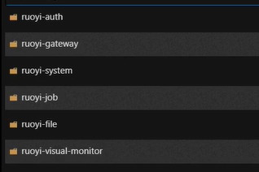

​	我们连接我们的k8s节点----然后使用sftp把这个文件夹上传到服务器上路径自己选择，目前是放在root/docker文件夹下

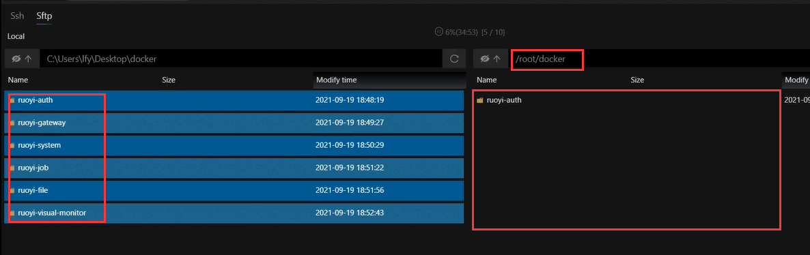

https://www.bilibili.com/video/BV13Q4y1C7hS?p=95&vd_source=243ad3a9b323313aa1441e5dd414a4ef

