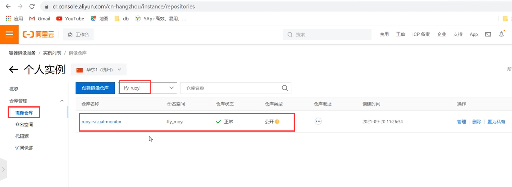

# 28.kubernetes应用部署实战-Java微服务上云-镜像推送


​		我们之前是把本地打好的jar包已经通过ftp上传到了服务器

​		接下来就是进入到每个项目里面制作镜像


​	

​		docker build -t 镜像名称:版本 -f 指定dockerfile .

​			最后的这个点. 指在当前目录工作--因为dockerfile里面有行代码是要拷贝当前路径下的target文件内容的


一共是7步，因为我们dockerfile中有7行代码，代表7个步骤，最重要的是第五个步骤


​	之后所有的ruoyi其他的微服务jar包都是这么制作镜像的


​	现在我们检查一下和ruoyi有关的镜像


​	现在我们的镜像只是在master节点--但是它不能只在master节点，因为我们集群可能有几十台机器，其他机器同样需要部署，那么就**需要从master节点把镜像推送到镜像仓库**了--我们使用阿里云的镜像仓库


​		阿里云菜单下--容器与镜像服务


​	我们使用个人版实例是免费的--但是有限额，这个命名空间相当于这个仓库要给哪里传，


​	我们可以将命名空间设置为公开的，公开就是大家都可以来这个仓库进行下载镜像，所以我们现在就把这些镜像往这个空间里面上传


​	上传镜像到这里需要遵循一个什么样的标准呢？我們看一下这个访问凭证，如果想要上传镜像就需要先登录，按这个指令进行登录


​	改为自己的用户名--然后输入密码，登录成功


​	镜像的推送--阿里云的镜像地址+名称空间+镜像名称：镜像版本号

```bash
$ docker login --username=forsum**** registry.cn-hangzhou.aliyuncs.com

#把本地镜像，改名，成符合阿里云名字规范的镜像。
$ docker tag [ImageId] registry.cn-hangzhou.aliyuncs.com/lfy_ruoyi/镜像名:[镜像版本号]
## docker tag 461955fe1e57 registry.cn-hangzhou.aliyuncs.com/lfy_ruoyi/ruoyi-visual-monitor:v1

$ docker push registry.cn-hangzhou.aliyuncs.com/lfy_ruoyi/镜像名:[镜像版本号]
## docker push registry.cn-hangzhou.aliyuncs.com/lfy_ruoyi/ruoyi-visual-monitor:v1

```

​	

​	docker tag 相当于给镜像改了个名字，tag后是可以是镜像的名称/id


然后推送，此时推送必须是镜像名称，不可以使用镜像id进行推送


​	


​	推送成功后，我们在这个容器镜像里面看一下--已经推送上来了




我们把其他的镜像也先改为符合阿里云的规则名字，然后进行推送


​	这些微服务都推送完毕


​	我们发现这些都是一些手动体力活，这些微服务还比较少，那么如果这些微服务很多呢比如几百个服务呢，我们需要考虑一下有没有一个自动化的流程


​	还有就是如果是在公司我们可以使用自建镜像仓库比如 habor--由于是内网，推送和下载也会比较快


https://www.bilibili.com/video/BV13Q4y1C7hS?p=96&spm_id_from=pageDriver&vd_source=243ad3a9b323313aa1441e5dd414a4ef


