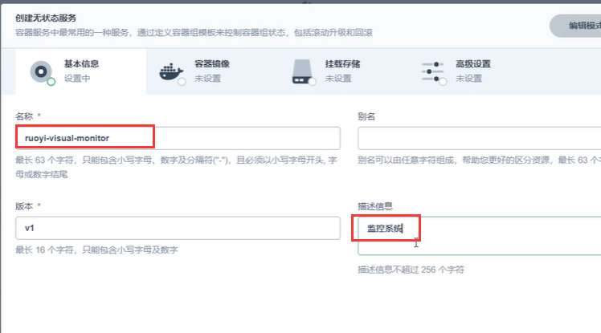

# 29.kubernetes应用部署实战-Java微服务上云-重新修改Dockerfile


​		我们现在已经将镜像推送到阿里云的个人镜像仓库了


​	接下来我们的思路还是和之前一样，因为已经部署过了中间件-数据层，现在我们需要部署微服务，整个部署的架构是自下而上的过程


​	按这么个顺序，我们先来部署 监控中心


​	登录kubesphere


​	因为从工作负载中部署的应用，他的服务名称会有一些其他的字符标识，所以为了我们更清晰的名称，我们接下来都使用服务进行部署


#### 部署Java微服务

​		选择无状态服务


​	填写微服务基本信息




​	输入阿里云的镜像地址--然后默认端口使用8080，然后同步主机时区


​	挂载存储这里我们的每个微服务没有什么需要挂载的--直接下一步


​		而且也不允许他外网访问--我们整个项目唯一需要外网访问的就是前端项目--然后创建


​	已经创建好了，列表存在该服务


#### 部署规则：

​	**这里注意**：因为我们在dockerfile目前是写死的每个应用 启动都会去获取Nacos中的"应用名称-激活环境标识.yml"这个文件，所以部署每个微服务都一定要小心，要注意这些配置文件是否正确。

- 应用一启动会获取到 "应用名-激活的环境标识.yml"
- 每次部署应用的时候，需要提前修改nacos线上配置，确认好每个中间件的连接地址是否正确


我们看一下刚刚部署的应用日志信息，我们发现原因是Nacos的问题连接不上，而且使用的还是本地Nacos并没有使用线上环境


​	

​	我们查看代码配置文件发现--原因是因为注册中心配了一个Nacos的地址，配置中心配了一个Nacos地址


​	其实也可以这样配，只写一个server-addr


​	解决方案：其实这个问题我们应该在docker启动命令上就改为使用线上的Nacos，因为我们的dockerfile启动命令的参数上没有精确的 将nacos的配置覆盖掉，导致的还是使用的之前的配置

​	

​	我们在启动命令参数上精确指定一下Nacos的配置中心地址，和注册中心地址


​	更新后的dockerfile文件

```bash
FROM openjdk:8-jdk
LABEL maintainer=leifengyang


#docker run -e PARAMS="--server.port 9090"
ENV PARAMS="--server.port=8080 --spring.profiles.active=prod --spring.cloud.nacos.discovery.server-addr=his-nacos.his:8848 --spring.cloud.nacos.config.server-addr=his-nacos.his:8848 --spring.cloud.nacos.config.namespace=prod --spring.cloud.nacos.config.file-extension=yml"
RUN /bin/cp /usr/share/zoneinfo/Asia/Shanghai /etc/localtime && echo 'Asia/Shanghai' >/etc/timezone

COPY target/*.jar /app.jar
EXPOSE 8080

#
ENTRYPOINT ["/bin/sh","-c","java -Dfile.encoding=utf8 -Djava.security.egd=file:/dev/./urandom -jar app.jar ${PARAMS}"]
```


​	那么我们就需要重新打包了和推送镜像了

​	我们先进入到存放项目镜像文件夹--然后找到dockerfile，修改dockerfile


​	重新构建镜像


​	重新推送镜像--到阿里云仓库


​		每个微服务都应该这样做，因为基本都是使用到了nacos


https://www.bilibili.com/video/BV13Q4y1C7hS?p=97&spm_id_from=pageDriver&vd_source=243ad3a9b323313aa1441e5dd414a4ef


