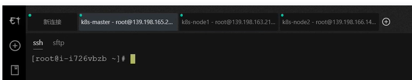
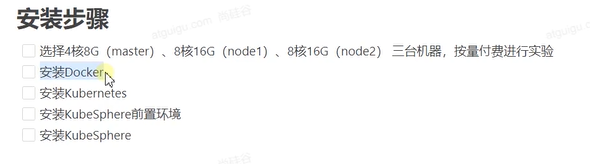
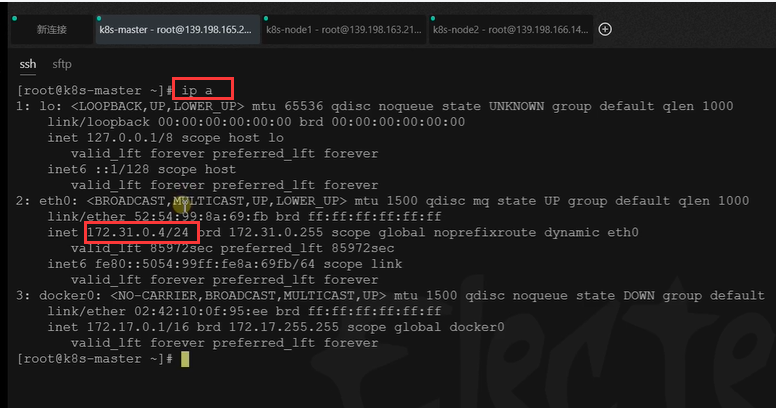
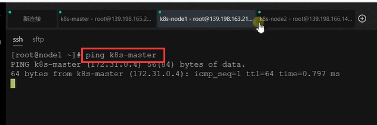
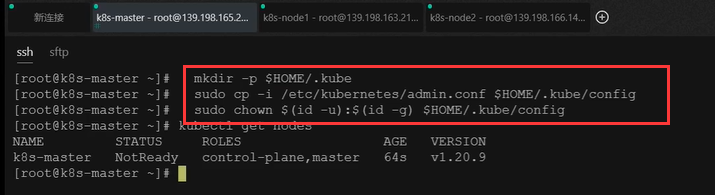
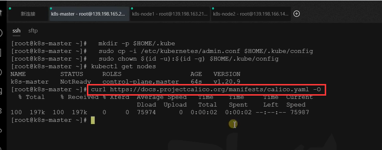
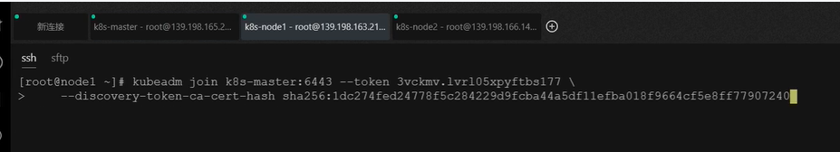
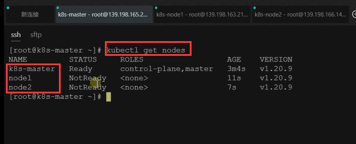
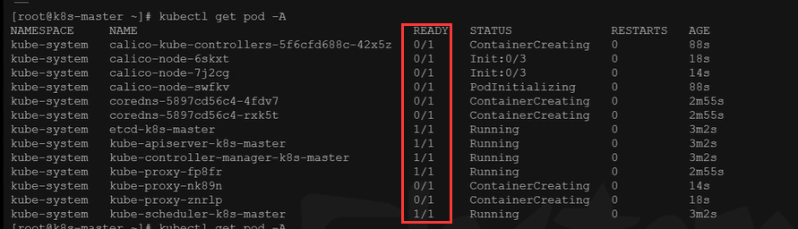

# 3.kubesphere-平台安装-安装kubernetes集群

​	

​		首先我们将节点重启，然后连接各个节点




安装前置环境步骤：系统使用的是Centos7.9




#### 1.安装Docker

```bash
sudo yum remove docker*
sudo yum install -y yum-utils

#配置docker的yum地址
sudo yum-config-manager \
--add-repo \
http://mirrors.aliyun.com/docker-ce/linux/centos/docker-ce.repo


#安装指定版本
sudo yum install -y docker-ce-20.10.7 docker-ce-cli-20.10.7 containerd.io-1.4.6

#	启动&开机启动docker
systemctl enable docker --now

# docker加速配置
sudo mkdir -p /etc/docker
sudo tee /etc/docker/daemon.json <<-'EOF'
{
  "registry-mirrors": ["https://82m9ar63.mirror.aliyuncs.com"],
  "exec-opts": ["native.cgroupdriver=systemd"],
  "log-driver": "json-file",
  "log-opts": {
    "max-size": "100m"
  },
  "storage-driver": "overlay2"
}
EOF
sudo systemctl daemon-reload
sudo systemctl restart docker
```


#### 2、安装k8s


## 1、基本环境

每个机器使用内网ip互通

每个机器配置自己的hostname，不能用localhost

```bash
#设置每个机器自己的hostname
hostnamectl set-hostname xxx

# 将 SELinux 设置为 permissive 模式（相当于将其禁用）
sudo setenforce 0
sudo sed -i 's/^SELINUX=enforcing$/SELINUX=permissive/' /etc/selinux/config

#关闭swap
swapoff -a  
sed -ri 's/.*swap.*/#&/' /etc/fstab

#允许 iptables 检查桥接流量
cat <<EOF | sudo tee /etc/modules-load.d/k8s.conf
br_netfilter
EOF

cat <<EOF | sudo tee /etc/sysctl.d/k8s.conf
net.bridge.bridge-nf-call-ip6tables = 1
net.bridge.bridge-nf-call-iptables = 1
EOF
sudo sysctl --system
```


## 2、安装kubelet、kubeadm、kubectl

```bash
#配置k8s的yum源地址
cat <<EOF | sudo tee /etc/yum.repos.d/kubernetes.repo
[kubernetes]
name=Kubernetes
baseurl=http://mirrors.aliyun.com/kubernetes/yum/repos/kubernetes-el7-x86_64
enabled=1
gpgcheck=0
repo_gpgcheck=0
gpgkey=http://mirrors.aliyun.com/kubernetes/yum/doc/yum-key.gpg
   http://mirrors.aliyun.com/kubernetes/yum/doc/rpm-package-key.gpg
EOF


#安装 kubelet，kubeadm，kubectl
sudo yum install -y kubelet-1.20.9 kubeadm-1.20.9 kubectl-1.20.9

#启动kubelet
sudo systemctl enable --now kubelet

#所有机器配置master域名
echo "172.31.0.4  k8s-master" >> /etc/hosts
```

​	这里唯一需要确认的就是master节点的IP地址




​		脚本都执行完毕后--我们ping一下看看能不能联通




## 3、初始化master节点

​	1、初始化--只需要在主节点执行脚本，前2项注意是master节点的ip和机器名称

```bash
kubeadm init \
--apiserver-advertise-address=172.31.0.4 \
--control-plane-endpoint=k8s-master \
--image-repository registry.cn-hangzhou.aliyuncs.com/lfy_k8s_images \
--kubernetes-version v1.20.9 \
--service-cidr=10.96.0.0/16 \
--pod-network-cidr=192.168.0.0/16
```


### 2、记录关键信息

记录master执行完成后的日志，copy出来

```bash
Your Kubernetes control-plane has initialized successfully!

To start using your cluster, you need to run the following as a regular user:

  mkdir -p $HOME/.kube
  sudo cp -i /etc/kubernetes/admin.conf $HOME/.kube/config
  sudo chown $(id -u):$(id -g) $HOME/.kube/config

Alternatively, if you are the root user, you can run:

  export KUBECONFIG=/etc/kubernetes/admin.conf

You should now deploy a pod network to the cluster.
Run "kubectl apply -f [podnetwork].yaml" with one of the options listed at:
  https://kubernetes.io/docs/concepts/cluster-administration/addons/

You can now join any number of control-plane nodes by copying certificate authorities
and service account keys on each node and then running the following as root:

  kubeadm join k8s-master:6443 --token 3vckmv.lvrl05xpyftbs177 \
    --discovery-token-ca-cert-hash sha256:1dc274fed24778f5c284229d9fcba44a5df11efba018f9664cf5e8ff77907240 \
    --control-plane 

Then you can join any number of worker nodes by running the following on each as root:

kubeadm join k8s-master:6443 --token 3vckmv.lvrl05xpyftbs177 \
    --discovery-token-ca-cert-hash sha256:1dc274fed24778f5c284229d9fcba44a5df11efba018f9664cf5e8ff77907240
```


​	我们先把记录的前三行拿出来在master节点执行一下




### 3、安装Calico网络插件

```bash
curl https://docs.projectcalico.org/manifests/calico.yaml -O

kubectl apply -f calico.yaml
```

​	

我们使用Calico作为我们k8s的网络组件

​	下载calico的yaml文件




应用安装calico---kubectl apply -f calico.yaml


​	至此我们的master节点就搞定了，接下来就是把worker节点加入进来


## 4、加入worker节点



​	这个命令是在记录关键信息的最后部分---分别在node1和node2执行，这样node1和node2就加入到集群环境中了

```
kubeadm join k8s-master:6443 --token 3vckmv.lvrl05xpyftbs177 \
    --discovery-token-ca-cert-hash sha256:1dc274fed24778f5c284229d9fcba44a5df11efba018f9664cf5e8ff77907240
```


​	我们现在查看一下集群中所有node的节点-发现有3个node没问题




​	大概全部搞定需要5-10分钟的时间

​	因为有很多pod需要加载进来




我们现在已经完成了kubesphere的安装前置环境都搞定了


https://www.bilibili.com/video/BV13Q4y1C7hS?p=70&spm_id_from=pageDriver


