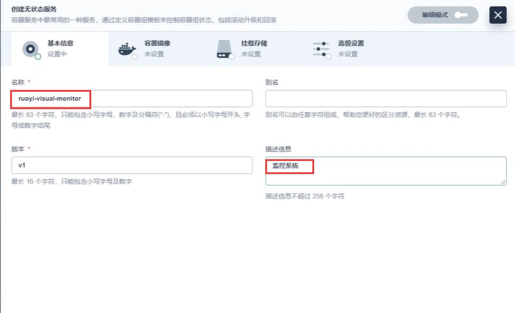
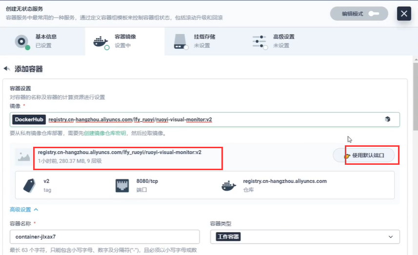
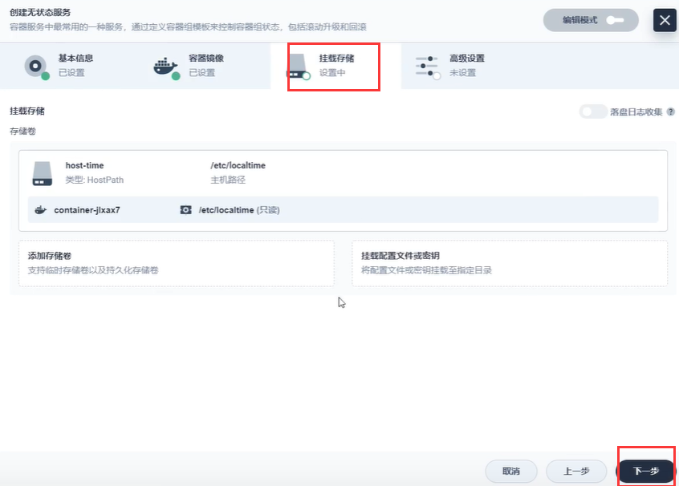
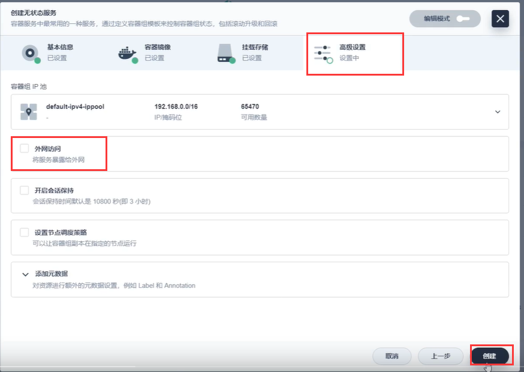
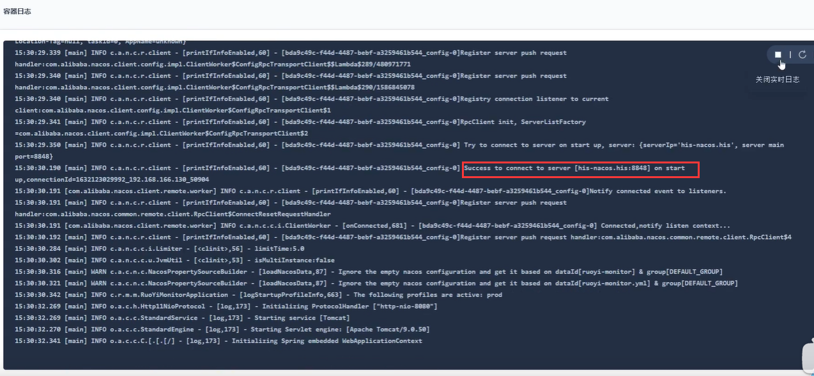
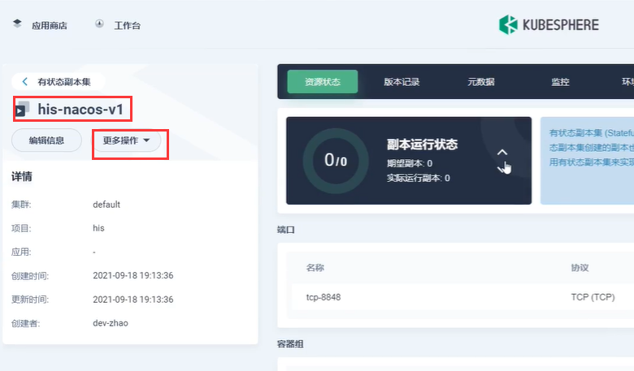
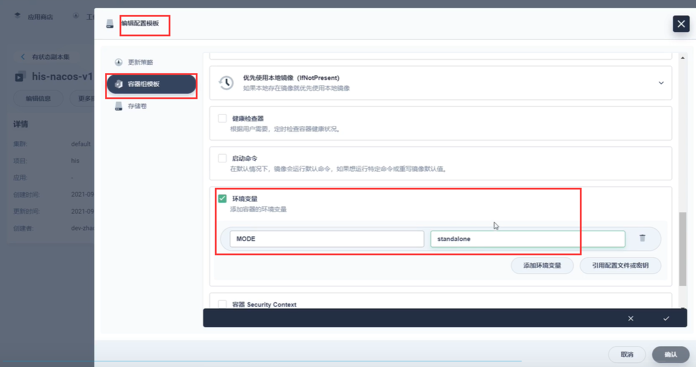

# 30.kubernetes应用部署实战-Java微服务上云-monitor上云完成

​		我们把ruoyi的项目全部都重新打包上传到了阿里云镜像仓库--重新打包的原因是启动参数Nacos配置没有生效

​	并且我们现在集群的每个节点都已经从阿里云仓库下载到了镜像

#### 重新部署微服务

​	服务--创建服务--无状态应用

​	选用V2版本的镜像，并且使用默认端口

​	同步主机时区

​	挂载内容--无需挂载--下一步

​	外网也无需暴露--直接下一步

​	我们查看一下日志---没有问题连接成功Nacos，也没有其他错误，项目启动成功

​	也有可能报错--原因是nacos1和nacos2的问题，如果有这个问题我们就先使用单节点的nacos，将原先的集群nacos修改一下

​	修改为单节点模式

​	那么我们的第一个微服务部署好了之后--其他的微服务按这个方式部署就可以了

​	

https://www.bilibili.com/video/BV13Q4y1C7hS?p=98&spm_id_from=pageDriver&vd_source=243ad3a9b323313aa1441e5dd414a4ef

