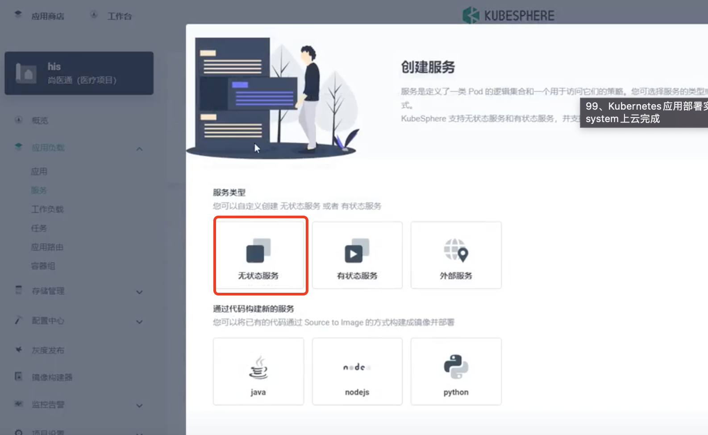
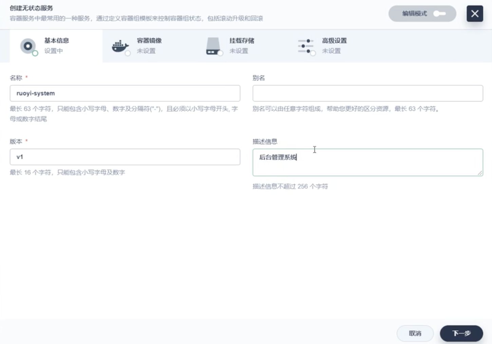
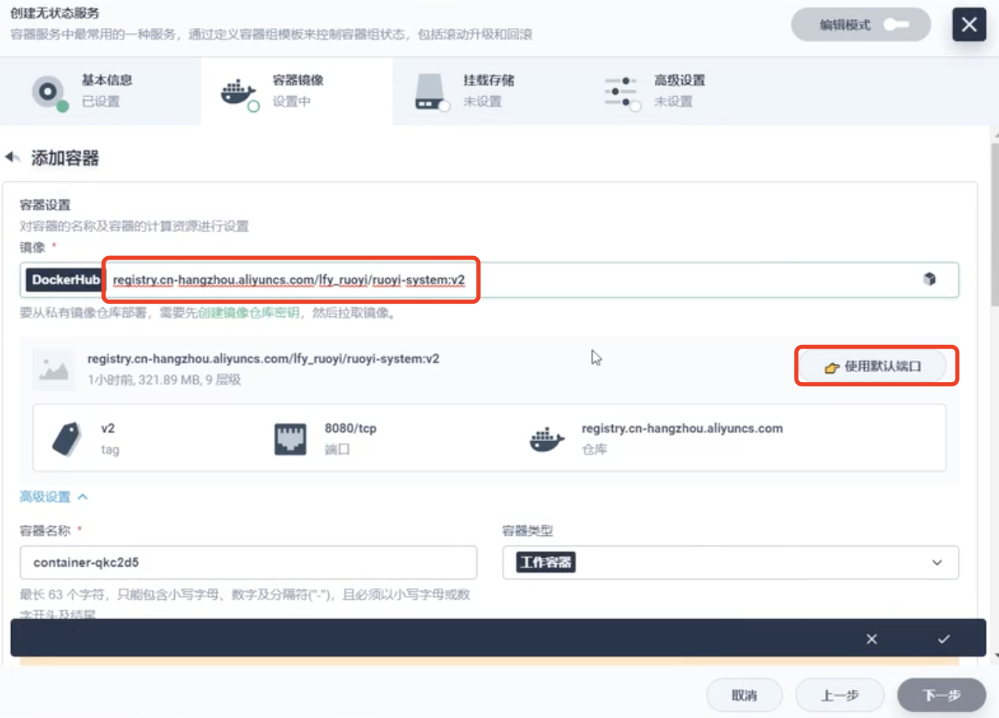
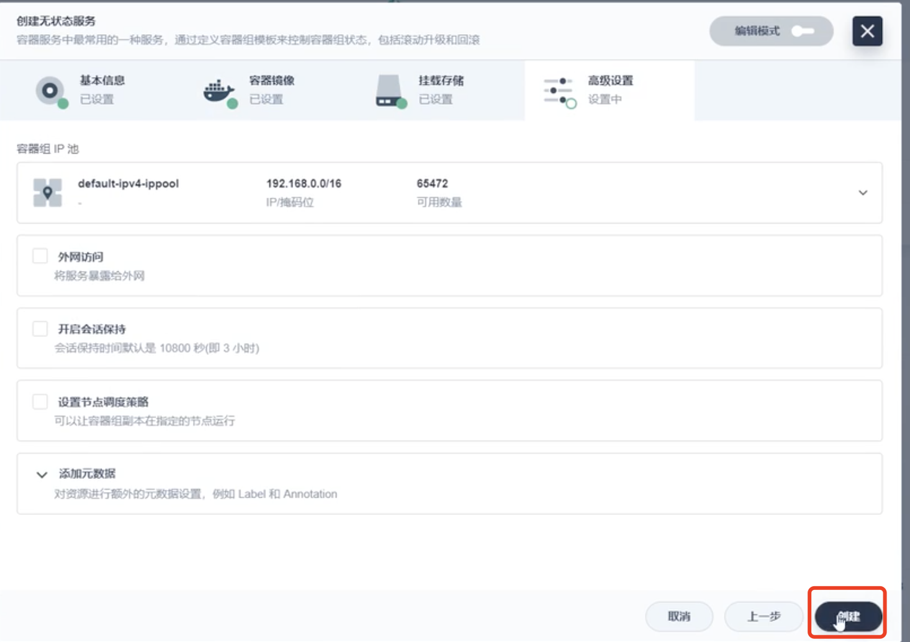
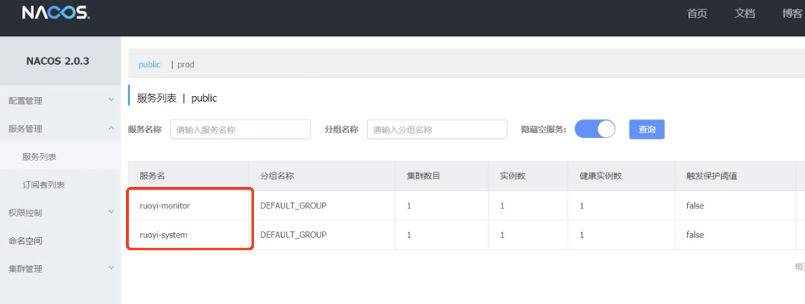
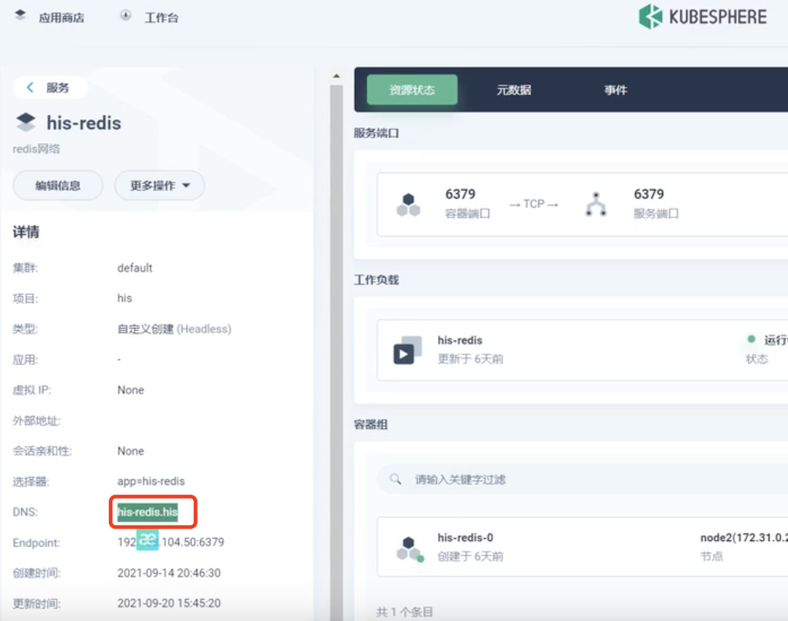
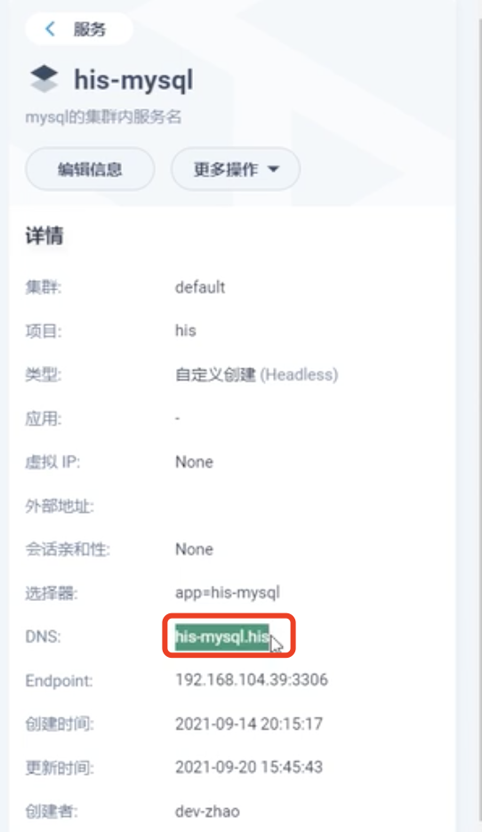
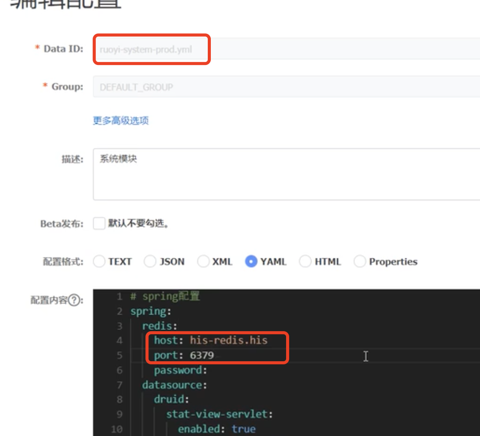
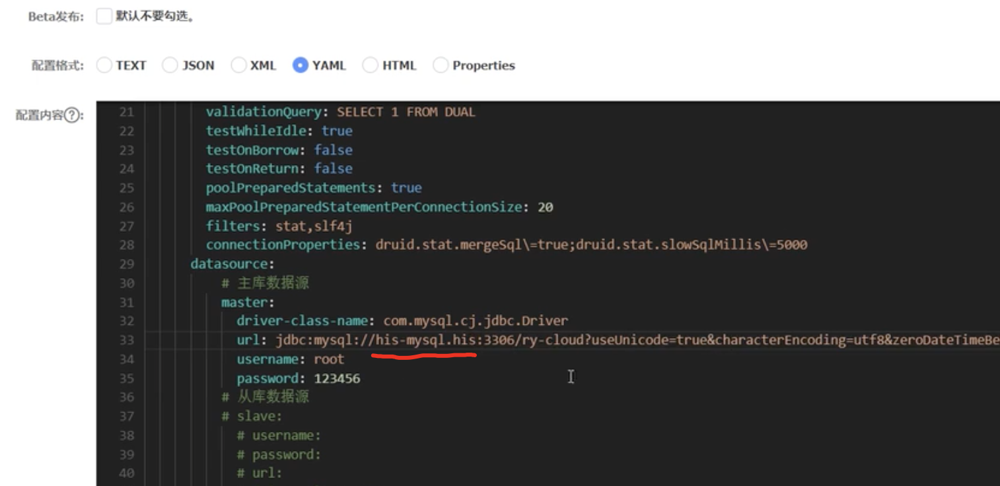
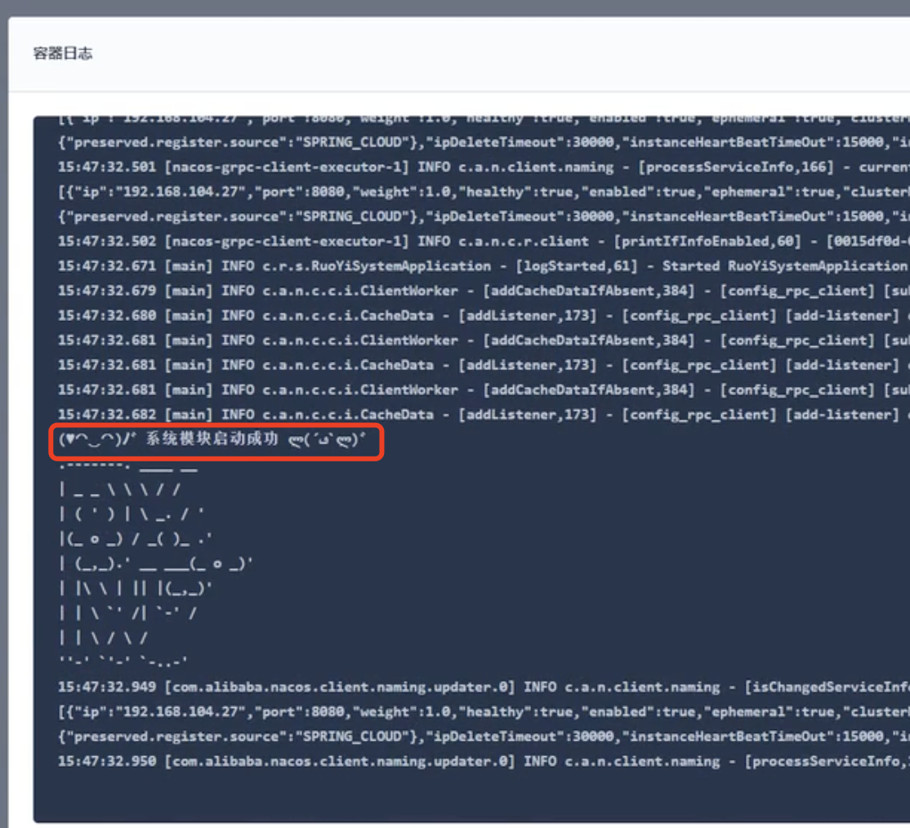

# 31.kubernetes应用部署实战-Java微服务上云-system上云完成

​	我们现在部署ruoyi的system

## 1、部署ruoyi-system

​	还是从kubesphere的服务里创建

填写基本信息

添加镜像--将我们上传到阿里云的镜像拉过来

直接下一步--创建就可以了

​	我们来到Nacos中--服务管理--服务列表可以看到已经启动起来的服务

​	我们启动起来发现项目有报错--原因与数据源相关，我们查看一下redis的地址内网地址是his-redis.his

​	查看一下mysql--内网地址是his-mysql.his

​	然后我们现在修改一下生产环境的Nacos

数据库也需要修改一下

​		然后点击发布

启动成功--没有问题

https://www.bilibili.com/video/BV13Q4y1C7hS?p=99&vd_source=243ad3a9b323313aa1441e5dd414a4ef

