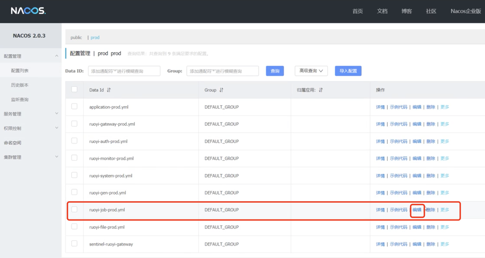
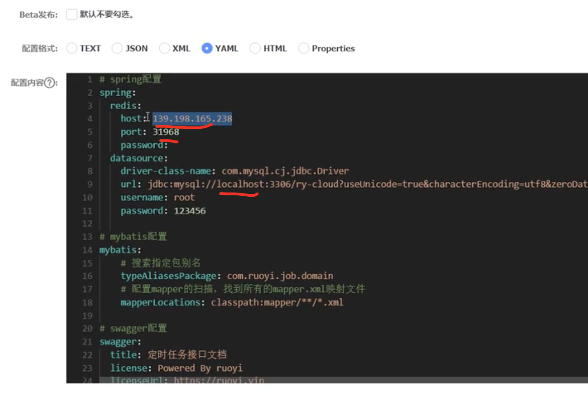
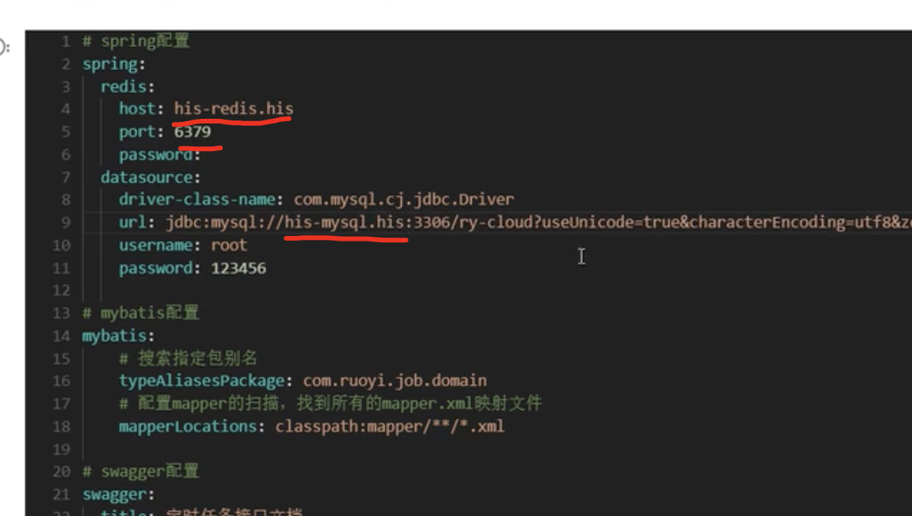
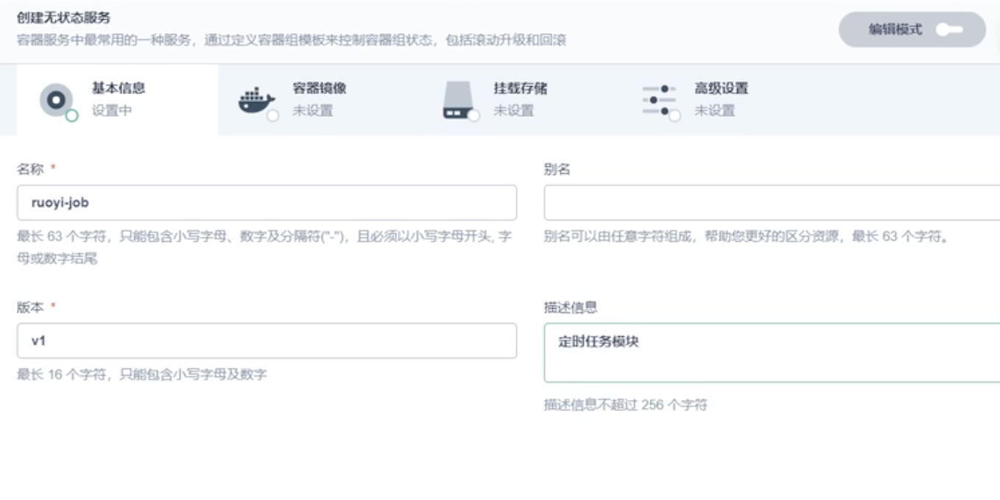
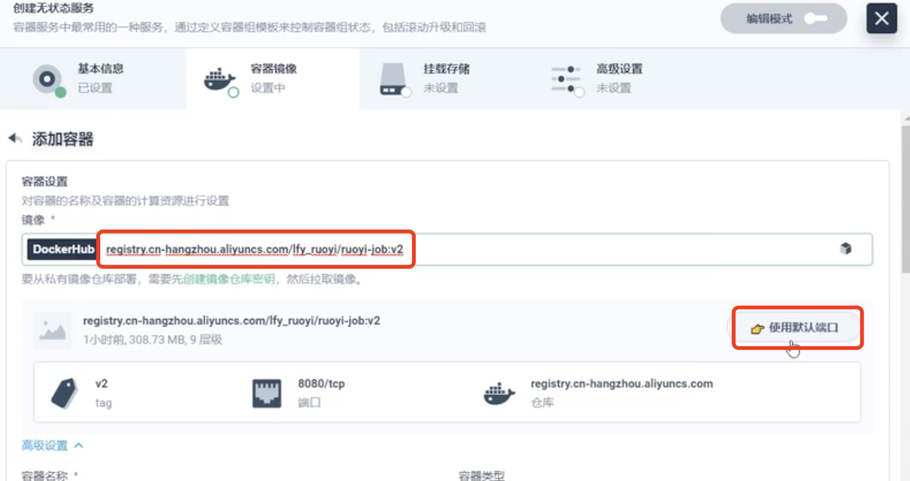
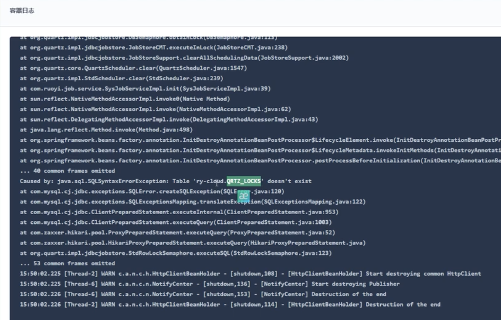
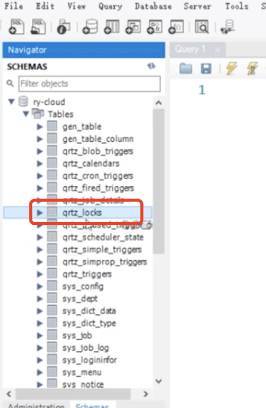
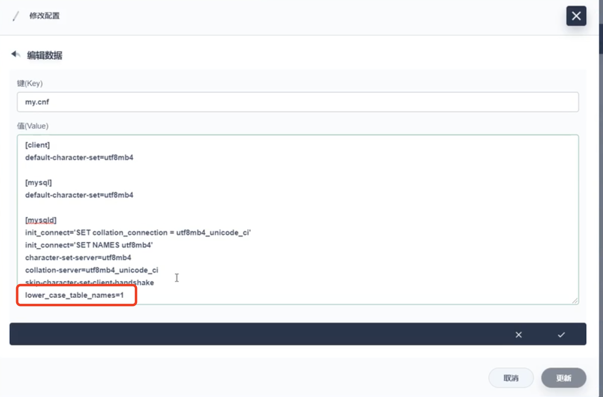
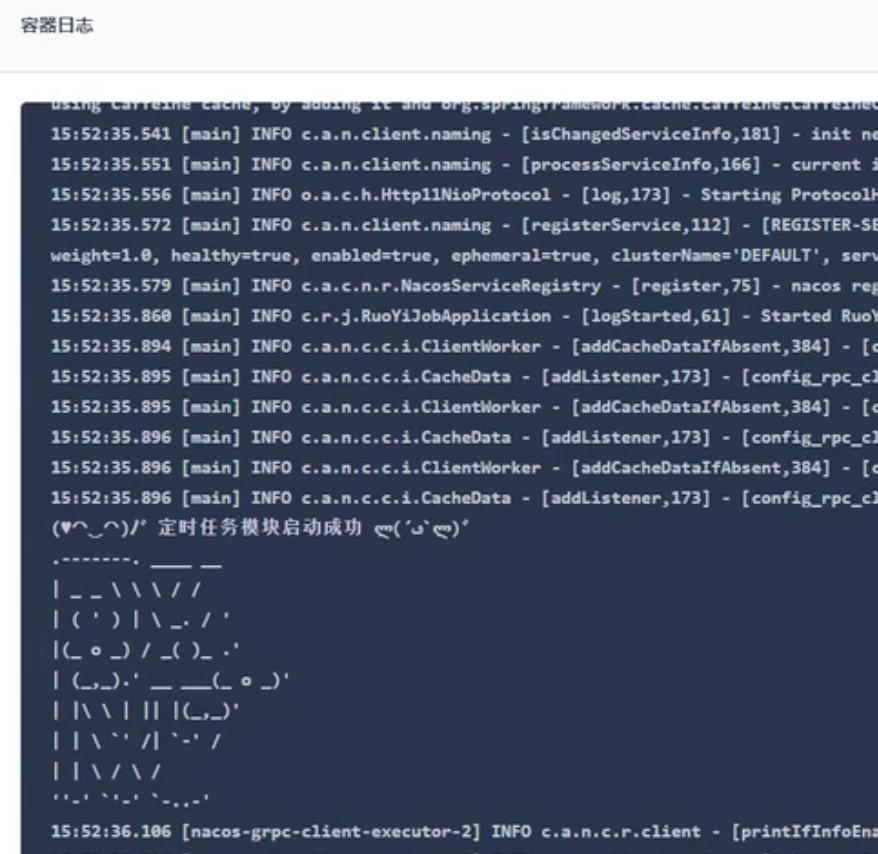
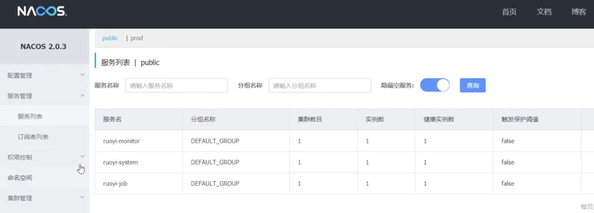

# 32.kubernetes应用部署实战-Java微服务上云-job上云成功

## 部署规则

- 应用一启动会获取到 "应用名-激活的环境标识.yml"
- 每次部署应用的时候，需要提前修改nacos线上配置，确认好每个中间件的连接地址是否正确

​	部署job前我们先做配置修改

redis的配置和mysql的配置都是需要修改的

改好后发布

#### 部署job服务

​	服务--无状态服务--基本信息填写

选择我们镜像仓库的镜像

​	使用8080端口--同步主机时区--一直下一步创建

查看启动是否成功--发现有个表找不到

我们检查数据库发现表是存在的，但是表是小写的而项目找的是大写的表

所以我们应该让这个项目不区分大小写表，我们需要修改一下数据库的配置项

​	在mysqld这个节点下--添加一个lower_case_table_name=1就可以了

重新启动mysql和job服务，项目正常运行

nacos的服务列表中也显示服务了

https://www.bilibili.com/video/BV13Q4y1C7hS?p=100&spm_id_from=pageDriver&vd_source=243ad3a9b323313aa1441e5dd414a4ef

