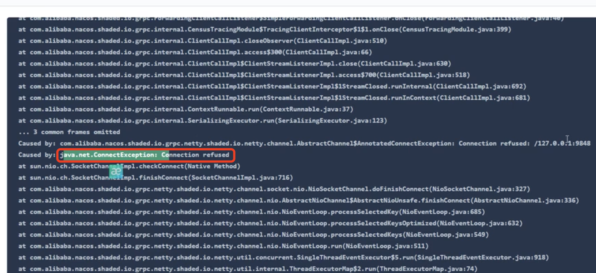
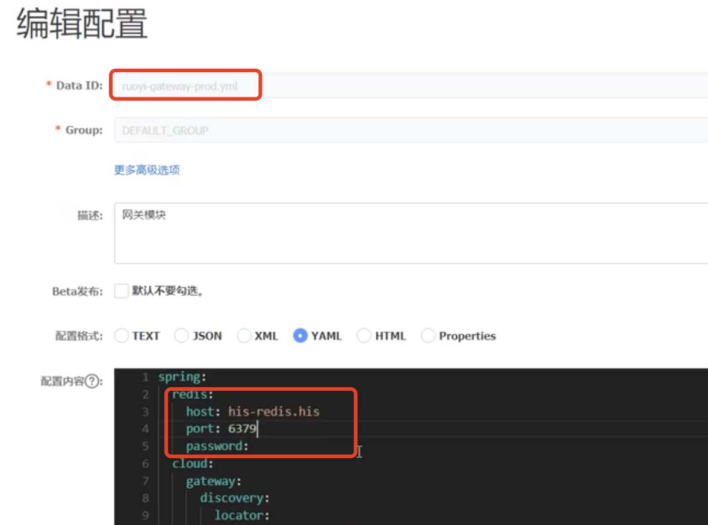
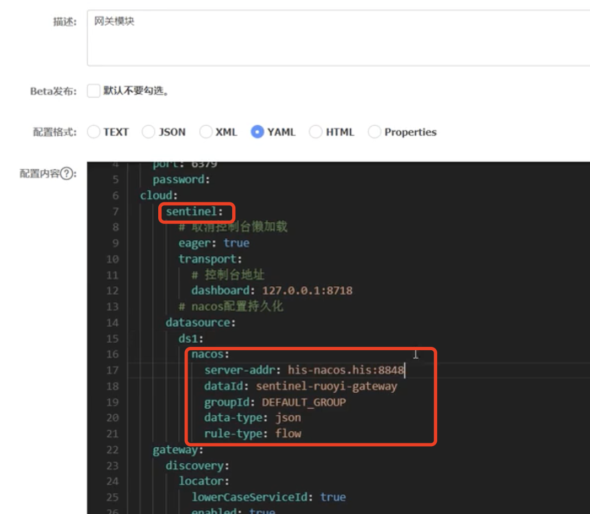
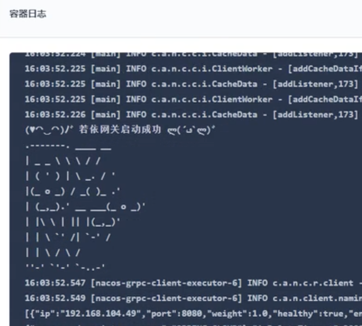

# 33.kubernetes应用部署实战-Java微服务上云-gateway上云成功

​	我们继续部署网关服务

​	和之前一样还是服务--无状态服务---基本信息填写--拉取镜像等等创建服务

服务发现还是有报错的地方

原因是nacos的配置的redis有点问题

sentinel这里也有用到nacos改为线上环境

​	sentinel流量保护的时候会给Nacos持久化保存数据

启动成功

https://www.bilibili.com/video/BV13Q4y1C7hS?p=101&spm_id_from=pageDriver&vd_source=243ad3a9b323313aa1441e5dd414a4ef