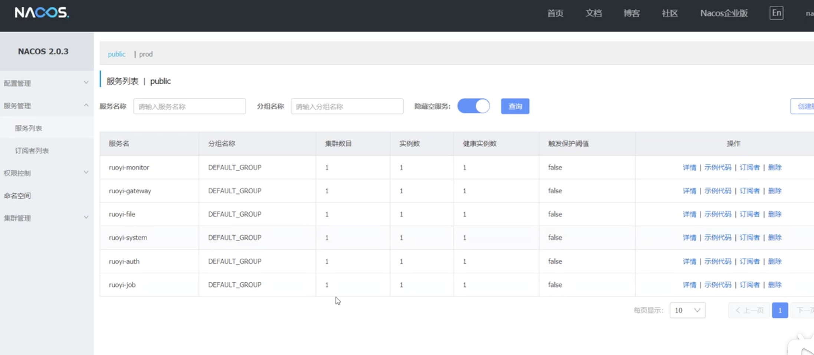

# 35.kubernetes应用部署实战-Java微服务上云-Auth上云完成

## ruoyi所有镜像

```bash
docker pull registry.cn-hangzhou.aliyuncs.com/lfy_ruoyi/ruoyi-auth:v2
docker pull registry.cn-hangzhou.aliyuncs.com/lfy_ruoyi/ruoyi-file:v2
docker pull registry.cn-hangzhou.aliyuncs.com/lfy_ruoyi/ruoyi-gateway:v2
docker pull registry.cn-hangzhou.aliyuncs.com/lfy_ruoyi/ruoyi-job:v2
docker pull registry.cn-hangzhou.aliyuncs.com/lfy_ruoyi/ruoyi-system:v2
docker pull registry.cn-hangzhou.aliyuncs.com/lfy_ruoyi/ruoyi-visual-monitor:v2
docker pull registry.cn-hangzhou.aliyuncs.com/lfy_ruoyi/ruoyi-ui:v2
```


## 我们部署最后一个auth--认证系统


​	我们先检查一下配置


redis需要改为线上环境


​	接下来部署和之前一样，无状态服务，，然后基本信息填写，然后选取镜像，然后创建服务。


服务启动成功


目前我们从Nacos中查看，已经有6个ruoyi的服务了




